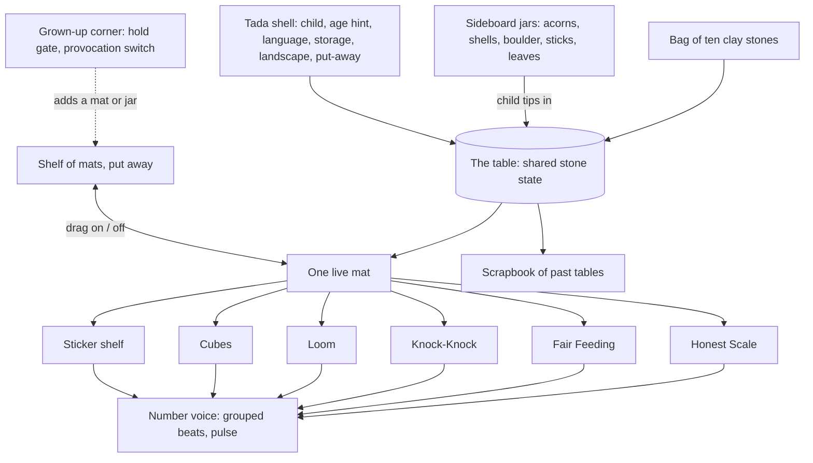
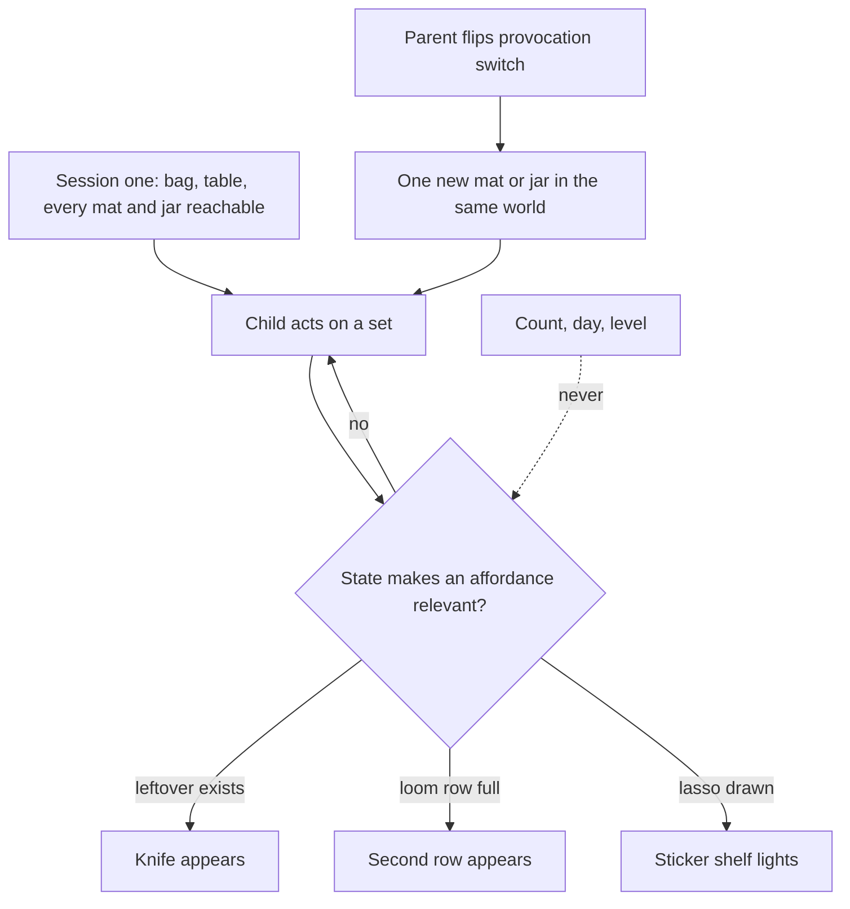
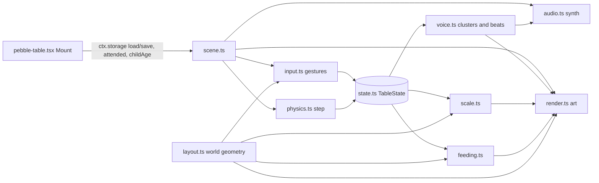
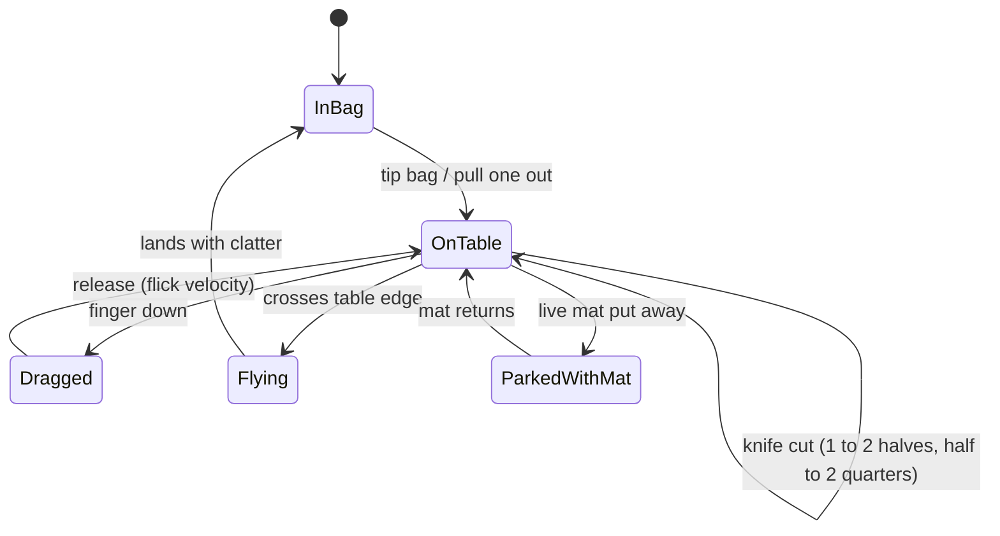
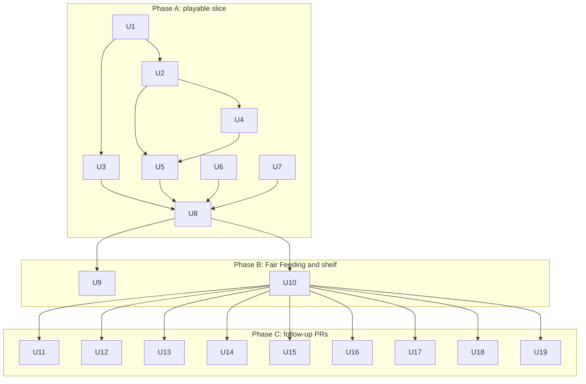

# Pebble Table - Plan

## Goal Capsule

- **Objective:** Ship an iPad toy for a 4-year-old — one table, one bag of stones, a shelf of mats — where real mathematics (quantity, equality, fair sharing, rhythm, pattern, shape) is felt through play, and which a child chooses to return to for about ten minutes a day over a month without any engagement mechanic. It ships as a Tada cartridge under the existing contract plus the small delta in Contract & Tada-R15 Delta, and stays buildable standalone through the cartridge-creator fake shell.
- **Product authority:** The owner briefs of 2026-09-22 ("go deep, make it fun"; then "compatible with Tada cartridges, but more creative freedom") and the Sep 21 Kieran–Lucas decisions (fun deep games over platform; a shared experimental-games repo; iPad support). The revised ideation artifact `docs/ideation-math-game-4yo.md` supplies the evidence base. `docs/cartridges.md` in the Tada repo is the authority for shell mechanics; Tada's R15 and R20 are accepted as written except where Contract & Tada-R15 Delta names an exact change. Every calm-by-design constraint is still judged on its merits in Constraints Re-decided — the game keeps them because they are good for the child, not because the shell asks.
- **Open blockers:** None. The contract delta needs Tada maintainers' acceptance, but every item in it has a fallback that keeps the cartridge shippable under the contract as written; the owner-only items under Outstanding Questions carry the default planning proceeds on.
- **Where it is built:** `games/pebble-table/` in `kieranklaassen/tada-jam`, run by the jam shell in `harness/` (the fake-shell equivalent named in Cartridge Mapping, re-implemented rather than copied). The jam grants Δ1–Δ4 as allowances (`AGENTS.md`); porting into Tada is the README's copy-plus-four-touchpoints procedure.
- **Execution profile:** Three phases (see Planning Contract → Sequencing). Phase A is the playable vertical slice (table, bag of ten, spill and sweep, persistence, Honest Scale, iPad-landscape touch). Phase B is Fair Feeding and the one-live-mat shelf. Phase C is every remaining mat and fun rule. `assumed default`: the first PR lands Phase A and Phase B; Phase C units ship in follow-up PRs against this same plan, each one self-contained.
- **Stop conditions:** Stop and report instead of guessing if a unit would need a shell or contract change beyond Δ1–Δ4, a dependency outside the Tada tech menu, or a product behavior this plan does not define.
- **Tail ownership:** `lfg` owns simplify, review, commit, PR, and CI after `ce-work` returns.
- **Product Contract preservation:** Product Contract unchanged. R1 and R37 are read in the jam context (the jam shell stands in for the Tada kid shell until the port); no R-ID was split or re-owned.

---

## Product Contract

### Summary

Pebble Table is a quiet, tactile iPad game about quantity for a 4-year-old that stays interesting at 5 and 6.
A wooden table, a cloth bag of ten clay stones, and a shelf of mats — a two-pan scale, a party of plates, a knock-knock door, a bead loom, a set of cubes, a shelf of numeral stickers — where the world answers every arrangement with physics, creatures, and sound instead of verdicts.
Jars of loose parts, a table that remembers everything, a spill, seasons, and a grown-up's hand on the other pan are what make it worth coming back to.
It runs inside the Tada kid shell as a cartridge — the shell brings the child, the language, the age hint, persistence, landscape, and put-away — and the same Mount runs standalone in the fake shell for development.

### Problem Frame

Kieran and Lucas diagnosed Tada v1 on Sep 21 as technically solid but over-constrained: the rules stripped the fun out of the apps ("een runner werd een heel plat dom dingetje"), and the two real problems sit in the games, not the platform — they get boring after five minutes because there is no depth, and their content is not grounded in what children need to learn. Kieran's action item was a math game for Kaia, who is four, plays on an iPad and not a computer, and does not read yet.

The ideation run found the category's failure mode named by its own practitioners — "digitized worksheets", "chocolate-covered broccoli" — and no shipped example of a toy-first, deep-math game for this age without coins or levels. It also found that the calm rules alone do not produce a good toy: the first Pebble Table draft, with identical stones and every mat live at once, was itself a five-minute toy. Fun and depth have to be built from the material — variables, persistence, a spill, a person — not from a reward schedule and not from restraint.

The adjacent products this could accidentally become, and why each is wrong: a math-drill app with a cute skin (the Math Meadow shape — questions, digits, hints, bloom badges) teaches the equals sign before the child has felt equality and dies when the questions run out; a Toca-style dollhouse with stones in it is fun and has no math in the verbs; a Numberblocks-with-fingers clone has prior art and no toy underneath. Pebble Table's identity is that the toy is the math: every verb the child performs — deal, weigh, knock, string, stack, lasso — is a mathematical act, and every reaction is a true statement about quantity.

### Key Decisions

- D1. **Tada cartridge with contract deltas, buildable standalone.** `decided (brief)` (session-settled: user-directed — chosen over a fully standalone game after one round: the owner's follow-up asked for cartridge compatibility with more creative freedom; the shell's contract is accepted as written plus the exact delta in Contract & Tada-R15 Delta, and the fake-shell shim keeps a standalone build). Governs R1, R41–R47.
- D2. **One material, one world, mats not mini-games.** `decided (brief)` (session-settled: user-directed — chosen over a hub of separate math games: the owner picked Pebble Table with six named mats and the parent hook). Governs R2–R5, R8–R13.
- D3. **The calm rules are kept on their merits, not inherited.** `assumed default`. No scores, streaks, timers, levels, praise, or verdicts; the world gives the verdict; sessions end losslessly. Kept because each demonstrably makes the game better for a 4-year-old — the argument is in Constraints Re-decided. Governs R26–R30.
- D4. **Fun-making tools are allowed with rules.** `assumed default`. A living world, surprises, a scrapbook album, characters with personality, and affordances that appear when the state makes them relevant are in; daily content, completion states, and progress-gated unlocks are out. Governs R31–R36.
- D5. **Runs in the Tada kid shell on iPad Safari, landscape, touch-first; no native build.** `assumed default`. The shell already gives landscape lock, server-side persistence with flush on put-away, crash containment, and the child's profile; Tada's own native shell is iPhone-only (`docs/native.md`), so iPad means the web shell, and the haptics and storage-eviction reasons for going native disappear or lose force. Governs R37–R40.
- D6. **Wordless kid loop; words on request; content packs in Dutch and English chosen by the child's profile language.** `assumed default`. Number is voiced as grouped beats always and as a spoken number word only when the child asks (tap a sticker, long-press a group); the question cards are a content pack keyed by `ctx.language` with English as the silent fallback. Nothing in the cartridge is a UI string, so the shell's i18n pipeline is untouched. Governs R14–R18, R24.
- D7. **The three return-pull changes are the base, not extras.** `decided (brief)` (session-settled: user-approved — chosen over the first-draft table of identical stones and live mats: the owner adopted the ideation's three changes after seeing the five-minute failure argued). Loose parts in child-chosen jars; one live mat at a time with full persistence and a spill; a grown-up-held provocation switch with seasons that only look different. Governs R6–R7, R19, R21–R22, R33, R36.
- D8. **Success is voluntary return, measured at home.** `decided (brief)` for the bar (ten minutes a day, a month); `assumed default` for the measurement (a four-week home trial with a parent diary and observation; the in-game session log is dropped because the contract has no parent surface and Tada's R15 forbids counters in kid-land). Governs Success Criteria.
- D9. **Age is a hint that sets defaults, never a gate.** `assumed default`. The child's profile age (`ctx.childAge`, whole years or null) decides bag size, which mats sit nearest the bag, and whether the sticker shelf is out; every mat and jar is reachable by any child in the first session, which is exactly the contract's rule that age is a hint (Tada R8). Governs R20, R34.
- D10. **Two Hands is the parent hook: co-play by geometry plus one question.** `decided (brief)` (session-settled: user-directed — chosen over a parent progress dashboard and over a coin-priced AI question: the research says the math lands in adult talk, and a report replaces the person with a ledger). Governs R23–R24.
- D11. **The grown-up corner lives inside the world behind a hold gate.** `assumed default`. The contract offers no per-cartridge parent settings, so the provocation switch is a three-second hold on the sideboard that a 4-year-old does not do by accident; state lives in `ctx.storage`. A proper parent-settings surface is a later contract proposal, not a v1 dependency. Governs R25, R33.



### Constraints Re-decided on Their Merits

Each rule Tada imposed is judged here only by whether it makes the game better for a 4-year-old. "Kept" rules become requirements; "dropped" rules free a design tool, which then gets its own rules under R31–R36.

| Rule | Verdict | Why, for a 4-year-old | Requirement |
|---|---|---|---|
| No scores, points, stars, XP | Kept | Extrinsic rewards undermine the motivation they are meant to build (Lillard's fourth principle); Common Sense Media flags Edoki's coins as "not typically Montessori… to compensate for the lack of adult feedback"; at 4, children "don't care about" winning or levels (Toca Boca). A score also tells the child there is a right table, and there is not. | R26 |
| No timers, no time pressure | Kept | Pace belongs to the child; Toca ships "no goals or time constraints"; NAEYC/NCTM: "neither policymakers nor teachers should set a fixed timeline". Physics time (a beam settling) stays; a clock does not. | R27 |
| No streaks, daily quests, "new today", login gifts | Kept | Nintendo's own account of Animal Crossing's clock is "deferred satisfaction" via "an inconvenient world"; players call it chores; a 4-year-old cannot consent to loss aversion. Fails the test "can the child close this gap now and then stop?" | R28 |
| No verdicts: no right/wrong, no "great job" | Kept, sharpened | Montessori's control of error: "the control of the error lies in the material itself"; the beam tilts, the plate is fuller, the leftover sits there. Evaluative praise is cut; honest world reactions caused by the child's arrangement (a party that eats when the plates match) are allowed because they are true of the state, identical for every child, and no louder than the act. | R29, R35 |
| Sessions end losslessly at any moment | Kept | A 4-year-old is called to dinner mid-deal; persistence is also the strongest return lever (ScratchJr edits outnumber new projects). No confirm dialogs, no "are you sure". | R30, R19 |
| Self-correcting materials, one difficulty at a time | Kept | Montessori isolation of difficulty and the Marsh finding that successful preschool apps have "one or two clear functions, lots of repetition" both point at one live mat. | R5, R34 |
| Wordless everywhere | Dropped for the parent side and for on-request speech; kept for the kid loop | A pre-reader cannot be gated on text and instruction narrows exploration (Bonawitz 2011), so the loop stays wordless. But US Pre-K expects number names and numerals 0–10 by age 4, and a child who asks "how many?" deserves an answer; speech arrives only when the child reaches for it. | R14–R17 |
| No external egress, no CDNs, no telemetry (Tada R20) | Kept, as written | No ads, no third-party trackers, no remote analytics in the child's space. Every asset the game needs — stones, jars, creatures, sounds — is procedural or repo-committed, so Tada R20 costs the design nothing; see Cartridge Mapping. | R44 |
| No `childAge` gating (age is a hint, Tada R8) | Kept, as written | Every mat reachable by every child; the profile age sets defaults. Bracelet Loom and Cubes are on the shelf for the 4-year-old too. | R7, R20 |
| Calm by design: alive at idle but still | Dropped as "still" | Toca and Sago worlds are alive; "would a kid screenshot it?" needs life. Idle life may move, snore, nibble, and change with the season; it may never ask, remind, or beckon. | R31 |
| No surprises, no hidden content | Dropped | Sago's "hidden surprises" and Schulz & Bonawitz's finding that preschoolers explore a familiar-but-ambiguous toy over a novel one make surprises a pull. Rule: found by wandering or by a math act, never enumerated, never counted, never dated. | R32 |
| No collections | Dropped as a ban, kept as a shape rule | Cooney 2010: the sticker collection "may have been too short-term a goal" — play stopped when it completed. The album is a scrapbook that grows without slots, silhouettes, counts, or a complete state. | R22 |
| No unlocks | Dropped as a ban, kept as a shape rule | Progress-gated unlocks are levels. Affordances that appear when the table's state makes them relevant (a knife when there is a leftover, a second loom row when the first is full) are Montessori isolation and the Goldilocks band: complexity grows because the child made it grow. Test: a new child reaches everything in session one by wandering. | R7, R34 |
| Content packs by locale, three languages, CI parity | Kept as the contract already defines it | The cards and spoken numbers are a content pack keyed by `ctx.language` with silent fallback to English, which is the contract's own rule; there are no kid-side UI strings, so the `t()` pipeline and parity test are not touched. | R18 |

### Cartridge Mapping

How the plan lands on `docs/cartridges.md`. Everything in this section fits the contract as written; the exceptions are collected in Contract & Tada-R15 Delta.

**Registry entry.** `key: 'pebble-table'`, `name: 'Pebble Table'`, `ageBand: [3, 7]`, `permissions: ['storage']`, `iconIdentity: { family: 'play', contrast: 'paper' }`, `windowShape` omitted (full desk). No `faces`: the mats near the bag already shift with age and a renamed icon adds nothing. `'weather'` is not declared in v1; the seasons read the device date. The four touchpoints (manifest const and `allManifests`, `registry.ts`, `CARTRIDGE_EMOJI`, regenerated `config/cartridge_registry.json`) are the only edits outside the cartridge directory.

| Plan need | Contract surface | Fit |
|---|---|---|
| Table state, live mat, guests, album (R19, R22) | `ctx.storage` — server-side per child, debounced save, flushed by the shell on put-away, `pagehide`, and hidden; 64 KB cap | Fits; server-side storage is more durable than any Home Screen web app, so the Safari eviction risk from revision 0 disappears. Album cards are compact state, not images, and the shelf is bounded (R45). |
| Age defaults (R20) | `ctx.childAge` (whole years or null; a hint under Tada R8) | Fits as-is; buckets are open-ended and `null` behaves like 4. |
| Language of cards and spoken numbers (R18) | `ctx.language` content-pack key with silent fallback | Fits as-is; packs `nl` and `en`, English fallback for every other key. |
| Who is playing | `ctx.childNickname` — not used | The table never shows a name; nothing to map. |
| Lossless exit (R30) | Put-away is the only dismissal; the shell flushes the pending save | Fits; the cartridge saves on every change and never opens a dialog. |
| Landscape only (R40) | `PortraitOverlay` (KTD-8) covers kid-land in portrait | Removed from the cartridge; the shell owns it. |
| Alive at idle (R31) | Fidelity bar demands it; attention rule demands the loop stops when `attended` is false | Fits; idle life pauses while faded or hidden (R46). |
| Sound on every touch (R39) | Synthesized with tone.js or raw Web Audio; `Tone.start()` inside the first real tap; silent while unattended | Fits; only the spoken number words need the delta (Δ3). |
| Physics for stones and beam | matter.js is on the tech menu | Fits; first PR that uses it adds the dependency. |
| Window geometry | The child can resize the window; the shell restyles the CSS box without a `resize` event | The canvas watches itself with a `ResizeObserver` and re-lays the table (R47). |
| Grown-up corner (R25, R33) | No per-cartridge parent surface exists | Lives inside the world behind a hold gate, stored in `ctx.storage` (D11); a parent-settings surface is a later contract proposal. |
| Session log (revision 0 R25) | No parent surface; Tada R15 forbids counters in kid-land | Dropped (Δ5). |
| Account, child picker (revision 0 R41–R42) | Parent sign-in and `/picker` are the shell's | Dropped from the cartridge; the shell supplies them. |

**Egress check (Tada R20) against the plan.** Stones, jars, acorns, shells, sticks, boulder, leaves, and snow-stones are procedural shapes or repo-committed SVG. Guests are repo-committed vector art with procedural idle motion. The table, mats, and seasonal décor are drawn, not photographed. Every sound — creak, clatter, knock, munch, the pentatonic number voice — is synthesized. Kid-side text is zero, so fonts are irrelevant. The only asset class the contract's sound rule does not cover is the spoken number word; see Δ3. Nothing in the plan needs `fetch`, `localStorage`, a CDN, or a third-party request.

**i18n.** The cartridge has no UI strings on either side: the kid loop is wordless and the grown-up corner is pictures and a switch. The question cards and number words are content packs inside the cartridge (the fishing `content.json` pattern), keyed by `ctx.language`, not `t()` keys, so `config/locales/frontend/*.yml` and the parity test are untouched. If a future shell-facing string appears it goes through `t()` in all three locales as the contract requires.

**Standalone build.** The cartridge-creator skill ships `shim/fake-shell.tsx`: a self-contained `FakeShell` that mounts a `Cartridge` under a faithful `CartridgeContext` (status lifecycle, debounced `save`/`flush`, flush-on-park, attention toggle, crash containment, `boring` and `meadow` tokens) with in-memory storage and no egress enforcement. It is aimed at AI-host artifacts, not a dev server, so a standalone Pebble Table build needs a thin shim on top of it: a Vite entry that renders `<FakeShell cartridge={pebbleTable} />`, a storage adapter that persists the fake context's slot to `localStorage` between reloads, a fake `childAge` and `language` control, and a portrait overlay of its own. None of that touches the cartridge code; the same Mount runs in both hosts, and the validator plus `npm run check` stay the compliance gate.

---

### Contract & Tada-R15 Delta

Every fun decision from D4 and the living-world rules, judged against Tada's R15 and the contract as written. In this section R15, R20, and R8 are Tada's rules; the plan's own requirements are cited by the Requirement column. Verdict codes: **fits** — no change needed; **(a)** — fits R15's intent, rule text should be clarified; **(b)** — needs an explicit amendment, written below; **(c)** — genuinely conflicts, recommend dropping.

| Fun decision | Requirement | Verdict | Reasoning |
|---|---|---|---|
| Living world, alive at idle | R31 | fits | The fidelity bar asks for it; the attention rule (pause when unattended) is already in R46. |
| Idle creatures with personality, guests that stay | R10, R31 | fits | Juice that responds, never nags; no character misses the child or asks for a return. |
| Surprises found by wandering or a math act | R32 | (a) | Nothing in R15 forbids hidden content; the text bans counters and daily mechanics, and the rule "never enumerated, counted, or dated" keeps it clean. Proposed clarification Δ1. |
| The mouse takes a leftover that sits too long | R32 | (a) with a design guard | A world-time event is not "a timer pushing continuation" as long as it neither rewards presence nor punishes absence. Guard: the mouse only moves while the table is attended, the cookie comes back with one tap, and nothing is ever lost. Proposed clarification Δ2. |
| Scrapbook album of past tables | R22 | fits | The contract's own model is the fishing journal, "a re-reading surface, not a score"; no slots, counts, or complete state. |
| State-revealed affordances (knife, ghost bead, second loom row) | R34 | fits | Not a level or an unlock: nothing is gated on count, day, or progress and everything is reachable in session one. |
| Honest world reactions (party eats, beam hums) | R35 | fits | Motion and sound that respond to the child; not praise, not a reward schedule. |
| Seasons that only look different | R36 | (a) | R15 bans "daily mechanics"; décor that mirrors the calendar without gating or counting anything is not a mechanic. Proposed clarification Δ1. |
| Spoken number words on request | R16 | (b) | The contract's sound rule reads "synthesized, never fetched" and bans `Tone.Player`, `Tone.Sampler`, and `Tone.Buffer` with a URL outright. A repo-committed same-origin clip breaks the letter and not R20. Amendment Δ3; fallback is on-device `speechSynthesis`, which the contract does not mention and which makes no network request for the Dutch and English voices shipped on iPadOS. |
| Grown-up-held provocation switch | R33 | (a) | A parent adding a mat is not an engagement mechanic and nothing forbids a hold gate inside a Mount, but no shipped cartridge has one and the doc should name the pattern so it is not reinvented. Proposed clarification Δ4. |
| Parent-visible session log (minutes per day) | revision 0 R25 | (c) | A per-child play counter has no parent surface in the contract and would sit in kid-land storage, which is a counter the contract forbids in spirit even when hidden. Dropped; the trial measures return with a parent diary instead. |
| Collectible-feeling guests, no roster | R10, R22 | fits | No roster, no silhouettes, no count of kinds seen; a creature is met, not collected. |

**Exact changes Tada would need to accept this cartridge**

- Δ1 (Tada R15 text, `docs/cartridges.md` §4 and `AGENTS.md`): add "A world may mirror the real calendar or weather in how it looks, and may hide things a child finds by playing, provided nothing becomes available or unavailable by date, nothing counts days or finds, and nothing is dangled at the child."
- Δ2 (Tada R15 text, §4): add "World-time events — a creature that wanders, naps, or nibbles while the child watches — are allowed when they neither reward presence nor punish absence, pause while unattended, and move nothing the child cannot get back with one tap."
- Δ3 (contract §4 sound rule, amendment): replace the flat ban with "Sound is synthesized by default. Short repo-committed clips may be played from a same-origin URL when synthesis cannot make the sound — recorded number words are the worked case. Remote URLs stay forbidden and the CI egress checks remain the gate. On-device `speechSynthesis` is permitted for the same purpose."
- Δ4 (contract §3, clarification): add "A cartridge may keep a grown-up corner behind a deliberate hold gesture for settings a parent tunes in the moment; its state lives in `ctx.storage` and it never shows the child a score, log, or verdict. A parent-facing settings surface outside kid-land is a contract proposal."
- Δ5 (no rule change): the cartridge drops the session log; if Tada later wants voluntary-return evidence from the shell, that is a proposal for a parent-side play view fed by the storage layer's `updatedAt`, not a cartridge feature.

Nothing here loosens Tada R20, the storage rules, attention, or lossless exit. If Δ3 is refused the cartridge ships with `speechSynthesis`; if Δ1, Δ2, or Δ4 are refused as clarifications the game is unchanged, because each already fits the rule's intent — the risk they remove is a reviewer reading R15 more narrowly than its authors.

---

### Actors

- A1. **The child** — four years old, pre-reader, iPad-native, plays alone or beside a grown-up; the only actor inside the table. Must still be interested at five and six.
- A2. **The grown-up at the table** — a parent or older sibling with their own fingers on the same screen; plays the other pan, the other dealer, the other knocker; reads the question card aloud.
- A3. **The parent as owner** — sets the child's age and language on the Tada child profile, and adds a mat or a jar from the grown-up corner in the moment; never appears in the child's play as a voice or a verdict.

### Requirements

**World and material**

- R1. Pebble Table is a Tada cartridge — one manifest, one Mount, declared `ctx.storage` — that also runs unchanged inside the cartridge-creator fake shell for standalone development.
- R2. The world is one landscape table seen from above, with a cloth bag, a sideboard of jars, and a shelf of mats; there is no start screen, menu, level select, or tutorial.
- R3. The bag holds ten identical clay stones by default and empties onto the table when tipped, the stones scattering and rolling with physics.
- R4. Stones and loose parts are moved by direct touch: drag, flick, tip a container, sweep a group toward the table edge; nothing is selected from a palette.
- R5. Exactly one mat is live on the table at a time; the others sit put away on the shelf as pictures, and dragging one onto the table puts the current one away with its arrangement intact.
- R6. The sideboard holds stoppered jars of loose parts — acorns, shells, sticks, a boulder, a few big stones, and a seasonal part — that the child tips onto the table herself; each jar adds at least one attribute the stones lack (size, weight, kind, colour, length).
- R7. Every jar and every mat is reachable by wandering in the first session; nothing is gated on time, count, or progress.

**Mats**

- R8. **Honest Scale.** A two-pan beam that tilts toward the heavier pan with a creak whose pitch follows the tilt and settles level in silence when the pans match; identical stones weigh the same, the boulder weighs some number of stones, and every beam state is a true statement.
- R9. **Fair Feeding.** Two to five guests sit at plates; the child deals stones or cookies one at a time or taps the bowl to hop one onto the next plate; guests look calmly toward a fuller plate, eat together when plates match, and leftovers stay in the bowl as a fact; a knife appears only while a leftover exists and cuts it into halves and quarters that can be dealt.
- R10. **Knock-Knock.** Knocking N times on the door makes the house echo N as grouped rhythm and open slowly on N creatures standing in those groups, who walk out and stay on the table; in reverse the house knocks first, and the door always opens, showing the gap as chalk marks rather than a verdict.
- R11. **Loom.** A ring of twelve slots; the child lays a repeating unit of stones or loose parts and the shuttle repeats it around the ring; a unit that divides twelve closes with a click, one that does not leaves the remainder as a visible knot; a faint ghost bead shows where the next bead would land.
- R12. **Cubes.** Eight wooden cubes on a shallow isometric grid that stack, slide, and mirror across a line; arrangements speak their count and their shape through the number voice, and the cubes are never cleared by the game.
- R13. **Sticker shelf.** Numerals 0–10 live on an edge shelf as peelable stickers that the child may ignore; stuck onto a group, plate, or pan the sticker sings its number, and it flutters back to the shelf on its own the moment the set it named changes. Off by default when the profile age is 3 (R20).

**Voice, words, and language**

- R14. The number voice is one wordless signature per quantity — N pentatonic beats in the grouping the arrangement shows, with the objects pulsing in the same grouping — and every mat that "says a number" says it this way.
- R15. The number voice sounds when the child acts on a set (places, tips, taps, lassos), never as commentary on an unchanged table.
- R16. A spoken number word plays only when the child asks — tapping a sticker or long-pressing a group — never unprompted.
- R17. The child's side of the game contains no readable text, digit buttons, or typed input; numerals appear only as stickers (R13).
- R18. Spoken number words and question cards are content packs in Dutch and English chosen by `ctx.language`, with English as the silent fallback for any other key.

**Growth, discovery, and persistence**

- R19. Whatever is on the table — live mat, arrangement, seated guests, stones on pans, a half-strung loom — is exactly there the next time the game opens, with no summary, no count, and no tidy-up.
- R20. The child's profile age (`ctx.childAge`) sets defaults only: bag size (5 at 3, 10 from 4 and when age is unknown), which mats sit nearest the bag, and whether the sticker shelf is out; it hides nothing.
- R21. Tipping the bag spills stones that roll; sweeping them off the table edge drops them into the bag with a clatter; this is the way to start again and it is always available.
- R22. The album is a shelf of past tables the child can set back on the table to continue; it has no slots, silhouettes, counts, or complete state.

**Parent side and co-play**

- R23. The table is drawn single-orientation from above so a grown-up beside or across from the child can play with their own fingers in the same world — the other pan, the other dealer, the other knocker — with no second-player mode, orientation flip, or menu.
- R24. A face-down card at the far edge shows, when flipped, one open question for the grown-up to ask about what is on the table right now, drawn from a static set of about thirty per language keyed to the live mat; it is never a report about the child.
- R25. A grown-up corner opens after a three-second hold on the sideboard and holds only the provocation switch (R33); it shows no log, count, or verdict, and closes on release.

**Kept calm rules**

- R26. The game shows no scores, points, stars, XP, progress meters, or rankings anywhere the child can see.
- R27. The game has no timers, countdowns, or time-limited states; only physics takes time.
- R28. The game has no streaks, daily rewards, login gifts, or content that is available only on certain days.
- R29. The game never says or shows right, wrong, or praise; the only feedback is the world's honest reaction to the arrangement.
- R30. The game can be closed at any instant with no loss, no dialog, and no penalty.

**Fun rules**

- R31. The world is alive at idle — guests nap and wander, the beam sways, a mouse lives under the table — and idle life never asks, reminds, or beckons.
- R32. Surprises are found by wandering or by a math act (the mouse takes a leftover that sits too long while the child watches and gives it back on a tap; knock ten and ten mice arrive; one knock and an elephant fills the doorway); they are never enumerated, counted, or dated, and never remove anything for good.
- R33. The provocation switch in the grown-up corner adds one mat or jar to the same world when the parent chooses; nothing is ever removed permanently, and there is no calendar cadence.
- R34. Affordances appear when the table's state makes them relevant (R9 knife, R11 ghost bead, the second loom row) and never because of a count, a day, or a level.
- R35. World reactions to a good arrangement — the party eats, the beam hums — are true of the state, identical for every child, and no louder than the act that caused them.
- R36. The table mirrors the real season in its décor and in one jar's contents (leaves in autumn, snow-stones in winter); nothing becomes unavailable, nothing is counted per day, and a child who skips a month finds nothing missing.

**Platform and input**

- R37. The game runs inside the Tada kid shell on iPad Safari at `/kid`, full-bleed in the app surface the shell owns, and in a desktop browser for development.
- R38. All gestures use at most three simultaneous fingers; the design never depends on four- or five-finger touches.
- R39. Every touch answers with motion and synthesized sound started inside the child's first real tap; there are no music loops or sound that urges action, and the game is fully playable muted.
- R40. The game never lays out a portrait table; the shell's portrait overlay covers kid-land when the iPad is turned.

**Cartridge boundaries**

- R41. The cartridge declares only the `'storage'` permission and reaches the child, age, and language through `ctx` alone.
- R42. The four registration touchpoints are the only edits outside the cartridge directory; no shell or contract code changes.
- R43. Nothing in the child's space links outside the game.
- R44. Every request from the cartridge goes to the Tada server; assets are procedural or repo-committed, sounds are synthesized except as Δ3 allows, and there are no ads, trackers, or analytics.
- R45. Saved state is compact plain JSON well under the 64 KB cap; the album keeps a bounded shelf of the most recent twenty tables as state, never as images.
- R46. Idle life, physics, and sound pause while the cartridge is unattended or the page is hidden and resume on attention.
- R47. The table re-lays itself to whatever size the window is given, including a child's resize, without hard-coded pixel geometry.



### Key Flows

- F1. **First open**
  - **Trigger:** The child opens the game on a fresh device.
  - **Actors:** A1
  - **Steps:** The table is on screen with the bag lying on it and the plates mat live by default at age 4; the child tips the bag; ten stones scatter and roll; the number voice sounds ten as two groups of five when they settle; the child pushes stones onto plates and the guests look; nothing prompts.
  - **Covered by:** R2, R3, R9, R14, R15

- F2. **Feeding a party**
  - **Trigger:** The plates mat is live and stones or cookies are on the table.
  - **Actors:** A1, optionally A2
  - **Steps:** The child deals one each or taps the bowl; a guest with fewer looks toward a fuller plate; when plates match the guests eat together and the table settles with a soft chord; a leftover sits in the bowl; a knife appears; the child cuts it into halves and deals them; the child knocks on the door (F3) to add a guest and deals again.
  - **Covered by:** R9, R10, R34, R35

- F3. **Knocking guests in**
  - **Trigger:** The child knocks on the door mat.
  - **Actors:** A1
  - **Steps:** Three knocks; the house echoes knock-knock, knock; the door opens slowly on three creatures in a two and a one; they walk out and sit at plates or wander; knock ten and ten mice pour in; knock once and an elephant fills the doorway.
  - **Covered by:** R10, R31, R32

- F4. **Weighing**
  - **Trigger:** The scale mat is live.
  - **Actors:** A1, optionally A2 on the other pan
  - **Steps:** Stones on each pan; the beam tilts and creaks; the child matches counts and the beam settles level in silence; the child tips the boulder from its jar and finds how many stones balance it; a grown-up puts shells on the far pan and the child answers with stones.
  - **Covered by:** R6, R8, R23

- F5. **Tipping a jar**
  - **Trigger:** The child drags a jar from the sideboard and tips it.
  - **Actors:** A1
  - **Steps:** Acorns roll out among the stones; the lasso now groups by kind; the loom takes acorn-stone-stone units; the scale weighs big against small; the child sweeps everything to the edge and it all clatters back into bag and jars.
  - **Covered by:** R4, R6, R11, R21

- F6. **Put away and come back**
  - **Trigger:** The child is called away mid-deal and closes the iPad; opens it the next day.
  - **Actors:** A1
  - **Steps:** The child parks the app on the Plank or the iPad locks mid-drag; the shell flushes the last save; on open the table is exactly as left — two guests fed, one plate short, the knife out; the child continues or tips the bag to start over; the album shows yesterday's table as a small card that can be set back.
  - **Covered by:** R19, R21, R22, R30

- F7. **Grown-up at the table**
  - **Trigger:** A parent sits down beside the child.
  - **Actors:** A1, A2
  - **Steps:** The parent's fingers are just more fingers — stones on the other pan, a rival dealer at the plates; the parent flips the card and reads "Which plate has more? How do you know?" in Dutch; the child answers with stones; the parent withdraws.
  - **Covered by:** R23, R24, R18

- F8. **Parent adds a provocation**
  - **Trigger:** After a week of plates and scale, the parent holds a finger on the sideboard for three seconds.
  - **Actors:** A3, then A1
  - **Steps:** The grown-up corner slides out with the shelf-extension switch; the parent adds the loom and lets go; the corner closes; next open the loom is on the shelf where it was not before, and the seasonal jar holds autumn leaves; nothing else changed and no log or count is shown.
  - **Covered by:** R25, R33, R36

### Acceptance Examples

- AE1. **Leftover and knife.** Covers R9, R34.
  - **Given** five cookies and two guests on the plates mat,
  - **When** the child has dealt two each,
  - **Then** one cookie sits in the bowl, both guests eat together, a knife lies beside the bowl, and the knife disappears if the child knocks in a third guest and deals the fifth cookie to them.

- AE2. **Sticker falls off.** Covers R13, R16.
  - **Given** a lasso ring around four shells with the "4" sticker stuck to it,
  - **When** one shell rolls out of the ring,
  - **Then** the sticker lifts and flutters back to the shelf without sound or verdict, and tapping the ring plays three beats; tapping the "4" sticker on the shelf speaks "vier" (Dutch default).

- AE3. **Door always opens.** Covers R10, R29.
  - **Given** the house knocked five times as knock-knock-knock, knock-knock,
  - **When** the child knocks three times,
  - **Then** the door opens on the house's five creatures with two chalk circles drawn beside them, and no sound or animation marks the answer as wrong.

- AE4. **Beam settles in silence.** Covers R8, R35.
  - **Given** three stones on the left pan,
  - **When** the child places the third stone on the right pan,
  - **Then** the beam levels, the creak stops, and nothing else plays; the stones pulse three-and-three once because the child acted (R15).

- AE5. **Lossless close.** Covers R19, R30.
  - **Given** a half-dealt party, the knife out, and a stone mid-drag,
  - **When** the app is parked on the Plank, the iPad is locked, or the tab is evicted,
  - **Then** no dialog appears, and on next open the table shows the same party with the dragged stone resting where the finger left the glass.

- AE6. **Season passes the three tests.** Covers R36, R28.
  - **Given** the device date moves from October to March with no play in between,
  - **When** the child opens the game,
  - **Then** the décor and the seasonal jar are spring, every other mat, jar, guest, and album card is unchanged, and nothing indicates time was missed.

- AE7. **Provocation adds, never removes.** Covers R33, R7.
  - **Given** the parent flips the switch to add the cubes mat,
  - **When** the child next opens the game,
  - **Then** the cubes mat is on the shelf and every previously present mat and jar is still there; a fresh child at any profile age can reach the cubes mat by dragging it from the shelf in the first session.

- AE8. **Three-finger cap.** Covers R38.
  - **Given** a child rests a whole hand on the glass,
  - **When** four or five touches register,
  - **Then** the game treats it as a rest and does nothing; no mechanic requires the fourth finger.

- AE9. **Muted is still a toy.** Covers R39, R14.
  - **Given** the iPad is muted,
  - **When** the child knocks four times,
  - **Then** the door pulses four times in the knock grouping and opens on four creatures; the visual pulse carries the count.

- AE10. **Age hint hides nothing.** Covers R20, R7.
  - **Given** the child's profile age is 3 (bag of five, stickers away),
  - **When** the child drags the sticker shelf from the mat shelf,
  - **Then** the stickers come out and work exactly as at age 6.

- AE11. **The mouse is a joke, not a loss.** Covers R32, R46.
  - **Given** a leftover cookie in the bowl and the child watching,
  - **When** ten seconds pass with the cookie untouched,
  - **Then** the mouse creeps out and drags the cookie under the table, a tap on the mouse returns it to the bowl, and if the cartridge is unattended or hidden the mouse does not move at all.

- AE12. **Grown-up corner is deliberate.** Covers R25.
  - **Given** a child tapping and swiping the sideboard,
  - **When** no touch is held for three full seconds,
  - **Then** the corner never opens; when a grown-up holds for three seconds it slides out, shows only the switch, and closes on release.

### Success Criteria

- Over a four-week home trial with Kaia and two to four other 4-to-6-year-olds, parents' diaries show the median child opening the game unprompted on at least four days a week, sessions of eight to fifteen minutes, and sessions ending without protest when the child is called away.
- In the first week, playtest observers record at least one spill or knock-ten moment per child that the child repeats on purpose — the "more dishes" signal.
- By week four, each child has tipped at least two jars and used at least three mats without adult prompting.
- Each family reports at least one moment of math talk away from the table — fair, more, the same, heavier — that they connect to the game.
- A parent who knows Montessori or Waldorf can describe what the beam, the plates, and the knock are teaching without being told; a stranger watching cannot find a score, a level, or a "good job".
- No child asks "did I win?" or "what do I have to do?" more than once in the trial; if they do, the world is prompting and R31 or R35 is being broken.

### Scope Boundaries

**Deferred for later**

- The sand heap and continuous pouring on the scale; a whole cake with a cut line beyond the leftover knife.
- Function machines (tunnel train, teach the machine), unit-switching scenes, footsteps and length measurement, ten-frames and rekenrek frames — all 5-to-7-year-old ideas that can become mats once the base holds a month.
- Native iPad app, Android, and desktop touch; multiplayer over a network; a second child profile per device.
- More languages than Dutch and English; a spoken narration mode.
- Publishing into the hosted experimental-games collection and any App Store distribution.

**Outside this product's identity**

- Questions, quizzes, digit buttons, hints, and anything that has an answer key.
- Levels, unlocks tied to progress, stars, coins, streaks, daily quests, timed modes.
- A parent dashboard of skills mastered or scores; the parent gets the same table and one question.
- AI-generated content or narration inside the child's world.
- Ads, in-app purchases, accounts, and any data leaving the device.

**Deferred to Follow-Up Work** (plan-local sequencing, not scope cuts)

- Phase C units (U11–U19) ship in follow-up PRs against this plan once the Phase A + B PR merges.
- The Tada port itself (four registration touchpoints, Δ1–Δ4 proposals) is a separate PR in the Tada repo after the jam version has been played at home.

### Dependencies / Assumptions

- Kaia is four, plays on an iPad, does not read, and her Tada profile carries her age and language (Dutch, from the Sep 21 call); the trial cohort beyond her is assumed and unconfirmed.
- A month of voluntary return is a ceiling, not a guarantee: the base rate for open-ended preschool apps is phased use — binge, drop, return when the world makes it relevant (Rosin; Marsh 2018). The plan raises the ceiling with variables, persistence, and a person and removes the floor (identical stones, live-at-once mats, inert guests); it does not promise thirty consecutive days.
- 2D rigid-body physics is sufficient for stones, beam, spill, and clatter; soft bodies are not needed for v1.
- iPadOS four- and five-finger system gestures cannot be suppressed by any app, web or native; R38 designs around them, and the parent can turn them off in Settings > Multitasking & Gestures or use Guided Access.
- Persistence is the Tada server's, so Safari's seven-day storage deletion does not threaten R19; the trade is that the table needs the Tada server reachable to load, which the shell already handles with its loading and try-again states.
- Safari has no Vibration API and no orientation lock for web content; the shell's portrait overlay covers R40, the count rides on motion and sound (R39), and haptics are out of reach because Tada's native shell is iPhone-only and there is no native iPad path.
- Web Audio starts suspended until a user gesture; the contract already requires `Tone.start()` inside the first real tap, and the standalone shim inherits the same rule.
- The evidence base is a synthesis of secondary sources gathered in the ideation run; no first-party retention data exists for any digital toy in this category.
- Attitudes toward screen time for under-sevens are hardening (WECAN 2025, AMI); the product's durability rests on being the screen a screen-sceptical parent would still sit down at — quiet, short, co-played, and tactile — not on any platform tailwind.
- The contract delta is small and each item has a fallback; the cartridge is shippable under the contract as written with `speechSynthesis` for number words and the clarifications unaccepted.

### Outstanding Questions

**Resolve Before Planning**

None.

**Deferred to Planning** (resolved in the Planning Contract: rendering and physics → KTD1, KTD2; album shape → KTD4, U16; Web Audio under attention → KTD7; spoken words → Assumptions and U14; shim additions → the jam shell, Goal Capsule; seasonal calendar → U15. Creature roster and art direction are execution-time, judged against the fidelity bar. The playtest protocol stays outside the code plan.)

- Rendering approach (canvas 2D, pixi, or three.js from the tech menu) and the matter.js body model for stones, beam, and spill.
- The compact album state shape and how twenty tables plus the live table stay well inside 64 KB.
- Web Audio handling under attention: contexts start suspended until a touch, and WebKit reports a non-standard `interrupted` state after backgrounding that may need a rebuilt context.
- Whether spoken number words ship as repo-committed clips (needs Δ3) or `speechSynthesis`, and how the pack falls back for a voice the device lacks.
- The standalone shim additions: `localStorage` adapter, age and language controls, portrait overlay.
- Creature roster size and art direction for guests, table, and jars; how "unformed enough" the creatures are.
- Exact seasonal calendar and how the device date maps to the four looks.
- The playtest protocol for the four-week trial and the session-log format.

**Owner-only items, proceeding on the stated default**

- Contract delta acceptance: Δ1, Δ2, Δ4 as clarifications and Δ3 as an amendment. Default: propose them in the cartridge PR; if refused, ship with `speechSynthesis` and the game otherwise unchanged.
- Trial cohort: Kaia plus two to four children from Kieran's and Lucas's circles (Marnie, Tess). If the trial is Kaia alone, Success Criteria become single-child observations and the medians drop.

### Sources / Research

- `docs/ideation-math-game-4yo.md` (revision 1) — the seven survivors, US-standards coverage table, Montessori and Waldorf critique, and the return-pull analysis this plan builds on.
- `docs/lucas-tada-conversation.md` — Sep 21 call: diagnosis, decisions, iPad and engine notes, Kaia as the first player.
- Tada repo: `docs/cartridges.md` (contract: manifest, `CartridgeContext`, storage semantics, attention, fidelity bar, §4 rules, sound rule), `app/frontend/cartridges/types.ts`, `app/frontend/kid/PortraitOverlay.tsx` (KTD-8 landscape lock), `.claude/skills/cartridge-creator/SKILL.md` and `shim/README.md` (fake shell: faithful vs fake list), `docs/native.md` (iPhone-only blocker).
- Evidence dossiers from the ideation run (`evidence-return-pull.md`, `evidence-montessori-waldorf.md`, `evidence-us-curriculum.md`, `external-research.md`) — Nicholson 1971; TIMPANI; Dauch 2018; Toca Boca and Sago Mini design statements; ScratchJr analytics; Loewenstein 1994; Kidd 2012 / Cubit 2021 / Poli 2020; Schulz & Bonawitz 2007; Bonawitz 2011; Cooney Center 2010 and 2018; Marsh 2018; HBET 2025; Lillard 2012 and eight principles; AMI and WECAN screen positions; Steiner on rhythm and whole-first; ELOF, Texas 2022, California 2024, Common Core K.
- Platform facts verified against Apple, WebKit, MDN, and caniuse for this plan: no Vibration API in Safari (caniuse.com/vibration); `ScreenOrientation.lock()` unsupported in Safari (MDN browser-compat-data); four- and five-finger gestures are a system setting (support.apple.com/en-us/125309) or Guided Access (support.apple.com/en-us/111795); Web Audio contexts start suspended until a user gesture (webkit.org/blog/6784). Kept for the standalone shim: Home Screen web apps are exempt from Safari's seven-day storage deletion (webkit.org/blog/10218) and run standalone with service workers (webkit.org/blog/13878); App Store guidelines 3.2.2(i), 4.7, and 1.3 govern any future native wrapper of a hosted games collection (developer.apple.com/app-store/review/guidelines).

---

## Planning Contract

### Assumptions

Pipeline run with no owner available; each bet below is the recommended default, tagged `assumed default`.

- The jam shell (`harness/JamShell.tsx`) is the standalone host the Cartridge Mapping calls for: `localStorage` slot adapter, age and language controls, attention toggle, park, portrait overlay, crash containment. `assumed default`.
- Until Knock-Knock (U11) lands, guests arrive at Fair Feeding by tapping an empty chair and leave by being dragged off an empty plate. `assumed default` — an interim door that U11 replaces with knocking (F3).
- The knife cuts a clay stone. Halves and quarters are honest fractions everywhere: they weigh 0.5 and 0.25 on the scale, count as 0.5 and 0.25 on a plate, and merge back into whole stones in the bag. `assumed default`.
- Guests "eat" by munching in place; stones are clay, so nothing on a plate disappears. `assumed default` (keeps the material conserved and every table losslessly restorable, R19).
- Default live mat on first open: Fair Feeding for ages 4 and under or unknown (F1), Honest Scale from 5. `assumed default` under R20.
- Spoken number words (R16) use on-device `speechSynthesis` (the Δ3 fallback) so no audio clips are committed in v1. `assumed default`.

### Key Technical Decisions

- KTD1. **Canvas 2D with procedural art, no rendering library.** One `<canvas>` owned by a scene class, like Tada's fishing `scene.ts`. Forty-odd circles, a beam, plates, and creatures do not need pixi or three; zero dependencies keeps the port trivial and the bundle small. The wood grain is pre-rendered to an offscreen canvas on each resize.
- KTD2. **A small custom top-down physics step instead of matter.js.** Seen from above there is no gravity: stones are circles with velocity, exponential friction, circle-circle collisions, and a table edge. Pans, plates, and the bowl are zones, not bodies. A fixed 1/120 s step makes the step deterministic and unit-testable under Node. matter.js stays on the menu for Cubes (U13) if stacking needs it.
- KTD3. **World units, not pixels.** The world is 1600 × 1000 units; the scene fits it into whatever box the `ResizeObserver` reports (letterboxed, DPR capped at 2) and inverts the transform for touches. Saved positions are world units, so a resized window or a different iPad restores the same table (R47, R19).
- KTD4. **One versioned, compact state shape.** `v`, `bag` (amount in quarter-stones), `pieces` (id, size, integer x/y), `liveMat`, `shelf` order, per-mat parked pieces, and Fair Feeding seats. `deserialize` clamps every number, drops unknown kinds and duplicate ids, repairs the total so stones are conserved, and falls back to the age-default table on anything unreadable. Twenty album tables at this shape stay far under 64 KB (R45).
- KTD5. **Mats are pure modules over the shared piece list.** `scale.ts` computes pan membership, honest weights, target tilt, and the spring-damped beam; `feeding.ts` computes plate totals, the bowl leftover, the fair-share-complete condition, and knife cuts. The scene only renders and routes input, so every mat rule is testable without a DOM.
- KTD6. **Number voice = spatial clusters, chunked by five.** The set acted on is clustered by single-linkage (gap under ~2.6 stone radii); clusters larger than five are chunked 5 + remainder, so ten spilled stones sound as five-and-five (F1). Each chunk plays rising pentatonic beats with a gap between chunks, and each piece pulses on its beat, so muted play still carries the count (R14, R39, AE9).
- KTD7. **Raw Web Audio synthesis, no tone.js.** A handful of voices — tap blip, stone clack, bag clatter, beam creak with tilt-following pitch, pentatonic beat, settle chord, munch, guest hop — built from oscillators and a shared noise buffer. The context is created and resumed inside the first pointerdown, suspended while unattended or hidden, and rebuilt if WebKit reports `interrupted` or `closed` (R39, R46).
- KTD8. **Pointer Events with a three-finger cap.** `touch-action: none`; up to three tracked pointers. A pointer on a piece drags it and flicks on release; a pointer on the bag pulls one stone out (drag) or tips the bag (tap); a pointer on empty table is a broom that pushes pieces it passes. A fourth simultaneous touch cancels every gesture and is treated as a resting hand (R38, AE8). Pieces that cross the table edge fly back into the bag with a clatter (R21).
- KTD9. **One live mat; the shelf parks arrangements.** Dragging a picture off the shelf onto the table swaps mats: pieces on the outgoing mat park with it in state and come back exactly placed when it returns (R5, R19). Stones are conserved across bag, table, and parked mats.
- KTD10. **Saves follow the child's hand.** Save on every settled change, on pointer up, throttled during drags (so a stone mid-drag is saved where the finger is), and when attention drops. The storage layer's debounce and the shell's flush-on-park do the rest (R19, R30, AE5).
- KTD11. **Age sets first-open defaults only.** `childAge` ≤ 3 gives a bag of five; 4, higher, or `null` gives ten. It also picks the default live mat and shelf order (see Assumptions). Once a table is saved, the saved table wins (R20, AE10).

- **Revision 3 (2026-09-22, owner-directed visual overhaul).** KTD1 and KTD2 are superseded: the owner chose claymation 3D, so rendering is react-three-fiber with one shared clay material, merged meshes, instanced stones, blob shadows, and one post pass (`docs/art-direction.md`), and physics is cannon-es rigid bodies (`physics3d.ts`) under the same world coordinates and game rules. The canvas scene (`scene.ts`, `render.ts`) and 2D physics (`physics.ts`) are replaced by `controller.ts` plus `view/`. Wordless idle guidance is added as `guidance.ts` (a response to "it's not super clear what to do"). U3's files and U8's scene wiring move accordingly; every other unit, rule, and test is unchanged.

### High-Level Technical Design

Module topology inside `games/pebble-table/`: the Mount is thin, the scene owns the loop, and all game rules are pure.



Piece lifecycle — every stone is always in exactly one place, which is what makes the table conserved and restorable:



Beam behavior (U7): target tilt is a saturating function of the weight difference, `tilt* = maxTilt · tanh((R − L) / 2)`, and the beam follows it with a damped spring. Level (`R == L`) settles silent; creak gain follows angular speed and pitch follows the angle.

### Sequencing



---

## Output Structure

```text
games/pebble-table/
  manifest.ts          manifest const (Node-importable)
  index.ts             jam registration (deleted on port)
  pebble-table.tsx     Mount + Cartridge
  layout.ts            world geometry: table, bag, mats, shelf, pans, plates
  state.ts             TableState, defaults by age, deserialize, conservation
  physics.ts           fixed-step top-down circle physics
  scale.ts             Honest Scale rules
  feeding.ts           Fair Feeding rules
  voice.ts             clusters, chunks, beat schedule
  audio.ts             Web Audio voices
  input.ts             pointer gestures and hit tests
  render.ts            procedural art
  scene.ts             loop, attention, resize, save cadence
  *.test.ts            beside each pure module
```

---

## Implementation Units

### U1. Table state, defaults, and persistence shape

**Goal:** The single source of truth for what is on the table, readable from any saved shape without crashing.
**Requirements:** R3, R19, R20, R45; KTD4, KTD11; AE5, AE10.
**Dependencies:** none.
**Files:** `games/pebble-table/state.ts`, `games/pebble-table/state.test.ts`, `games/pebble-table/layout.ts`, `games/pebble-table/manifest.ts`, `games/pebble-table/index.ts`.
**Approach:**
1. Define piece sizes (whole, half, quarter) with amounts in quarter-stone units, and the table state per KTD4.
2. `defaultTable(childAge)` builds the first-open table: all stones in the bag, live mat and shelf order by age.
3. `deserialize(unknown, childAge)` validates and repairs; `serialize` rounds positions to integers.
4. A repair step keeps bag + pieces + parked equal to the bag size.
**Test scenarios:**
- Age 3 gives a bag of five (20 quarters); ages 4, 7, 12, and `null` give ten.
- Covers AE10. Age 3 still lists every built mat on the shelf.
- A round trip through `serialize` and `deserialize` returns the same table.
- `null`, a string, an array, and `{ v: 99 }` all fall back to the default table.
- Negative, NaN, and out-of-world coordinates are clamped into the table.
- Duplicate piece ids and unknown sizes are dropped, and the total is repaired so no stone is created or lost.
- A table with ten whole stones serializes well under 2 KB.
**Verification:** Tests pass; the state module imports nothing from the DOM.

### U2. Top-down physics step

**Goal:** Stones scatter, roll, collide, and slow like clay on wood.
**Requirements:** R3, R4, R21; KTD2.
**Dependencies:** U1.
**Files:** `games/pebble-table/physics.ts`, `games/pebble-table/physics.test.ts`.
**Approach:** Fixed 1/120 s substeps over bodies (id, x, y, vx, vy, r). Exponential friction with a rest threshold, pairwise circle separation with restitution, and a report of pieces whose centers left the table rectangle. Dragged pieces are kinematic. Collision impacts are returned so audio can clack.
**Test scenarios:**
- A moving stone comes to rest in finite steps and never reverses direction from friction alone.
- Two overlapping stones are separated after one step.
- A head-on collision conserves momentum within tolerance.
- A kinematic (dragged) body pushes others but is not pushed.
- A stone crossing the table edge is reported as fallen.
- Impacts above the clack threshold are reported with their speed; resting contact reports nothing.
**Verification:** Tests pass deterministically with no timers.

### U3. Procedural art and layout

**Goal:** A warm walnut table, a linen bag, clay stones, felt mats, and a shelf that a kid would screenshot.
**Requirements:** R2, R5, R17, R47; KTD1, KTD3; fidelity bar.
**Dependencies:** U1.
**Files:** `games/pebble-table/render.ts`, `games/pebble-table/layout.ts`, `games/pebble-table/layout.test.ts`.
**Approach:** `layout.ts` owns world geometry and the world↔screen fit. `render.ts` draws, in order: frame, table with pre-rendered grain, live mat, pieces with shadow and speckle, bag, shelf pictures, and transient effects (pulses, dust puffs). No text anywhere on the kid side (R17).
**Test scenarios:**
- The fit keeps the 16:10 world whole inside 4:3, 16:10, and ultra-wide boxes and centers it.
- `toWorld(toScreen(p))` returns `p` for any box.
- A `0 × 0` box is reported as unusable so the scene skips it.
- Every mat's live area sits inside the table and clear of the bag and shelf.
**Verification:** Tests pass; a screenshot at iPad landscape shows no text and its own palette.

### U4. Touch gestures

**Goal:** Direct touch for everything: drag, flick, pull from bag, tap to tip, sweep with a broom finger, three-finger cap.
**Requirements:** R4, R21, R38; KTD8; AE8.
**Dependencies:** U1, U2, U3.
**Files:** `games/pebble-table/input.ts`, `games/pebble-table/input.test.ts`.
**Approach:** A gesture tracker keyed by pointer id classifies each pointer on down (piece, bag, knife, shelf picture, chair, or broom) and emits intents the scene applies. Hit tests use rendered positions (pan offsets included) with a generous finger slop. Flick velocity comes from the last ~80 ms of samples.
**Test scenarios:**
- Down on a stone then up without movement is a tap on that stone; with movement it is a drag ending in a flick carrying recent velocity.
- Down on the bag and up within the tap window tips the bag; dragging out of the bag pulls exactly one stone.
- Down on empty table becomes a broom that follows the finger.
- Covers AE8. A fourth simultaneous pointer cancels all active gestures, and no intent fires until every finger lifts.
- Two fingers can drag two stones independently.
- A tap slightly outside a stone's radius but inside the slop still hits it; the topmost stone wins overlaps.
**Verification:** Tests pass on synthetic pointer sequences.

### U5. Bag, spill, and sweep back

**Goal:** Tip the bag and ten stones scatter; sweep them off the edge and they clatter home.
**Requirements:** R3, R21; F1, F5 (sweep half).
**Dependencies:** U2, U4.
**Files:** `games/pebble-table/state.ts`, `games/pebble-table/scene.ts`, `games/pebble-table/state.test.ts`.
**Approach:** `tipBag` turns the bag amount into pieces at the bag mouth with fanned velocities (whole stones first, then leftover fractions). `returnToBag` removes a fallen piece and merges its amount; the scene animates it into the bag. Pulling one stone moves one whole stone (or the largest fraction) into the finger.
**Test scenarios:**
- Tipping a bag of ten produces ten whole pieces and an empty bag.
- Tipping an empty bag does nothing.
- Returning two halves then tipping again produces one whole stone from them.
- Pulling from a bag holding 1.5 stones yields a whole stone first, then a half.
- The total is conserved across any sequence of tip, pull, and return.
**Verification:** Tests pass; in the browser a tap spills and a broom sweep returns stones with a clatter.

### U6. Number voice and sound

**Goal:** Every act answers with sound; quantity sounds as grouped pentatonic beats with matching pulses.
**Requirements:** R14, R15, R39, R46; KTD6, KTD7; AE9.
**Dependencies:** none (consumed by U8).
**Files:** `games/pebble-table/voice.ts`, `games/pebble-table/voice.test.ts`, `games/pebble-table/audio.ts`.
**Approach:** `voice.ts` is pure: cluster a set of pieces, chunk by five, and return a beat schedule (time, pitch index, piece ids). `audio.ts` owns the AudioContext and voices and plays schedules. The scene triggers the voice only after an act by the child settles (R15), never on an unchanged table.
**Test scenarios:**
- Ten stones in one heap schedule as 5 + 5; three in a row as 3; two heaps of 2 and 1 as 2 + 1.
- Seven touching stones chunk as 5 + 2.
- Halves count as pieces for beats (the voice counts objects, the scale weighs amounts).
- Beat times rise within a chunk and leave a longer gap between chunks.
- Every piece id in the set appears on exactly one beat.
- An empty set produces no schedule.
**Verification:** Tests pass; in the browser, spilling the bag plays five-and-five with pulses, and muting leaves the pulses.

### U7. Honest Scale mat

**Goal:** A two-pan beam that tilts toward the heavier pan with a creak and settles level in silence when the pans match.
**Requirements:** R8, R23, R35; KTD5; F4; AE4.
**Dependencies:** U1, U2.
**Files:** `games/pebble-table/scale.ts`, `games/pebble-table/scale.test.ts`.
**Approach:** Pan membership by piece center inside the pan's rest circle; weight = summed amounts. The beam integrates a damped spring toward the target tilt from the High-Level Technical Design and reports angle, angular speed, and a `settledLevel` edge. Pieces on a pan render with the pan's vertical offset so the lower pan visibly drops.
**Test scenarios:**
- Empty pans target level.
- Three stones left and none right tilts left; the tilt is larger for 5 : 0 than for 1 : 0 and never exceeds the maximum.
- Covers AE4. Three left and three right targets level, and the beam reaches rest with zero creak gain and a single `settledLevel` event.
- Two halves on one pan balance one whole stone on the other.
- A stone straddling the pan edge counts only when its center is inside.
- The spring does not oscillate forever: angular speed falls under the rest threshold within two seconds of simulated time.
**Verification:** Tests pass; in the browser the beam creaks while moving and falls silent when level.

### U8. Mount and scene wiring

**Goal:** The playable slice inside the jam shell: load, play, save, pause, resize.
**Requirements:** R1, R19, R30, R37, R40, R41, R43, R44, R46, R47; KTD3, KTD10; F6; AE5.
**Dependencies:** U3, U4, U5, U6, U7.
**Files:** `games/pebble-table/pebble-table.tsx`, `games/pebble-table/scene.ts`, `games/pebble-table/saveCadence.ts`, `games/pebble-table/saveCadence.test.ts`.
**Approach:** The Mount loads state from `ctx.storage` (already cached by the host), creates the scene with the canvas, forwards `attended`, and disposes on unmount. The scene runs the rAF loop only while attended and visible, watches its canvas with a `ResizeObserver` (skipping `0 × 0`), and saves per KTD10 through a small pure save-cadence helper. Idle life: the beam sways faintly and the bag breathes, paused when unattended (R31 slice).
**Test scenarios:**
- Covers AE5. Loading a saved table with a piece at a given position restores that position exactly.
- The save cadence emits a save after a drag ends and when attention drops, throttles during a drag, and never saves while nothing changed.
**Verification:** Tests pass; in the jam shell, spill, weigh, park, reload, and find the table unchanged; toggling Attended stops and restarts the loop.

### U9. Fair Feeding mat

**Goal:** Guests at plates, dealing by hand or by tapping the bowl, calm looks toward fuller plates, eating together when shares match, an honest leftover, and a knife that cuts it.
**Requirements:** R9, R29, R34, R35; KTD5; F2; AE1.
**Dependencies:** U8.
**Files:** `games/pebble-table/feeding.ts`, `games/pebble-table/feeding.test.ts`, `games/pebble-table/render.ts`, `games/pebble-table/scene.ts`.
**Approach:**
1. Five chair slots around the bowl; seated guests default to two; an empty chair tap seats a guest, and dragging a guest off an empty plate stands them up (interim door, see Assumptions).
2. Plate totals and bowl contents by zone; tapping the bowl hops one piece onto the next plate in seat order.
3. Fair-share complete = every seated plate equal and above zero, and the bowl holding less than one piece per guest; after a short calm the guests munch together and a soft chord plays (R35).
4. Leftover = bowl non-empty while the share is complete; the knife lies beside the bowl only then (R34), and dropping it on a piece cuts whole → two halves → two quarters.
5. A guest whose plate holds less than another's looks toward the fullest plate.
**Test scenarios:**
- Covers AE1. Five stones, two guests, two dealt to each: share complete, one leftover, knife present; seating a third guest and dealing the fifth stone to them removes the knife.
- Bowl taps deal round-robin in seat order and skip empty chairs.
- Plates of 2 and 2 with an empty bowl complete; 2 and 1 do not.
- Plates of 1 and 1 with three in the bowl are not complete (another round is possible).
- Cutting a whole gives two halves at the same spot; cutting a half gives two quarters; a quarter cannot be cut.
- Two halves on one plate match one whole on the other.
- The guest with fewer looks toward the fullest plate; equal plates look ahead.
**Verification:** Tests pass; in the browser the AE1 story plays end to end.

### U10. Shelf and one live mat

**Goal:** Put a mat away and bring another out, with every arrangement kept.
**Requirements:** R5, R7, R19, R20; KTD9; AE10.
**Dependencies:** U8.
**Files:** `games/pebble-table/state.ts`, `games/pebble-table/state.test.ts`, `games/pebble-table/scene.ts`.
**Approach:** `swapMat(state, key)` parks pieces lying on the outgoing mat's area with it and restores the incoming mat's parked pieces; pieces off-mat stay on the table. The shelf shows every built mat that is not live, in age-default order; mats not built yet (Phase C) are not shown.
**Test scenarios:**
- Swapping scale → feeding → scale restores the scale's pieces at the same coordinates.
- Pieces off the mat area stay on the table across a swap.
- Swapping to the live mat is a no-op.
- Totals are conserved across any sequence of swaps.
**Verification:** Tests pass; in the browser dragging a shelf picture onto the table swaps mats.

### U11. Knock-Knock mat (Phase C)

**Goal:** Knock N, hear N echoed in groups, meet N creatures who stay; the house knocks first in reverse and the door always opens.
**Requirements:** R10, R29, R32; F3; AE3. Replaces the interim chair door in U9.
**Dependencies:** U10.
**Files:** `games/pebble-table/knock.ts`, `games/pebble-table/knock.test.ts`.
**Approach:** Knock taps collected until a pause; count → grouped rhythm via `voice.ts`; creatures step out in those groups and join the table (and fill Fair Feeding chairs). Chalk marks show a gap, never a verdict.
**Test scenarios:**
- Three knocks yield a 2 + 1 echo and three creatures.
- Covers AE3. House knocks five, child knocks three: the door opens on five with two chalk circles and no wrong-sound.
- Knock ten yields ten mice; one knock yields the elephant.
**Verification:** Tests pass; AE3 plays in the browser.

### U12. Loom mat (Phase C)

**Goal:** A twelve-slot ring where a repeating unit closes with a click when it divides twelve and leaves a knot when it does not.
**Requirements:** R11, R34.
**Dependencies:** U10.
**Files:** `games/pebble-table/loom.ts`, `games/pebble-table/loom.test.ts`.
**Approach:** Unit detection from the first laid beads; shuttle repeats; ghost bead shows the next slot; second row appears when the first fills (R34).
**Test scenarios:**
- Units of 1, 2, 3, 4, and 6 close; 5 and 7 leave a knot of the remainder.
- The ghost bead index advances with each bead.
- The second row appears only when the first is full.
**Verification:** Tests pass.

### U13. Cubes mat (Phase C)

**Goal:** Eight wooden cubes on an isometric grid that stack, slide, and mirror, voiced by count and shape.
**Requirements:** R12.
**Dependencies:** U10.
**Files:** `games/pebble-table/cubes.ts`, `games/pebble-table/cubes.test.ts`.
**Approach:** Grid cells with heights; mirror across a line; count voiced through `voice.ts`; never cleared by the game.
**Test scenarios:**
- Stacking raises height.
- Mirroring maps cells across the line.
- The count of eight is conserved through any move.
**Verification:** Tests pass.

### U14. Sticker shelf and spoken words (Phase C)

**Goal:** Numerals 0–10 as peelable stickers that sing their number when stuck to a set and flutter home when the set changes; words only on request.
**Requirements:** R13, R16, R17, R18; AE2.
**Dependencies:** U10.
**Files:** `games/pebble-table/stickers.ts`, `games/pebble-table/stickers.test.ts`, `games/pebble-table/content.ts`.
**Approach:** A sticker binds to a set snapshot; a change detaches it. Spoken words via `speechSynthesis` keyed by `ctx.language` with English fallback (Δ3 fallback).
**Test scenarios:**
- Covers AE2. A ring of four shells loses one: the sticker returns silently; tapping "4" speaks "vier" for `nl`.
- An unknown language falls back to English.
- Off by default at age 3 and still reachable (AE10).
**Verification:** Tests pass.

### U15. Sideboard jars and seasons (Phase C)

**Goal:** Stoppered jars of loose parts with new attributes, and a season-mirroring décor and jar.
**Requirements:** R6, R7, R36; F5; AE6; Δ1.
**Dependencies:** U10.
**Files:** `games/pebble-table/jars.ts`, `games/pebble-table/season.ts`, `games/pebble-table/jars.test.ts`, `games/pebble-table/season.test.ts`.
**Approach:** New piece kinds (acorn, shell, stick, boulder weighing five, big stone, seasonal part); season from device month; kinds return to their own jar on sweep.
**Test scenarios:**
- Covers AE6. October → March changes décor and the seasonal jar only.
- The boulder balances five stones.
- A sweep sorts parts back to their own jars.
**Verification:** Tests pass.

### U16. Album of past tables (Phase C)

**Goal:** A scrapbook shelf of up to twenty past tables the child can set back.
**Requirements:** R22, R45.
**Dependencies:** U10.
**Files:** `games/pebble-table/album.ts`, `games/pebble-table/album.test.ts`.
**Approach:** Snapshot on session start when the table changed since the last card; bounded to twenty; no counts or slots.
**Test scenarios:**
- The twenty-first card drops the oldest.
- Restoring a card conserves stones.
- Twenty cards stay under 40 KB.
**Verification:** Tests pass.

### U17. Question card (Phase C)

**Goal:** A face-down card that shows one open question for the grown-up, keyed to the live mat and `ctx.language`.
**Requirements:** R18, R23, R24; F7.
**Dependencies:** U10.
**Files:** `games/pebble-table/content.ts`, `games/pebble-table/content.test.ts`.
**Approach:** About thirty questions per language as a content pack; English fallback.
**Test scenarios:**
- The `nl` and `en` packs have questions for every built mat.
- `fr` falls back to English.
**Verification:** Tests pass.

### U18. Grown-up corner (Phase C)

**Goal:** A three-second hold on the sideboard opens the provocation switch; it adds a mat or jar and never removes one.
**Requirements:** R25, R33; F8; AE7, AE12; Δ4.
**Dependencies:** U15.
**Files:** `games/pebble-table/corner.ts`, `games/pebble-table/corner.test.ts`.
**Approach:** Hold detector ignoring taps and swipes; switch state in `ctx.storage`.
**Test scenarios:**
- Covers AE12. No open under three seconds of held touch.
- Covers AE7. Adding cubes keeps every existing mat and jar.
**Verification:** Tests pass.

### U19. The mouse and idle life (Phase C)

**Goal:** Guests nap and wander, and a mouse borrows a long-ignored leftover while the child watches and returns it on a tap.
**Requirements:** R31, R32, R46; AE11; Δ2.
**Dependencies:** U9.
**Files:** `games/pebble-table/mouse.ts`, `games/pebble-table/mouse.test.ts`.
**Approach:** World time advances only while attended; after ten attended seconds of an untouched leftover the mouse drags it under the table; one tap returns it.
**Test scenarios:**
- Covers AE11. The mouse moves only while attended; a tap restores the piece; nothing is lost.
**Verification:** Tests pass.

---

## Verification Contract

- `npm run check` — TypeScript (`tsc --noEmit`), vitest (all `*.test.ts` beside the game plus `test/`), and the source egress scan. Must pass on every commit.
- `npm run build && npm run egress:built` — production build and built-asset egress scan, as CI runs them.
- CI (`.github/workflows/ci.yml`) green on the PR.
- Browser smoke in the jam shell at iPad landscape sizes (1180 × 820 and 1024 × 768, touch emulation): first open shows the table with no text; tapping the bag spills; a broom sweep returns stones; Honest Scale tilts and levels; Fair Feeding plays AE1; park + reload restores the table; portrait shows the overlay. Screenshots or a short recording are the evidence.
- Fidelity bar walked in the PR description (alive at idle, motion and sound on every touch, own palette, screenshot-worthy).

## Definition of Done

- **Global (this PR):** Phase A and Phase B units (U1–U10) are implemented with their test scenarios passing; the Verification Contract holds; `games/pebble-table/` imports only `../types`, its own modules, and React; no text on the kid side; no score, timer, streak, verdict, or dialog anywhere (R26–R30); nothing outside `games/pebble-table/` changes except the README games table and this plan, so the Tada port stays the four touchpoints (R42); no dead-end or experimental code left in the diff.
- **Per unit:** each unit's Verification line holds and its tests live beside the module.
- **Phase C:** each follow-up PR meets the same global bar for its unit and keeps every earlier AE passing.
