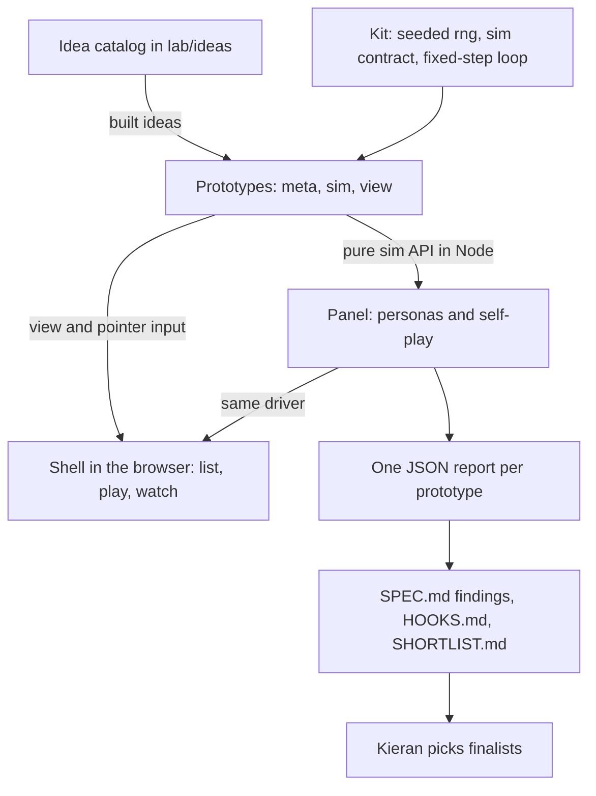
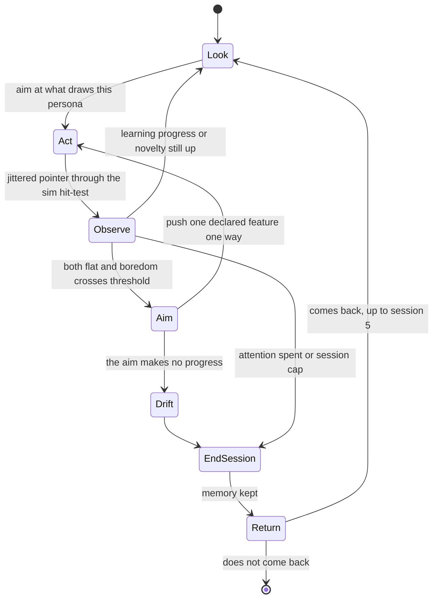
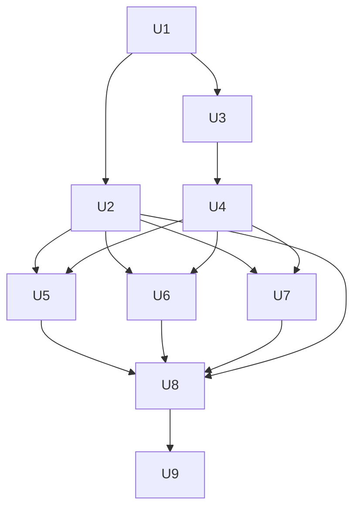

# Mechanic Prototype Lab - Plan

## Goal Capsule

- **Objective:** Kieran can say, with evidence, which two or three bare-bones game loops for children hold up on repeat play (play 5 differs from play 1), so phase 3 polishes loops that earned it.
- **Means:** About 100 ideas cut on paper against a named depth engine, then 30 built as throwaway prototypes in a separate `lab/` directory and played over repeated sessions by a seeded panel of simulated child personas (KTD1, KTD4).
- **Product authority:** Kieran Klaassen's brainstorm dialogue, and the Sep 21 and Sep 23 conversations with Lucas Huizinga, whose feedback was that the current jam games look good but have little content, tricky mechanics, and unclear next steps. `CONCEPTS.md` supplies the shared vocabulary. Repo rules in `AGENTS.md` and `docs/art-direction.md` apply to jam games and do not apply to these prototypes, except where a requirement below says so.
- **Authority hierarchy:** The Product Contract wins on behaviour. A KTD wins on mechanism within the requirements it cites. A unit overrides neither.
- **Active scope:** Phase 2 of a three-phase plan (look, then mechanics, then factory). The factory in phase 3 is not active scope.
- **Execution profile:** Code, one long autonomous run that fans out wherever work is independent: U2 and U3 run side by side after U1, idea generation runs as parallel ideators and parallel critics (KTD11), and each prototype in a batch is built by its own parallel builder (U5 to U7).
- **Stop conditions:** Stop and report when the root checks or CI go red from lab changes and cannot be fixed inside `lab/`, when a settled decision proves unworkable, or when the persona instrument fails its fixture validation (U2) and cannot be repaired. Never rank prototypes with an instrument that failed validation.
- **Finishes and ships:** The executing agent finishes through review and opens a pull request. Kieran merges and picks finalists.
- **Open blockers:** None.

---

## Product Contract

### Summary

A process and a set of prototypes for finding game loops with depth on repeat play. An agent generates about 100 one-line loop ideas, each naming its depth engine and what differs on play 5, with about a third starting from a physical toy or playground game. Thirty survive to be built as free, simple-graphics prototypes. A panel of simulated child personas plays each one, and each prototype ends with a one-page spec and a play report that phase 3 can build on.

### Problem Frame

The jam games built so far were made to test looks, and they read as style concepts rather than games. Lucas's feedback on jam.tada.computer was that they look great but have little content or tricky mechanics, and that even the promising ones (Hillside Spring, Shadow Lantern) are hard to understand.

The older diagnosis holds too. A working mechanism gives an easy wow, but games go stale after one play or after five minutes, and AI-generated content repeats the same structure in different words. The platform is not the problem.

There is no way yet to tell a loop with depth from one with only a wow. Phase 2 exists to build that evidence cheaply and at volume before any loop gets polished.

### Actors

- A1. Kieran, who reads the shortlist, picks finalists, and decides what changes in the guidelines.
- A2. Simulated child personas, which play prototypes as stand-ins for children.
- A3. Real children (Kaia and Tess are the ones named), who test the last few finalists.

### Key Decisions

- **Depth on repeat play is the primary claim** (session-settled: user-directed — chosen over clarity in 10 seconds, learning-grounding, and cheap volume: your Sep 21 diagnosis is that games go stale after one play). Governs R1, R7.
- **Prototypes are fully free of jam and cartridge rules** (session-settled: user-directed — chosen over keeping the design rules and dropping the polish: the point is to explore without constraint). Governs R4.
- **Light winning is allowed, and what it teaches may amend the guidelines and the contract** (session-settled: user-directed — chosen over rebuilding the fun without the hook, and over parking hooked winners outside Tada: some winning is fine because we can learn and maybe change the contract). Governs R9.
- **Ideas come from a depth-engine funnel, with a physical-toy lens for about a third of them** (session-settled: user-directed — chosen over the funnel alone and over breeding prototypes in waves: it is the direct answer to repetitive AI ideas). Governs R1, R2.
- **Simulated child personas test the prototypes** (session-settled: user-directed — chosen over agent self-play alone as the child-testing stage: Kieran wants tests that stand in for the children described). Governs R6, R7.
- **The filter is an assumption, not a decision:** persona panel and self-play cut the duds, Kieran picks, real children test the last few. No one has confirmed a trusted judge.

### Requirements

**Idea catalog**

- R1. About 100 loop ideas are written, each with a one-line loop, a target age, a named depth engine, and a "what is different on play 5" line. Ideas missing a depth engine or a play-5 line are cut, with the reason recorded.
- R2. About a third of the ideas start from a physical toy or playground game, and the catalog shows which ones. No more than a small share of the built prototypes rely on the same kind of depth engine.

**Prototypes**

- R3. Thirty ideas are built as prototypes, chosen so that different depth engines and age targets are all represented.
- R4. Each prototype is playable on an iPad-sized touch screen, uses simple graphics, and is free of the jam's rules: it may show words, scores, wins, or timers if that helps find a good loop. The graphics carry no effort beyond making the loop legible.
- R5. Every prototype can be opened from one place for Kieran to try, without setting anything up per prototype.

**Testing**

- R6. A panel of child personas, each defined by age, touch precision, attention span, and what draws them, plays every prototype. Personas behave like children: imprecise touches, short attention, distractible, and inclined to invent their own aims. They are seeded from Kaia and Tess plus a few archetypes across ages. Runs are repeatable given the same seed.
- R7. For every prototype the panel reports what personas touch in the first 10 seconds, whether and how they come back over repeated sessions, and whether they set goals of their own. A separate self-play report says how much outcomes vary and whether one strategy dominates. A prototype is judged on depth first, and only prototypes that pass on depth are checked for clarity.

**Outputs**

- R8. Each prototype has a one-page spec: its verb, its depth engine, what varied on repeat play, the persona and self-play findings, and its known weaknesses.
- R9. Each spec flags every hook the prototype leaned on (score, level, timer, win state, unlock), with a note on whether the persona results suggest the loop needed it. These flags are the raw material for changing the guidelines.
- R10. A ranked shortlist of finalists comes out of the reports for Kieran to choose from. Clarity blocks a finalist from going to polish but does not disqualify a prototype from the 30.

### Key Flows

- F1. From idea to shortlist
  - **Trigger:** The agent starts the run.
  - **Actors:** A1, A2
  - **Steps:** Ideas are written and cut on paper; 30 survivors are built; personas and self-play test each; reports and specs are written; the shortlist is ranked; Kieran picks finalists.
  - **Outcome:** A shortlist and 30 specs for phase 3 to use.
  - **Covered by:** R1, R3, R6, R7, R8, R10

### Acceptance Examples

- AE1. **Covers R1.** Given an idea whose loop is fun once but names no depth engine, when the catalog is cut, it is dropped and the reason is recorded.
- AE2. **Covers R6.** Given the same seed and the same prototype, when the panel runs twice, the two reports show the same persona behaviour.
- AE3. **Covers R7, R10.** Given a prototype that personas quit after one session, when the shortlist is ranked, it does not appear as a finalist regardless of how clear it was.
- AE4. **Covers R9.** Given a prototype that gives a score on each round, when its spec is written, the score is flagged and the persona results say whether players returned for it.

### Success Criteria

- All 30 prototypes are playable from one entry point.
- Each prototype has a spec with the R8 fields and a play report with the R7 findings.
- The shortlist exists, and Kieran can say from it which two or three loops he would polish and why.
- The existing checks (`npm run check` and the CI build) still pass.

### Scope Boundaries

**Deferred for later**

- The factory itself: skills, packs, and automation that turn a winning loop into a polished game (phase 3).
- Polish for the winners: art style, motion personality, performance tiers, and the rebuild that makes a winner a Tada cartridge.
- Breeding new prototypes by crossing winners.

**Outside this work**

- Changing any existing jam game, the jam shell, or the contract itself; the contract may be amended later as a result of what R9 shows.

### Dependencies / Assumptions

- The judging funnel of persona panel and self-play, then Kieran, then real children is an assumption. No one has confirmed a trusted judge.
- Personas are model guesses at children, so their findings need real-child checks before anything is committed to polish.
- Prototypes stay offline unless planning finds a reason otherwise.

<!-- ce-section: work-relationships -->
### How This Work Fits Together

This plan covers phase 2 only: finding loops with depth. The breakdown below is the current understanding, not a committed roadmap.

- Phase 1, looks (the existing jam games and `docs/art-direction.md`): done, and this work does not change it.
- Phase 3, factory (skills and packs that assemble looks and loops): Depends on the specs and reports this plan produces, and Still to decide is how packs are structured.

### Sources / Research

- `CONCEPTS.md`: quality bar, age band, guidance ladder, scene want, and cold playtest proxy, the last being the closest existing idea to a persona run.
- `docs/plans/2026-09-23-hillside-spring-plan.md` and `docs/plans/2026-09-23-shadow-lantern-plan.md`: the two games Lucas said were nice but unclear.
- Placement, from the root checks: `tsconfig.json` (`include` lists `harness`, `games`, `scripts`, `test`, `vite.config.ts`), `vite.config.ts` (vitest `include` globs), `harness/games.ts:5` (eager glob of `../games/*/index.ts`), `test/games.test.ts` (an `index.ts` in every `games/` folder), `scripts/egress-check.ts` (walks `games/`, `harness/`, and `dist/` with `--built`), `scripts/wordless-check.ts` (`isKidSideFile`, `games/**` only), `.github/workflows/ci.yml` (every branch push, then `npm run build`, then `egress:built`).
- Precedents: `games/bedtime-forest/rng.ts` (seeded mulberry32), `games/shadow-lantern/coverage.test.ts` (`solveByHints`, a headless driver), `docs/solutions/workflow-issues/record-a-deterministic-walkthrough-on-software-gl-with-a-paused-clock.md` (fixed 33 ms step, seeded randomness, software GL at about 0.8 s per frame), `docs/solutions/test-failures/frame-budget-tests-that-hold-on-a-shared-ci-runner.md` (count work, never assert wall time), `docs/solutions/conventions/wordless-clarity-for-the-declared-age-band.md` (age-band cue table with research or default basis, taps through the game's real hit-test, Kidd and Poli on attention, Bonawitz on demonstrations narrowing exploration), `docs/solutions/workflow-issues/share-a-production-build-not-the-dev-server.md`.
- Kaia is four (`docs/plans/2026-09-22-001-feat-pebble-table-plan.md`). Tess's age is not recorded anywhere in the repo.

---

## Planning Contract

Product Contract preservation: R1 to R10, A1 to A3, F1, AE1 to AE4, and the six Key Decisions carry over unchanged, except that the personas Key Decision's `Governs` line now reads R6, R7 (R5 is the shell entry point, which no Key Decision governs). The Outstanding Questions deferred to planning are resolved in KTD1, KTD6, KTD8, and KTD9 and removed from the Product Contract.

### Key Technical Decisions

- KTD1. **The lab is a top-level `lab/` directory with its own toolchain, and it changes no existing check.** The root checks use explicit allowlists (tsconfig `include`, vitest `include`, the `games/*/index.ts` glob, the `games/` and `harness/` scans), so nothing under `lab/` reaches them. The lab gets its own `tsconfig`, vitest config, and Vite config (root `lab/`, so output lands in `lab/dist`, which the existing `dist/` ignore pattern already covers, and never in the published `dist/`; port 4174 with `--strictPort`), and a new `lab` job in `.github/workflows/ci.yml` so its code is judged without touching the existing steps. Ideas, specs, and reports stay under `lab/`, because `compound audit --strict` requires frontmatter on `docs/solutions/`. Rejected: adding exemptions to the existing checks (edits the contract surface) and a folder under `games/` (the registry test demands `index.ts` and a manifest). Resolves the location question. Serves R4, R5.
- KTD2. **A prototype is a pure sim plus a thin canvas view, with no new packages.** `meta.ts` and `sim.ts` import nothing from the DOM or Vite, so Node can load them, mirroring the jam's Node-importable `manifest.ts`. `view.ts` draws flat shapes on a 2D canvas from the sim's snapshot. The shell is plain TypeScript and DOM, so nothing React-shaped leaks into sims. Physics needs use a hand-rolled fixed-step integrator or `cannon-es`, which is already a dependency. Serves R4.
- KTD3. **Runs are deterministic and headless.** Sims take an injected seed and advance in fixed 33 ms steps, in the browser and in the panel alike. `meta.ts` and `sim.ts` never call `Math.random`, `Date.now`, or `performance.now`, and a sim that needs finer stepping substeps inside `step`. The panel plays sims in Node against the pure API and never in a browser, because software GL renders about 0.8 s per frame and the panel needs millions of steps. The browser gets one smoke check per prototype. Scripts run under Node's type stripping like `scripts/*.ts`, so lab modules they import use explicit `.ts` extensions and erasable syntax only (`erasableSyntaxOnly` and `verbatimModuleSyntax` in the lab `tsconfig`, so a type imported without the `type` modifier fails `lab:typecheck` instead of failing only under Node, which keeps that import). Serves R6.
- KTD4. **Personas are seeded policy agents, not model-driven players.** A persona is a record of age, touch jitter, attention span, what draws it (novelty or mastery), aim-invention tendency, and return propensity, each parameter labelled `research` or `default` per the age-band table in `docs/solutions/conventions/wordless-clarity-for-the-declared-age-band.md`. Its policy emits screen-space pointer input with jitter through the sim's own hit-test. The sim's `affordances()` only steers where the persona aims and never replaces the hit-test, since forgiving hit areas change results and a persona that taps exact centres overstates clarity. Persona and sim are seeded separately. Model-driven personas were rejected: they are not repeatable by seed (R6) and would need an API key, which the repo's delivery rules keep out of the tree. The bake-off gate did not qualify: one mechanism survived research, so there was nothing to develop and compare. The sim contract is the boundary a model-driven driver could use later. Implements the personas Key Decision. Serves R6.
- KTD5. **Depth is read from counts and state, and the engagement signal is learning progress.** A persona's engagement decays when its own prediction of what its actions do stops improving and nothing new turns up (attention follows learning progress, per Kidd and Poli, cited in the age-band doc), so both a constant sim and pure noise bore it. At session end a persona returns with a probability equal to its return propensity scaled by how much learning progress and novelty were left when the session ended (a fixed function in `lab/panel/thresholds.ts`, drawn from the persona's seeded stream), so a session that ended bored rarely brings the child back and one that ended mid-discovery usually does. Novelty is counted against the bounded signature space the sim contract defines, so all 30 prototypes share one granularity. Every measure comes from the action and outcome stream (signatures reached, actions taken, aims pursued), never from wall time. Hints and demonstrations are off for return and self-set-aim runs and on for the first-10-seconds run, because a demonstration narrows exploration (Bonawitz, cited in the same doc). Serves R7.
- KTD6. **Panel shape: eight personas, three noise seeds each, five sessions, 3 sim-minutes per session.** The eight are Kaia (4), Tess (5, age assumed, see Assumptions), and six archetypes at ages 3, 6, 7, 8, 9, and 11 whose other traits vary independently of age. Five sessions match the claim that play 5 differs from play 1. Every session calls `createSim` fresh with a sim seed derived from the run seed and the session index, and nothing carries over between sessions except the persona's own memory, so an unlock or level hook restarts each session and the report says so. Every persona plays every prototype (R6), and the depth gate reads only the target panel: personas within one year of the prototype's target age band, widened to the nearest two when fewer fall in. The rest are reported as information. All constants live in `lab/panel/thresholds.ts`. The whole panel over 30 prototypes is estimated at about ten minutes on a laptop for hand-rolled sims (a `cannon-es` sim costs roughly 50 to 250 µs per tick, so physics-heavy prototypes run longer), and tests count ticks rather than assert seconds. Resolves the session-shape question.
- KTD7. **Self-play is three fixed policies, and hooks are ablated by config.** Policies are random, repeat-one (always the most salient affordance), and greedy on the prototype's declared objective feature. Greedy forks by replaying the input log into a fresh sim of the same seed, which deterministic sims allow, so no prototype writes a `clone`. Replay cost grows with the log, so greedy decides every 15 ticks over at most its four most salient affordances and plays episodes of at most 600 ticks (20 sim-seconds), with the constants in `lab/panel/thresholds.ts`. Variety is the entropy of outcome signatures across policies and seeds. Dominant strategy means repeat-one or greedy beats random on the objective by a margin while its own outcome variety collapses. A prototype without an objective reports variety only. The sim config's `hooks` field is the list of enabled hook names, all enabled by default. A prototype declaring hooks runs, on its target panel, one arm with the list empty and one arm per declared hook with only that hook removed, and the report shows each arm's session-3 return-share difference from the all-hooks-on run. Each hook gets one verdict: `needed` when removing it lowers the session-3 return share by more than a fixed threshold; `not needed` only when removing it changes affordances or signatures and return does not drop; `inconclusive (the persona model has no reward response)` when removal leaves affordances and signatures unchanged, because persona engagement follows learning progress and novelty and cannot register a reward. `lab/reports/HOOKS.md` prints this rule at its top. A prototype whose hook is the loop itself records `n/a` with a reason. Serves R7, R9.
- KTD8. **The catalog is typed data with a validator, and the validator owns the counts.** Depth engines are a closed set of eight defined in `lab/ideas/engines.ts`: emergence, combination, mastery, mystery, other-minds, expression, variation, and rule-play. The validator enforces: every idea has an engine and a play-5 line or is cut with a reason; no engine is primary for more than 6 of the 30 built and each is primary for at least 2; between 30 and 40 percent of written ideas are physical-toy ideas naming their toy, and at least one third of the built ones; at least 4 built per age bucket (2 to 4, 5 to 6, 7 to 9, 10 to 12), where an idea's bucket is the one containing the lowest age in its band; every built prototype has a distinct primary verb; at least 6 reserve ideas exist, counting a reserve promoted to replace a failed prototype toward that floor. `CATALOG.md` is generated from the data. Resolves the per-engine cap and how the physical-toy third is counted. Implements the funnel Key Decision. Serves R1, R2, R3.
- KTD9. **The shortlist is the depth gate, then a ranking within each age bucket, with clarity as a flag.** The gate passes a prototype when at least half its target-panel runs start session 3. Passing prototypes (the shortlist entries) are ranked within their own age bucket, by KTD8's bucket rule, on the mean rank across three sub-signals: return through session 5, change from play 1 to play 5 (novel signatures and action range), and self-set aims that made progress. Ranking is per bucket because each prototype is judged by a different persona subset, and a cross-bucket ranking would compare persona constants instead of loops. A dominant-strategy flag ranks an entry below an unflagged one of equal rank. Each entry carries a clarity flag from the first-10-seconds run, computed from cue-blind touches (spread over the field with jitter, ignoring `affordances()`) as the share that changed sim state and the ticks to the first change, because the affordance list is the builder's own declaration and cannot show whether a child would find the real target; a low flag marks the entry blocked for polish, not removed. Thresholds are fixed from the fixtures (U2) before any real prototype is scored, then frozen, so no prototype gets a threshold tuned to it. If the frozen gate passes fewer than three prototypes, nothing is retuned: `SHORTLIST.md` states the pass count and adds a near-the-gate list ordered by session-3 return share, labelled as not shortlist entries, so Kieran can decide whether to reset the gate. Ranks compare prototypes with each other and absolute values mean little. Resolves how depth is measured. Serves R7, R10.
- KTD10. **One shell, served as a production build on its own port.** The shell lists every prototype from a directory glob (the example included, marked as the reference), plays one at the hash route `#/play/<key>`, and offers a grown-up strip (restart, new seed, watch a persona play) that `?chrome=0` hides, with `?seed=` and `?watch=<persona>` for reproducing a panel run by eye. Watching a persona is how Kieran checks the personas themselves. The 1180×820 logical field is letterboxed into any viewport, and controls are touch-first at 48 px or more. The lab is shared with `npm run lab:serve` (port 4174), never the dev server, and the hand-off says which URL is the jam (4173) and which the lab. Serves R5.
- KTD11. **Ideation fans out in parallel, and each file has exactly one writer.** Eight ideators run at once, one per depth engine, each blind to the others, each writing only its own shard `lab/ideas/shards/<engine>.ts` of 14 ideas, exactly 5 of them physical-toy ideas (5 of 14 across eight shards gives 40 of 112, inside the 30 to 40 percent rule), spread over the four age buckets. Before the fan-out one writer produces `lab/ideas/toys.ts`, a list of about 40 real physical toys and playground games, partitioned among the ideators so their physical-toy ideas start from different toys. Idea ids are `<engine>-NN`, assigned inside each shard, so shards cannot collide. A second parallel round runs eight critics, each critiquing the next engine's shard in the list so no ideator judges its own work, and writing `lab/ideas/critiques/<engine>.ts` with a keep or cut verdict and reason per idea, applying the cut tests from U4. One selector then merges the shards and critiques, resolves verbs shared across shards, chooses the 30, assigns batches, orders the reserves, and writes `lab/ideas/decisions.ts`; the validator (KTD8) decides when the selection is acceptable. Rejected: a single agent writing 100 ideas in one pass (converges on the same few structures, which is the failure the funnel exists to prevent) and ideators sharing one file (parallel writes collide). Serves R1, R2, R3.

### Assumptions

- Kaia is the only documented child: age 4, plays on an iPad, does not read, Dutch-speaking (`docs/plans/2026-09-22-001-feat-pebble-table-plan.md`). Words on a prototype therefore do not help her persona, and her touch and attention numbers are still defaults.
- Tess is seeded at age 5. Her age is not recorded; the Pebble Table plan describes the trial cohort as 4 to 6 year olds. It is one field in `lab/panel/personas.ts`, and Kieran can correct it.
- Persona parameters are agent defaults except where the age-band doc cites research. Rows below age 3 stay unsupported, as in that doc.
- Learning progress is a fair stand-in for a child's interest. If personas favour novelty-chasing loops, the per-persona breakdown in each report shows it, and Kieran's own judgment stays the filter.
- Every prototype can be expressed as a landscape field of 1180×820 logical units. Orientation locking and portrait play are not needed for a mechanic test.
- Prototypes need no sound, and the loop must read without it.
- Prototypes carry nothing between sessions (KTD6), so a loop whose depth only shows by accumulating state across visits is measured as fresh visits and looks shallower than it is. Carrying state across sessions is deferred.
- The lab CI job adds a minute or two to a run and is acceptable.
- Node 24 type stripping runs the lab scripts, as it runs `scripts/*.ts`.

### Implementation constraints

- No file under `games/`, `harness/`, `scripts/`, or `test/`, and neither root `tsconfig.json` nor root `vite.config.ts`, changes. Additive edits are allowed to `package.json` (scripts only), `.github/workflows/ci.yml` (one new job), `AGENTS.md`, and `CONCEPTS.md`. The jam's home page does not link to the lab, since open work edits that page.
- Nothing under `lab/` imports from `games/` or `harness/`, and nothing there is imported by them.
- Prototype source stays offline: no network calls or URLs, no new packages. A lab-side test enforces it, since the jam's egress scan does not look in `lab/`.
- Determinism holds in prototypes and in the panel: no `Math.random`, `Date.now`, or `performance.now` in `meta.ts`, `sim.ts`, or `lab/panel/`.

### Prototype recipe

Each of the 30 prototypes is one folder, `lab/protos/<key>/`, with `<key>` equal to the catalog's `protoKey`, and is done when all of these hold.

- `meta.ts` declares key, name, verb, depth engine, lens and toy, age band, hooks (by name), named features (with an objective direction where one exists), an upper bound on distinct outcome signatures (at most 64), and hook-ablation status, and it matches its catalog entry.
- `sim.ts` implements the sim contract (High-Level Technical Design) and is deterministic for a seed and an input log.
- `view.ts` draws flat shapes from the snapshot and forwards pointer input in logical coordinates. Scores, words, wins, and timers are allowed. The drawing stays under about 150 lines, and any further effort goes into the loop.
- `index.ts` exports what the shell needs and nothing else.
- `sim.test.ts` scripts a short play and asserts the loop's characteristic moment happened (a tower toppled, a mix produced a new colour), so a sim that never reaches its mechanic cannot pass. The shared contract suite in `lab/kit/contract.test.ts` covers determinism, fuzz input (taps, drags, and holds), affordances, finite features, the signature bound, and source hygiene for every prototype without per-prototype code.
- `SPEC.md` starts as a skeleton (verb, engine, what should vary, declared hooks) with marked placeholders for the report findings that U8 fills.
- A prototype that cannot be made to work in bounded effort is replaced from the reserve list by the lead, serially after the batches finish, never by a parallel builder: the failed idea becomes `cut` with a reason, the first reserve whose promotion keeps every KTD8 rule valid takes its place (its decision record names the idea it `replaces`), the failed folder is deleted, and `lab:catalog` is rerun.

### Deferred to Follow-Up Work

- A model-driven persona driver behind the same sim contract, as a second opinion on the seeded personas.
- A written protocol for testing finalists with real children.
- Carrying a prototype's state from one session to the next, for loops whose depth accumulates across visits.
- Portrait layout, sound, and a contact sheet of screenshots for all 30.

---

## High-Level Technical Design

*This illustrates the intended approach and is directional guidance for review, not implementation specification. The implementing agent should treat it as context, not code to reproduce.*



**The sim contract.** Every prototype exports `createSim(config)` with `config = { seed, hooks, hints }`, where `hooks` is the list of enabled hook names, returning:

| Member | Purpose |
|---|---|
| `step()` | Advance one fixed 33 ms tick. |
| `pointer(event)` | Raw pointer input in logical coordinates (down, move, up, with an id). The sim's own hit-test decides what was touched. |
| `affordances()` | What a child could be drawn to right now: rectangle, kind (tap, drag, hold), salience. Personas use it to choose where to aim. |
| `observe()` | The outcome signature, the named numeric features, and events since the last call (hook events, state changes). The signature is a string naming a discrete outcome class only, never coordinates, scores, or counters, and it takes between 2 and the bound `meta.ts` declares (at most 64) distinct values across a fuzz run of one session. |
| `snapshot()` | Plain data the view draws from. |

**One persona session.**



**What the panel measures** (KTD5, KTD7, KTD9).

| Measure | Source | Used for |
|---|---|---|
| First 10 seconds | With hints on and cue-blind touches: share of touches that changed sim state, ticks to the first state change, distinct action kinds. The share of aimed touches that land on a declared affordance is reported as the builder's declaration only | Clarity flag, checked only after the depth gate |
| Return | Share of target-panel runs that start session 3, 4, and 5 | Depth gate and rank |
| Play 5 against play 1 | New signatures per 100 actions, and distinct action kinds, in session 5 minus session 1 | Rank |
| Self-set aims | An aim is adopted when boredom crosses threshold and counts only if the chosen feature moved the intended way over a window | Rank, with the features chosen |
| Outcome variety | Entropy of signatures across the three self-play policies and seeds | Spec and report |
| Dominant strategy | Repeat-one or greedy beats random on the objective while its variety collapses | Flag that lowers rank |
| Hook effect | Session-3 return share with all hooks on, minus the share with all hooks off and with each hook removed alone | `lab/reports/HOOKS.md` and each spec |

**Sequencing.**



### Output Structure

```text
lab/
  README.md
  index.html
  vite.config.ts
  tsconfig.json
  vitest.config.ts
  smoke.mjs
  kit/
    rng.ts  sim.ts  loop.ts  canvas.ts  draw.ts
    contract.test.ts  isolation.test.ts  rng.test.ts  canvas.test.ts
    example/            reference prototype and template (key `example`, never one of the 30)
  shell/
    main.ts  routes.ts  list.ts  play.ts  lab.css  routes.test.ts
  ideas/
    engines.ts  types.ts  validate.ts  render.ts  catalog.ts
    toys.ts  decisions.ts
    shards/     <engine>.ts  index.ts   (x8, one writer each)
    critiques/  <engine>.ts             (x8, one writer each)
    CATALOG.md  validate.test.ts  render.test.ts  catalog.test.ts
  panel/
    types.ts  personas.ts  driver.ts  session.ts  selfplay.ts
    metrics.ts  thresholds.ts  run.ts  report.ts
    fixtures/  constant.ts  noise.ts  ladder.ts  emergent.ts  scoreOnly.ts
    *.test.ts
  protos/
    <key>/  meta.ts  sim.ts  view.ts  index.ts  sim.test.ts  SPEC.md   (x30)
  reports/
    <key>.json  (x30)  SHORTLIST.md  HOOKS.md  INSTRUMENT.md
```

### System-Wide Impact

- Root `package.json` gains `lab:*` scripts. `.github/workflows/ci.yml` gains one job. The root `tsconfig.json`, `vite.config.ts`, `.gitignore`, and every existing check are untouched, and lab scripts write only under `lab/dist`, never the published `dist/`.
- CI runs the lab job on every branch push, so a red lab job shows as a red run. The lab's own tests must stay fast and free of wall-clock assertions.
- `AGENTS.md` gets one short section so an agent opening `lab/` does not apply the jam's wordless and egress rules to it.

### Risks & Dependencies

| Risk | Mitigation |
|---|---|
| The persona model is a guess, so depth scores could reward the model's own biases | Validate the instrument on fixtures of known depth (U2) before scoring anything; report per persona and per sub-signal, not only a composite; freeze thresholds before real prototypes; real children check finalists (A3) |
| Thirty agent-built prototypes drift from the contract | A shared contract suite runs over every prototype folder, and the recipe is one template (`lab/kit/example/`) |
| Depth is measured on the sim, but a child plays the view | The smoke check confirms each view renders and takes a tap; watch mode lets Kieran compare a persona's play with the screen |
| Lab code leaks into the root checks (someone adds a glob or an include) | `lab/kit/isolation.test.ts` fails if root config references `lab` or lab imports jam code |
| A red lab CI job blocks the PR | Lab tests are quick and deterministic; nothing there asserts wall time |
| A prototype fails to build | At least 6 ordered reserve ideas replace it, swapped serially by the lead and recorded in the catalog |
| The clarity flag reads clear for a confusing prototype, because it measures responsiveness and not whether the drawing communicates | Cue-blind touches make the flag independent of the builder's affordance declaration; watch mode lets Kieran see what a persona did, and real children check the shortlist entries (A3) |
| Parallel builders see each other's half-written folders in lab-wide checks | Each builder works in its own worktree and merges only when green (U5 to U7) |
| Idea quality regresses to the same loop in new words | Distinct verb per built prototype, play-5 lines checked for escalation-only wording, and the physical-toy lens seeded from a written list of real toys |
| Parallel ideators converge on the same few loops, or write over each other | Blind ideators with disjoint toy lists and one writer per file (KTD11); cross-shard verb collisions resolved by the selector; the validator rejects a selection with a repeated verb |

---

## Implementation Units

**Phase A: Foundations (U1 to U3)**

### U1. Lab scaffold, shared kit, and shell entry

- **Goal:** A `lab/` directory that builds and serves one entry point listing prototypes, with its own typecheck, test, build, and CI job, leaving every existing check unchanged.
- **Requirements:** R4, R5, Success Criteria (existing checks pass).
- **Dependencies:** None.
- **Files:**
  - Create `lab/README.md`, `lab/index.html`, `lab/vite.config.ts`, `lab/tsconfig.json`, `lab/vitest.config.ts`, `lab/smoke.mjs`.
  - Create `lab/kit/rng.ts`, `lab/kit/sim.ts`, `lab/kit/loop.ts`, `lab/kit/canvas.ts`, `lab/kit/draw.ts`.
  - Create `lab/kit/example/{meta,sim,view,index}.ts` as the reference prototype.
  - Create `lab/shell/{main,routes,list,play}.ts` and `lab/shell/lab.css`.
  - Modify `package.json` (scripts `lab:dev`, `lab:typecheck`, `lab:test`, `lab:build`, `lab:serve`, `lab:check`, `lab:smoke`) and `.github/workflows/ci.yml`.
  - Test: `lab/kit/contract.test.ts`, `lab/kit/isolation.test.ts`, `lab/kit/rng.test.ts`, `lab/kit/canvas.test.ts`, `lab/shell/routes.test.ts`.
- **Approach:** KTD1, KTD2, KTD3, KTD10. The example prototype is the template builders copy. The contract suite discovers prototypes by listing directories (Node has no `import.meta.glob`) and the shell by `import.meta.glob` from `lab/shell/` (`../protos/*/index.ts`, like the jam's `../games/*/index.ts`, plus `../kit/example/index.ts`). Both include the example under the key `example`, and a test asserts the two discover the same set and that each `lab/protos/*` folder has the recipe's files. `lab:panel` with a key runs that prototype, `example` included; without a key, and for `lab:report` and the catalog's built count, only `lab/protos/*` counts, so the example never counts toward the 30. The lab `tsconfig` sets `verbatimModuleSyntax` next to `erasableSyntaxOnly`, and the example uses `import type` for every type import so builders copy the pattern. The new CI job runs `lab:check` and `lab:build` and nothing else.
- **Test scenarios:**
  - The same seed gives the same rng sequence and different seeds differ.
  - Contract suite on the example: the same seed and input log give the same signature and features after N ticks; a fuzz stream (extreme coordinates, overlapping pointer ids, a down without an up, taps, drags, and holds) does not throw; `affordances()` is non-empty at the start and inside the logical bounds; features are finite; the distinct signatures seen across one fuzz session number at least 2 and no more than the bound `meta.ts` declares (itself at most 64).
  - Source hygiene, tested on in-memory strings: `Math.random`, `Date.now`, or `performance.now` in a `sim.ts` is flagged; DOM identifiers in `meta.ts` or `sim.ts` are flagged; a URL or `fetch(` in any prototype file is flagged; clean source passes.
  - Isolation: root `tsconfig.json` `include` and root `vite.config.ts` test `include` name no `lab` path; no lab file imports from `games/` or `harness/`; the lab Vite config's output directory is under `lab/`.
  - Routes: `#/play/<key>` resolves; an unknown key falls back to the list; `?chrome=0`, `?seed=12`, and `?watch=<id>` parse; a non-integer seed falls back to the default; unknown params are ignored.
  - Discovery: the shell glob's set of prototype keys equals the directory listing's, and both contain `example`.
  - Canvas fit ignores a 0×0 measurement and letterboxes 1180×820 into wide and tall viewports.
- **Verification:** `npm run lab:check` and `npm run lab:build` pass and write `lab/dist` only. `npm run check` and `npm run build && npm run egress:built` still pass. `npm run lab:smoke` opens the example at 1180×820, takes one tap, and sees no console errors (local, needs Playwright browsers).

### U2. Persona panel, self-play, and instrument validation

- **Goal:** A headless, seeded panel that plays any contract-conforming prototype over repeated sessions and reports the measures in the design, validated on fixtures whose depth is known.
- **Requirements:** R6, R7, R9 (hook ablation runner), AE2. Its gate logic supports AE3.
- **Dependencies:** U1.
- **Files:**
  - Create `lab/panel/{types,personas,driver,session,selfplay,metrics,thresholds,run}.ts`.
  - Create `lab/panel/fixtures/{constant,noise,ladder,emergent,scoreOnly}.ts`: a sim where nothing ever changes, a sim of pure noise, a sim that unlocks a new mechanic every few actions, a small combining sim with no unlocks whose state space grows from interaction, and the constant sim plus a score hook.
  - Modify `lab/shell/play.ts` (watch mode) and `package.json` (`lab:panel`).
  - Test: `lab/panel/{personas,driver,session,selfplay,metrics,run,instrument}.test.ts`.
- **Approach:** KTD4, KTD5, KTD6, KTD7. The driver is shared by the panel and the shell's watch mode so what Kieran watches is what the panel measured. Each session builds a fresh sim from the derived seed (KTD6), and the return decision follows KTD5. Thresholds are chosen against the fixtures so that `ladder` and `emergent` pass the gate while `constant`, `noise`, and `scoreOnly` fail, then frozen, and `lab/reports/INSTRUMENT.md` (written in U8) records them with each persona parameter's `research` or `default` label.
- **Test scenarios:**
  - AE2: the same seed twice gives byte-identical report JSON; a different persona seed changes the touches.
  - Instrument validation: on the fixtures the gate passes `ladder` and `emergent` and fails `constant`, `noise`, and `scoreOnly`, and both positives outrank all three negatives. The unit is not done until this holds.
  - Driver: with jitter 0 a persona hits a target's centre; with jitter larger than the target it misses at roughly the expected rate over 1000 seeded taps, and every touch goes through the sim's `pointer()`.
  - Session: memory carries across sessions while each session builds a fresh sim with the seed derived from run seed and session index; a session ends at spent attention or the cap; five sessions at most; a persona that ends a session bored returns less often than one that ends it mid-discovery over 1000 seeded draws.
  - Self-set aims: an aim is adopted only after boredom crosses the threshold and counts as progress only when the feature moves the intended way; a sim with no controllable feature yields adoption without progress.
  - Self-play: repeat-one on a fixture with a planted dominant strategy raises the flag; random on `constant` has zero variety; greedy forks by replay and matches a direct run of the same input log, and replayed ticks stay within a fixed budget counted in the test.
  - Hook ablation: with an empty `hooks` list a sim emits no hook events, and removing one named hook leaves the others; the report holds the all-off arm and one arm per hook; a hook whose removal leaves affordances and signatures unchanged gets the inconclusive verdict (`scoreOnly` shows it); a prototype marked `n/a` records its reason.
  - Clarity: the first-10-seconds flag comes from cue-blind touches; a sim that answers no touch away from its declared affordances reads low even when its declaration is honest.
  - A sim that throws mid-session is recorded as a crash in the report and the run continues; a sim with no affordances after the start yields zero affordance touches but counts free touches.
  - Source scan: `lab/panel/` has no `Date.now`, `performance.now`, or `Math.random`.
  - The input log the shell's watch mode produces for one seed equals the panel's.
- **Verification:** `npm run lab:test` passes with the instrument test included. `npm run lab:panel -- example` writes a report.

### U3. Idea catalog schema, validator, and renderer

- **Goal:** Typed idea records and a validator that make R1 to R3 checkable, and a renderer for a readable `CATALOG.md`.
- **Requirements:** R1, R2, R3, AE1.
- **Dependencies:** U1.
- **Files:**
  - Create `lab/ideas/{engines,types,validate,render,catalog}.ts`, `lab/ideas/shards/index.ts` (empty list), and modify `package.json` (`lab:catalog`).
  - Test: `lab/ideas/validate.test.ts`, `lab/ideas/render.test.ts`.
- **Approach:** KTD8, KTD11. Parallel writers each own one file, so the record is split by writer and joined. An idea draft (written by an ideator) has an id, name, one-line loop, verb, age band (whole years 2 to 12, at most 4 wide), depth engine (nullable), secondary engines, lens (`physical-toy` or `other`), toy (required for physical-toy), and play-5 line (nullable). A critique (written by a critic) has an id, a keep or cut verdict, and a reason. A decision (written by the selector, and later by the lead's replacement swaps) has an id, status (`built`, `reserve`, `cut`), cut reason, `protoKey`, batch (1 to 3), reserve order, and, for a promoted reserve, the id it `replaces`. `catalog.ts` joins the three into full records and reports drafts that lack a critique or decision. `validate()` takes the joined records and returns a list of problems, as `validateManifest` does in `harness/contract.ts`. The real catalog is validated in U4, so these tests use in-memory records.
- **Test scenarios:**
  - AE1: an idea with no engine that is `built` is a problem; the same idea `cut` with a reason passes; `cut` without a reason is a problem.
  - A physical-toy idea with no toy, a built idea with no `protoKey` or a non-kebab-case one, an unknown engine, and an age band wider than 4 years or outside 2 to 12 are each a problem.
  - An idea whose band straddles buckets (4 to 7) counts once, in the bucket of its lowest age; a promoted reserve still counts toward the floor of 6 reserves.
  - Two built ideas sharing a verb, an engine primary for 7 built ideas, a physical-toy share outside 30 to 40 percent, fewer than 4 built in an age bucket, and fewer than 6 reserves are each a problem.
  - The renderer is deterministic, lists every idea id, and puts the counts summary first.
- **Verification:** `npm run lab:test` passes.

**Phase B: Content (U4 to U7)**

### U4. Ideation pass: about 100 ideas, cut on paper, 30 chosen

- **Goal:** 112 written ideas from eight parallel ideators, cut against the depth-engine test by parallel critics, with 30 chosen to build in three batches and at least 6 reserves, all recorded in the catalog.
- **Requirements:** R1, R2, R3, AE1.
- **Dependencies:** U3.
- **Files:**
  - Create `lab/ideas/toys.ts`, `lab/ideas/shards/<engine>.ts` (eight), `lab/ideas/critiques/<engine>.ts` (eight), and `lab/ideas/decisions.ts`.
  - Modify `lab/ideas/shards/index.ts` (list the eight shards).
  - Create `lab/ideas/CATALOG.md` (generated) and `lab/ideas/catalog.test.ts`.
- **Approach:** KTD11 sets the shape, and the funnel exists to beat repetitive ideas, so the work runs in four steps.
  1. **Toys, one writer.** Write about 40 real physical toys and playground games (marble runs, blocks, see-saws, hopscotch, tag, hide and seek, sandpits, water play, dominoes, string figures, slinkies, kites, shadow puppets, and more), each with the physical behaviour a loop could borrow, partitioned into eight disjoint lists of about five.
  2. **Ideate, eight ideators in parallel.** Each gets one engine's definition, the idea draft shape, the age buckets, its own toy list, and the rules: 14 ideas, exactly 5 of them physical-toy ideas built on its toy list, 3 or 4 per age bucket (by the lowest age in the band), each with a loop, a verb, an age band, and a play-5 line that names what concretely changes. An ideator writes only its own shard and does not read the others.
  3. **Critique, eight critics in parallel.** Each critiques the next engine's shard and writes a keep or cut verdict with a reason per idea. Cut any idea whose engine does not actually produce the play-5 difference, whose play-5 line is only escalation (harder, faster, more levels, a higher score), that cannot be a pure deterministic sim on a 1180×820 field in bounded effort, or that shares a verb with a stronger idea in the same shard.
  4. **Select, one writer.** Merge shards and critiques, resolve verbs shared across shards, choose the 30 by the KTD8 constraints, and assign batches so each has ten prototypes, at least four engines, and at least three physical-toy ideas, so a partly finished lab is still balanced. Order the reserves. Run the validator; a failing rule sends the selector back to swap ideas, and an engine or age bucket that cannot be filled sends one targeted ideator round that rewrites the gap engine's shard (for a bucket gap, the shard with the most cut ideas) in place, swapping critic-cut ideas for new ones aimed at the gap while keeping 14 ideas and exactly 5 physical-toy ideas, and the paired critic re-critiques the changed ideas so every draft still has exactly one critique.
- **Test scenarios:**
  - The real catalog passes `validate()` with every KTD8 rule.
  - It holds at least 100 written ideas across eight shards of 14, exactly 30 built (10 per batch), and at least 6 reserves.
  - Every shard's ideas carry that shard's engine as primary, ids prefixed with the engine, and exactly 5 physical-toy ideas whose toy is in `toys.ts`; ids are unique across shards.
  - Every draft has exactly one critique, and every decision names an existing id.
  - At least 10 ideas are cut and each has a reason (the funnel cut something).
  - No built idea's play-5 line consists only of escalation wording.
  - `CATALOG.md` matches what the renderer produces from the data.
- **Verification:** `npm run lab:test` and `npm run lab:catalog` (no diff after running).

**Batches of ten (U5 to U7).** Each batch follows the Prototype recipe. The batch number in the catalog says which ten ideas a unit builds. Batches and the ten builders inside a batch are independent and run in parallel, each builder in its own git worktree branched from the U4 result, running the full `npm run lab:check` there and merging only when green; the lead runs `lab:check` once more on each combined batch.

### U5. Prototype batch 1

- **Goal:** The ten batch-1 prototypes are playable from the shell and pass the contract suite.
- **Requirements:** R3, R4, R5, R9 (hook declarations).
- **Dependencies:** U2, U4.
- **Files:** Create `lab/protos/<key>/{meta,sim,view,index}.ts`, `lab/protos/<key>/sim.test.ts`, and `lab/protos/<key>/SPEC.md` for each batch-1 key. No other file is touched, and `lab/ideas/decisions.ts` and `lab/ideas/CATALOG.md` change only through the lead's replacement rule.
- **Approach:** The Prototype recipe. Copy `lab/kit/example/`. Declare hooks by name in `meta.ts`, honour the `hooks` list (an empty list means no hook events, and each named hook can be removed alone), and declare a signature bound. Put any idle hint behind `hints` so the panel can hold it fixed.
- **Test scenarios:** For each prototype, in `sim.test.ts`:
  - A scripted play reaches the loop's characteristic moment.
  - The same seed and script give the same signature.
  - For a `variation` prototype, two seeds give at least two distinct signatures after the same script.
  - An empty `hooks` list yields no hook events, and removing one named hook leaves the others working.
  - The shared contract suite passes without per-prototype code.
- **Verification:** `npm run lab:check`. `npm run lab:smoke` opens each at 1180×820, a tap leaves a non-blank canvas, and there are no console errors (local).

### U6. Prototype batch 2

- **Goal:** The ten batch-2 prototypes are playable from the shell and pass the contract suite.
- **Requirements:** R3, R4, R5, R9 (hook declarations).
- **Dependencies:** U2, U4.
- **Files:** As U5, for the batch-2 keys.
- **Approach:** As U5.
- **Test scenarios:** As U5.
- **Verification:** As U5.

### U7. Prototype batch 3

- **Goal:** The ten batch-3 prototypes are playable from the shell and pass the contract suite.
- **Requirements:** R3, R4, R5, R9 (hook declarations).
- **Dependencies:** U2, U4.
- **Files:** As U5, for the batch-3 keys.
- **Approach:** As U5.
- **Test scenarios:** As U5.
- **Verification:** As U5.

**Phase C: Synthesis (U8 to U9)**

### U8. Full panel run, specs, hook table, and shortlist

- **Goal:** All 30 prototypes have a panel report, a completed one-page spec, and a ranked shortlist Kieran can choose from.
- **Requirements:** R7, R8, R9, R10, F1 (closes it), AE3, AE4.
- **Dependencies:** U2, U5, U6, U7.
- **Files:**
  - Create `lab/panel/report.ts` and `lab/panel/report.test.ts`.
  - Create `lab/reports/<key>.json` for each prototype, `lab/reports/SHORTLIST.md`, `lab/reports/HOOKS.md`, `lab/reports/INSTRUMENT.md`.
  - Modify each `lab/protos/<key>/SPEC.md` and `package.json` (`lab:report`).
- **Approach:** KTD7, KTD9. Run the panel, then `report.ts` fills each spec's marked findings section, writes the hook table (each hook, the return-share effect of removing it alone, and the KTD7 verdict), and writes the shortlist ranked within each age bucket with a clarity flag and, for a low one, the reason it is blocked for polish. When fewer than three prototypes pass the frozen gate, it adds the near-the-gate list KTD9 describes and changes no threshold. The parts of each spec that need judgment (what varied on repeat play, known weaknesses) are written from the report data and stay within one page.
- **Test scenarios:**
  - AE3: a report whose target-panel runs quit after session 1, with a perfect clarity result, is absent from the shortlist entries.
  - Ranking is per age bucket: two passing prototypes in different buckets are never ordered against each other, and each bucket's entries are ordered by mean sub-signal rank.
  - With a fixture set where fewer than three prototypes pass, `SHORTLIST.md` states the pass count and lists near-the-gate prototypes without calling them shortlist entries.
  - AE4: a prototype declaring a `score` hook produces a row in `HOOKS.md` with its own arm, the all-off arm, and a verdict under the KTD7 rule; a hook whose removal changes nothing reads inconclusive.
  - The ranking does not change when persona order is shuffled.
  - Running `lab:report` twice produces no diff.
  - Every one of the 30 specs contains all R8 fields, and none runs past 70 lines.
  - Every shortlist entry carries a clarity flag.
- **Verification:** `npm run lab:panel`, `npm run lab:report`, and `npm run lab:test` pass, and the reports are byte-identical on a second run.

### U9. Documentation and root pointers

- **Goal:** Kieran and any future agent know what `lab/` is, how to run it, which URL is which, and that the jam's rules do not apply there.
- **Requirements:** Success Criteria; supports R5.
- **Dependencies:** U1 to U8.
- **Files:**
  - Modify `lab/README.md`, `AGENTS.md` (`CLAUDE.md` is a symlink to it), and `CONCEPTS.md` (only for terms that surfaced during the build).
- **Approach:** The README covers the scripts, the two URLs (jam on 4173, lab on 4174), reading a report, and adding a prototype from the example. The `AGENTS.md` section says the lab is exempt from jam rules, has its own scripts, and never shares imports with `games/`.
- **Test scenarios:** Test expectation: none -- documentation only. The isolation test from U1 still passes and nothing is added under `docs/solutions/`.
- **Verification:** `npm run lab:check` and `npm run check` pass.

---

## Verification Contract

| Command | Applies | Proves |
|---|---|---|
| `npm run lab:typecheck` | U1 to U9 | The lab program compiles under its own strict `tsconfig` |
| `npm run lab:test` | U1 to U9 | Contract suite, instrument validation, catalog rules, report rules, isolation |
| `npm run lab:build` | U1, U5 to U7, U9 | `lab/dist` builds and the published `dist/` is not touched |
| `npm run lab:catalog` | U3, U4 | `CATALOG.md` matches the data |
| `npm run lab:panel` and `npm run lab:report` | U2, U8 | Reports and specs regenerate byte-identically |
| `npm run lab:smoke` | U1, U5 to U7 | Each view renders at 1180×820 and takes a tap without console errors (local only) |
| `npm run check` | Every unit | The jam's typecheck, tests, egress scan, and wordless check are unaffected |
| `npm run build && npm run egress:built` | Every unit | The jam's production build and built-asset scan are unaffected |
| The new `lab` job in CI | Final push | The lab checks pass on a clean runner |

Also: the branch diff touches no path under `games/`, `harness/`, `scripts/`, or `test/`, and neither root `tsconfig.json` nor root `vite.config.ts`.

---

## Definition of Done

**Global**

- Every unit's verification passes, and CI is green on the final head including the new `lab` job.
- The catalog validates: at least 100 written ideas, 30 built across all depth engines and age buckets, at least 6 reserves, cuts with reasons.
- All 30 prototypes have the five recipe files, a spec with the R8 fields, and a report, and each opens from the shell.
- The instrument passed its fixture validation before any prototype was scored, and its thresholds and persona parameter labels are recorded in `lab/reports/INSTRUMENT.md`.
- `lab/reports/SHORTLIST.md` and `lab/reports/HOOKS.md` exist, and Kieran can name two or three loops to polish from them, or `SHORTLIST.md` states plainly how many passed the frozen gate and lists the near-the-gate prototypes.
- No key value or secret is written anywhere.
- Abandoned attempts are removed: no folder for a replaced prototype, no experimental code left behind.

**Per unit**

| Unit | Done when |
|---|---|
| U1 | The lab builds and serves the example, the isolation and contract tests pass, and the jam's checks are unchanged |
| U2 | The fixture validation holds and two runs of one seed give identical reports |
| U3 | The validator catches each rule violation in its tests and the renderer is deterministic |
| U4 | The real catalog passes every rule and `CATALOG.md` matches the data |
| U5 to U7 | Each of the ten prototypes meets the Prototype recipe and passes the shared suite and its own scripted-play test |
| U8 | Thirty reports and specs exist, the shortlist obeys AE3, and regeneration produces no diff |
| U9 | The README and `AGENTS.md` section exist and the checks still pass |

---

## Documentation / Operational Notes

- The hand-off names the lab URL (port 4174) and the jam URL (port 4173) separately, and says the lab is a production build from `npm run lab:serve`.
- Persona results are model guesses. Any statement of them in a PR or a spec says so, and real children check the finalists.
- What this run learns about placement, headless depth measurement, and persona limits is captured through the compound workflow after the lab lands, not written into `lab/`.
