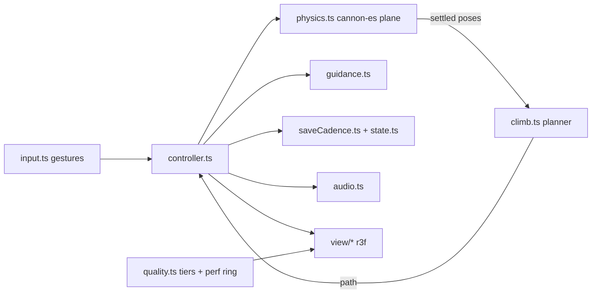
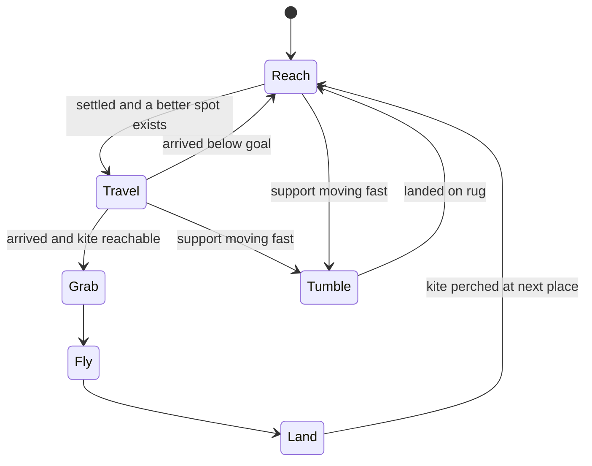

# feat: Kite Tower - rainbow wood stacking game

## Goal Capsule

- **Objective:** A wordless iPad game for ages 5 to 8 in the rainbow wood style. A kite is stuck high on a playroom shelf; a peg-doll child on the rug reaches up. The child drags rainbow arches, blocks, half-moons and planks from a wooden tray and stacks them. The peg doll climbs whatever it can, and towers sway and topple softly. When the doll reaches the kite, it flies the kite round the room, and the kite drifts to a new perch at a different height.
- **Product authority:** The jam brief (`docs/jam-10-games.md` row 3 in the Project store), the shared worker brief, and the repo rules: `AGENTS.md`, `docs/art-direction.md`, `docs/solutions/**`, `CONCEPTS.md`, `.claude/skills/jam-game-creator/SKILL.md`.
- **Where it is built:** `games/kite-tower/**`, one registry row in `docs/art-direction.md`, and this plan. Nothing else changes: no packages, harness, scripts, CI, or other games.
- **Stop conditions:** Stop and report if the game needs a dependency outside `scripts/egress-check.ts`, a harness or contract change, or anything R15 forbids.
- **Tail ownership:** LFG owns simplify, review, commit, PR (published through the GitHub MCP), and the CI watch.
- **Product Contract preservation:** Bootstrap plan; no upstream contract to preserve.

---

## Product Contract

### Summary

A tidy playroom, rendered as Grimm's-style sanded beech with watercolour stains. The child builds, and the doll's climb makes stability something the child can feel: a wide base stands, a narrow one sways, arches bridge gaps, and planks make ramps. Toppling is funny and never punished. Reaching the kite is a flight round the room, not a level. The kite then settles somewhere else.

### Requirements

- R1. One obvious want at idle: the kite is stuck up high and the doll reaches for it.
- R2. The child drags pieces from a wooden tray into one build plane, where they fall and stack under real physics (cannon-es). A tap turns a piece a quarter turn, so ramps, bridges and upside-down cradles are one tap away.
- R3. A held piece hovers above whatever is under it and shows where it will land, so a 5-year-old can place it without depth guessing.
- R4. The doll climbs to the best point it can reach on the settled build, using step-ups (hoists), ramps, hops across small gaps, and drops. With partial progress it still climbs as high as it can, so every piece that helps shows up at once.
- R5. The doll's weight pushes down on what it stands on. Narrow stacks sway visibly and can topple. Toppling tumbles pieces softly, the doll hops down unhurt with a funny reaction, and nothing breaks or is lost.
- R6. When the doll can reach the kite, it frees it and is carried round the room on the kite string, lands softly on the rug, and the kite drifts to a new perch at a different height and place. There is no counter, no level, and no end.
- R7. Two more peg dolls, each with its own personality and gait, watch, react to topples, and cheer with body language when the kite flies. The hero has a third, distinct motion set.
- R8. Guidance ladder: glow after 3 s idle, then a ghost-hand demonstration of one next move chosen from the state, backing off (5, 10, 20, 40 s) and stopping after four. Any touch clears it. A first-open invitation (the doll reaches and a tray piece wiggles) plays at most three times.
- R9. Wordless and R15-clean: no text, numerals, voice instructions, scores, timers, or verdicts on the kid side.
- R10. Lossless: piece poses and the kite's perch are saved through `ctx.storage` on every meaningful change, read by a defensive `deserialize`, and restored exactly. Put-away mid-flight restores the kite at its destination.
- R11. Attention: the render loop, physics, and audio pause while unattended or hidden. At most three fingers act; a fourth cancels everything.
- R12. Age is a dial: children aged 5 or under start at the lowest perch, older ones at a middle one. Every perch is reachable by every child.
- R13. Performance: adaptive quality tiers (DPR 2, 1.5, 1.25, 1 with effects cut in lower tiers), `?tier=N` override, `window.__jamPerf`, a hidden `?fps=1` bar-graph overlay, under 80 draw calls, no shadow maps, at most one post pass, geometry built once, nothing allocated per frame. Target `cpuP95Ms` under 8 ms at 6× CDP throttle.
- R14. The rainbow wood look at its best: one procedural beech grain atlas (albedo and roughness) tinted per object, grain that follows each face (long grain on faces and edges, end grain on cut ends), crisp bevels on every piece, lathe peg dolls, a three-light rig with no HDRI, contact shadows baked once and frozen for static props, and soft blob shadows for moving things.

### Scope boundaries

- One scene and one mode. No grown-up corner (Δ4), no spoken words (Δ3), no calendar mirror (Δ1).
- No free rotation gesture; the quarter-turn tap covers it.
- A watcher joining the climb is a stretch goal, attempted during refinement only if the core loop is solid.

---

## Planning Contract

### Key Technical Decisions

- KTD1. **A 2D build plane in a 3D room.** Pieces live on the plane z = 0 in front of the shelf. cannon-es bodies get `linearFactor (1,1,0)` and `angularFactor (0,0,1)`, so stacking is 2D physics viewed from a fixed 3/4 camera. This removes depth ambiguity for a 5-year-old and keeps the climb planner 2D. The tray, watchers, and room props sit off the plane.
- KTD2. **One shape definition drives physics, planner, and mesh.** Each piece kind is a list of convex 2D parts around its centre of mass plus a depth. Physics extrudes the parts into `ConvexPolyhedron`s, the planner reads their upward-facing edges, and the mesh is an extruded, bevelled outline of the same shape.
- KTD3. **The climb planner is pure and runs on settle, not every frame.** Standable samples come from upward-facing edges (slope up to about 38°) that have head clearance. A graph connects samples by walking, hoists (up to 1.6 units), hops (gaps up to 1.1), and drops (up to 3). A Dijkstra search picks the best reachable goal: the kite if reachable, otherwise the highest point nearest the kite.
- KTD4. **Doll weight is a real force and sway is a view effect.** While the doll stands on a piece, physics applies its weight at the contact point, so a truly unstable stack topples for real. A cheap stability margin (centre of mass against the base span of each contact-connected stack) drives a render-only sway, so a narrow tower visibly wobbles before it goes.
- KTD5. **A held piece hovers above the skyline.** Its bottom is kept above everything beneath it, and a landing shadow marks where it will fall. No overlap is possible on release, so the physics never explodes.
- KTD6. **Characters are not physics bodies.** The hero follows planner waypoints. Watchers stand behind the plane. A piece landing on a doll makes it pop up onto the piece or scoot aside.
- KTD7. **Rendering: r3f with frame work in refs.** Pieces are drawn with one instanced mesh per shape, tinted by instance colour (stain = multiply). Dolls are lathe bodies with sphere heads and painted face textures. The wood atlas has a long-grain region and an end-grain region, and per-face UVs pick a window in the right one, so no texture ever wraps. Tone mapping is the renderer's Neutral curve. The only full-screen post pass (a grade plus a vignette) runs in the top tier only.
- KTD8. **The game owns the render loop so frame CPU is measurable.** A high-priority `useFrame` renders and records update plus submit time into a preallocated ring buffer. The quality controller reads rAF intervals and changes tier with hysteresis.
- KTD9. **Guidance, input, save cadence, quality tiers, the planner, and saved state are pure modules with tests beside them,** written fresh for this game. They follow Pebble Table's shape without importing from it.

### High-Level Technical Design



Hero doll states (directional):



### Output structure

```text
games/kite-tower/
  manifest.ts  index.ts  kite-tower.tsx
  pieces.ts  climb.ts  physics.ts  state.ts  perches.ts
  guidance.ts  input.ts  saveCadence.ts  quality.ts
  controller.ts  hero.ts  audio.ts
  layout.ts  sway.ts
  *.test.ts beside each pure module
  view/ camera.ts  stage.tsx  wood.ts  shapes.ts  room.tsx  pieces.tsx  dolls.tsx  kite.tsx  game.tsx  perf.tsx
  ART.md  REFINEMENT.md
```

---

## Implementation Units

### U1. Scaffold, manifest, saved state

- **Goal:** A mountable cartridge with a versioned, defensively read state.
- **Requirements:** R9, R10, R12
- **Files:** `games/kite-tower/manifest.ts`, `index.ts`, `kite-tower.tsx`, `state.ts`, `state.test.ts` (covers perches too), `perches.ts`, `saveCadence.ts`, `saveCadence.test.ts`
- **Approach:** `ageBand [5, 8]`, `storage` permission. State holds each piece as either in the tray or on the plane (x, y, angle), plus the perch index and the flight destination. Perches are a fixed list of places with varied heights, and the next perch is always a different place and height.
- **Test scenarios:** A default state for age 5 starts at the lowest perch and for age 8 at a middle one. A null age gets the default. Garbage input, a wrong version, non-finite numbers, and unknown piece ids all fall back or are dropped without throwing. Positions are clamped into the play area. A round trip through serialize and deserialize is lossless. The next perch always differs from the current one. Save cadence saves immediately when asked, throttles while dragging, and settles a pending change.
- **Verification:** The game appears in the jam list and mounts.

### U2. Piece shapes and the climb planner

- **Goal:** Shared piece geometry and a tested route finder.
- **Requirements:** R3, R4
- **Files:** `pieces.ts`, `pieces.test.ts`, `climb.ts`, `climb.test.ts`
- **Approach:** Convex parts per kind (arch, cube, pillar, half-moon, plank), centred on the centre of mass. Helpers transform the parts, find the top and bottom of a shape at a given x, and compute the lift needed to hover above the skyline. The planner samples standable points and searches the graph described in KTD3.
- **Test scenarios:** A cube beside the doll under the lowest kite is reachable. A lone pillar (taller than a hoist) is not climbable. Stairs let the doll reach a height of 2. A plank leaning from the floor onto a cube works as a ramp. An arch between two towers bridges the gap. A gap wider than a hop blocks the route. A surface covered by another piece is not standable. Without a full route the doll still gets the highest reachable point nearest the kite. The lift keeps a held cube above a tower.
- **Verification:** vitest passes; the planner handles 12 pieces well under a millisecond.

### U3. Physics plane

- **Goal:** Soft, 2D-constrained cannon-es stacking with held-piece hover and doll weight.
- **Requirements:** R2, R3, R5
- **Files:** `physics.ts`, `physics.test.ts`
- **Approach:** Floor and side walls. Pieces become bodies with plane constraints and lowered gravity so falls look soft. Held pieces are kinematic with no collision response and follow the finger with lag. Release drops them from the hover height. Each step reports impacts (for sound), motion, and settling. Contact-connected stacks feed the sway margin.
- **Test scenarios:** A dropped cube comes to rest on the floor and the world reports settled. A cube dropped on a cube rests at height 2. A plank balanced far off-centre on a cube topples. A wide base carrying doll weight at its edge stands, while a narrow pillar with doll weight at its edge tips. A held piece has no collision response and follows its target. Bodies never leave the play area in z.
- **Verification:** vitest passes, and a live drop in the browser looks soft.

### U4. Input, controller, hero behaviour

- **Goal:** The playable loop.
- **Requirements:** R2, R4, R5, R6, R11
- **Files:** `input.ts`, `input.test.ts`, `controller.ts`, `controller.test.ts`, `hero.ts`, `hero.test.ts`
- **Approach:** The gesture tracker handles tap, drag, and the four-finger cancel. The controller ties input to physics, runs the planner on settle, drives hero state, advances the flight and the perch, triggers saves, and routes sound. The hero turns planner waypoints into timed moves (walk, hoist, hop, drop) with a pose readable by the view.
- **Test scenarios:** A fourth finger cancels every gesture until all lift. A tap on a piece turns it a quarter. A drag from the tray puts the piece on the plane. When the world settles with a cube under the lowest kite, the hero travels, grabs, and a flight starts; after the flight the perch changes and a save fires. A support moving fast sends the hero tumbling to the rug. Pausing stops time. A restored state places pieces back exactly.
- **Verification:** A scripted browser run builds, climbs, and flies.

### U5. Guidance ladder

- **Goal:** Wordless idle help.
- **Requirements:** R8, R1
- **Files:** `guidance.ts`, `guidance.test.ts`
- **Approach:** The scheduler (glow at 3 s, demonstrations from 5 s with doubling gaps, at most four, cleared by any touch, first-open peek) and `chooseHint` (tray piece to the spot beside the hero under the kite; otherwise a loose piece onto the best stack; nothing during flight), plus the hand pose over a demonstration.
- **Test scenarios:** No glow before 3 s. The first demonstration starts at 5 s and the gaps grow. At most four per idle stretch. A touch resets everything. The hint targets a tray piece when one exists, a loose piece when the tray is empty, and nothing while flying. The peek stops after three or after the first touch.
- **Verification:** vitest passes, and the idle screenshot at 6.4 s shows the glow and the hand.

### U6. Rainbow wood view

- **Goal:** The style at its best, inside the budget.
- **Requirements:** R14, R7, R1, R13
- **Files:** `view/wood.ts`, `view/shapes.ts`, `view/camera.ts`, `view/stage.tsx`, `view/room.tsx`, `view/pieces.tsx`, `view/dolls.tsx`, `view/kite.tsx`, `view/game.tsx`, `view/perf.tsx`, `quality.ts`, `quality.test.ts`
- **Approach:** Procedural grain atlas. Bevelled extruded pieces with per-face grain UVs and contact darkening baked into vertex colours. Lathe peg dolls with painted faces and a distinct motion routine each. A wooden kite with a verlet tail. Room props with contact shadows rendered once into a texture. Instanced blob shadows and glows. The three-light rig. Tiers, the perf ring buffer, and the `?fps=1` overlay.
- **Test scenarios:** The quality controller drops a tier after sustained slow frames, raises one only after a longer fast stretch, never oscillates faster than its hold time, and honours `?tier=N`. The ring buffer keeps the last 600 samples in order. The rest is `Test expectation: none -- visual; verified by screenshots and the perf probe`.
- **Verification:** A spike screenshot at 1180×820, and the probe reports draw calls under 80.

### U7. Sound

- **Goal:** Motion and sound on every touch.
- **Requirements:** R11, R5, R6
- **Files:** `audio.ts`
- **Approach:** Raw Web Audio modal wood "tok"s pitched by piece size, a pickup slide, a ratchet for the quarter turn, doll hops and hoists, topple giggles, kite wind and a pentatonic arpeggio, and landing chimes. The context is created on the first tap, suspended while unattended, and rebuilt after an interruption.
- **Test scenarios:** `Test expectation: none -- audio output verified by ear and by the controller's sound-call tests in U4`.
- **Verification:** The controller tests assert the right sound calls.

### U8. Docs, registry, refinement

- **Goal:** Register the style and log 30 iterations.
- **Requirements:** R13, R14
- **Files:** `games/kite-tower/ART.md`, `games/kite-tower/REFINEMENT.md`, `docs/art-direction.md` (one row)
- **Approach:** Follow Pebble Table's REFINEMENT format and include `cpuP95Ms` at 6× and draw calls for every pass.
- **Test scenarios:** `Test expectation: none -- documentation`.
- **Verification:** `npm run check`, `npm run build && npm run egress:built`.

---

## Verification Contract

| Gate | Proves |
| --- | --- |
| `npm run check` | Types, vitest (all units), source egress, wordless |
| `npm run build && npm run egress:built` | The built bundle is egress-clean |
| Perf probe (Chromium 4× and 6×, WebKit, Pebble Table baseline) | R13 |
| Idle screenshot at 6.4 s, walkthrough video | R1, R8, R7, R14 |

## Definition of Done

All gates are green and CI passes on the draft PR. REFINEMENT.md has 30 real passes and a "Still weak" section. Media is saved in the Project store. The final report is returned.

## Assumptions

- The youngest child (5) can drag. The first perch needs one piece placed beside the doll, and a tap on a tray piece hops it onto the rug as a fallback.
- Lowered gravity (about a third of real-world scale) reads as "soft" rather than floaty. This gets tuned during refinement.

## Risks

- **cannon-es convex stacking jitter.** Mitigate with sleep, damping, a fixed step, and modest mass ratios.
- **Planner and physics disagree** (the doll stands on air after motion). Re-plan on every settle, and send the doll tumbling when its support moves.
- **Software GL makes absolute fps meaningless on this VM.** Report CPU proxies and fps relative to Pebble Table, as the brief requires.
