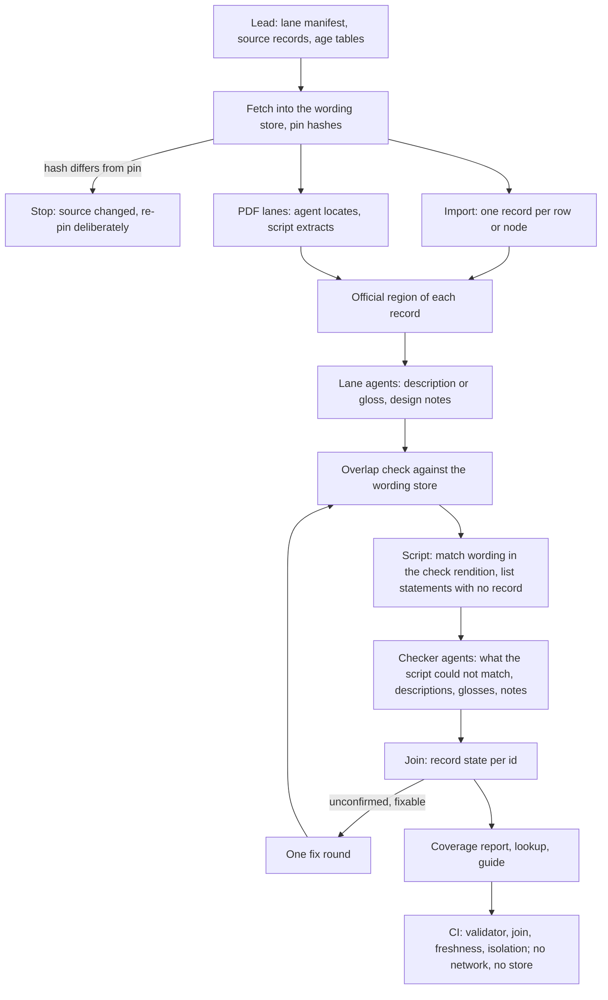
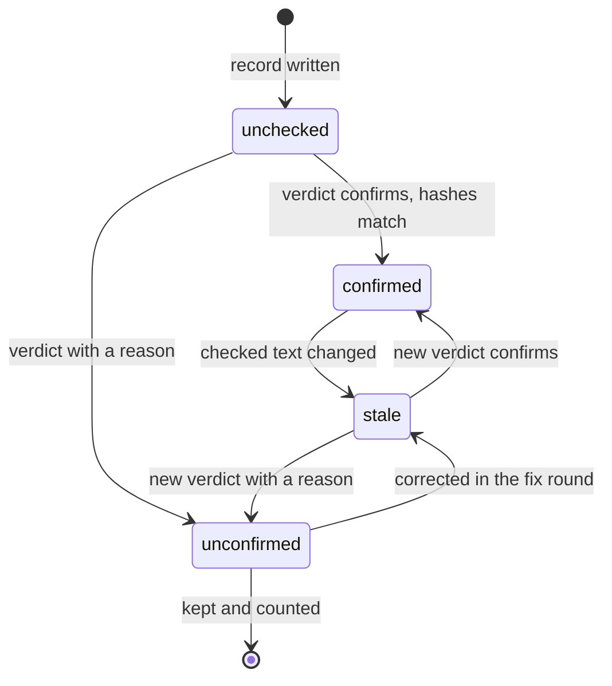

# Education Pack for California and the Netherlands - Plan

## Goal Capsule

- **Objective:** Someone designing a jam game, a person or an agent, can look up every official learning standard for a child of a given age in California or the Netherlands, in math, reading and language, science, and practical life and feelings, read its official wording and source, and trust what they find.
- **Means:** official text is imported by script from each publisher's own files into one record per standard, lane agents add the pack's own notes, and a separate pass checks every record against its source (KTD3, KTD7).
- **Product authority:** Kieran Klaassen, the owner. This plan covers the pack only. The learning games that will be designed from it are not active scope here.
- **Authority order:** the Product Contract decides what the pack is; the Planning Contract decides how it is built; a unit overrides neither.
- **Stop conditions:** stop and report if a publisher's file cannot be fetched and no other official rendition exists, if a source's terms turn out to forbid even a code-and-link record, or if evidence shows a settled Key Decision cannot work.
- **Execution profile:** code plus a large generated corpus, built by many parallel agents in one working tree (KTD13), ending in one pull request.
- **Who finishes:** the implementing agent ships the pull request; the owner decides whether to ask California's publisher for permission to commit its wording.
- **Open blockers:** none.

---

## Product Contract

### Summary

Build an education pack inside the jam repo for two places, California and the Netherlands.
It holds every official learning standard for ages 2 to 5, the first school years, and ages 9 to 12, across four subjects, one record per standard, each with its official code, wording, source and short notes for game design.
It is a reference for the people and agents who design games. A child never sees it.

### Problem Frame

The owner asked for about 20 learning games "grounded in the packs and the USA learning", aligned with what children do at school.
The pack he meant does not exist. It is two plan documents in the Tada app repo, and those cover four lanes only: Netherlands groep 5 and California grade 3, mathematics and spelling.
Nothing in either repo records a standard for ages 2 to 5, for grades 4 to 6, or for science.

The jam holds a handful of standards statements inside one convention document and one game plan, each written for a single game.
No jam game today starts at age 2 or reaches ages 11 and 12, so the ages he asked for are also the ages with the least to stand on.
Games built now would claim an alignment nobody could check.

### Key Decisions

- **The pack is built before any game.** (session-settled: user-directed — chosen over grounding each game in the official standards directly: he wants the games designed from the pack, not beside it.)
- **It is built in the jam repo now, in the record format the Tada plan specifies.** Governs R10. (session-settled: user-directed — chosen over carrying out the Tada pack plan in the Tada repo: the games follow in the same session, and the corpus can be lifted into the Tada plugin later.)
- **Every standard for the chosen ages, not a slice.** Governs R4. (session-settled: user-directed — chosen over a curated slice built for play, and over recording only what the games need: he wants the pack complete and reusable.)
- **California and the Netherlands.** Governs R1. (session-settled: user-directed — chosen over the national US frameworks: these are the two places the Tada plan uses.)
- **The deepest research, not the quickest.** Governs R11, R12. (session-settled: user-approved — chosen over a single-pass import: he asked for "the most expensive pack research", and a wrong standard would mislead every game designed from it.)
- **The pack is a Compound Pack.** Governs R19. (session-settled: user-directed — chosen over a reference folder that a designer has to be told about: he wants the normal brainstorm, plan and review flows to discover it on their own.)
- **Design notes ride on every record, kept apart from the official wording.** Governs R7, R13. A game designer needs both, and must never mistake the pack's reading for the publisher's text.
- **A level with no official per-year standard is filled from what the jurisdiction officially publishes, labelled by its standing.** Governs R5, R6. Dutch core goals are set for the end of primary school, not per groep, so the national curriculum institute's published elaborations carry the per-age detail.

### Requirements

**Coverage**

- R1. The pack covers two jurisdictions, California and the Netherlands, kept separate.
- R2. It covers three age ranges: ages 2 to 5 (early learning); the first school years (California transitional kindergarten, kindergarten and grade 1; Netherlands groep 1 to 3); and ages 9 to 12 (California grades 4 to 6; Netherlands groep 6 to 8). Dutch per-age material follows the curriculum institute's own bands, so groep 6 arrives with the band that also holds groep 4 and 5.
- R3. It covers four subjects: mathematics; reading and language; science; practical life and feelings.
- R4. Within R1 to R3, every standard the official framework publishes is a record. None is left out for being a poor fit for a game.
- R5. Where a jurisdiction publishes no per-year standard for a cell, the pack uses what that jurisdiction officially publishes for that area and age, and invents nothing. A cell with nothing published says so in the pack.

**What a record holds**

- R6. Each record holds the official code or locator, the official wording, the jurisdiction, level and subject, the source (publisher, link, version, retrieval date), and its official standing as the publisher states it, for example a State Board-adopted standard, a legal core goal, guidance, or a draft not yet in force.
- R7. Each record holds short design notes for game makers: what the standard looks like in a child's hands at that age, its limits such as number ranges, and the common mistakes.
- R8. Dutch records keep the Dutch wording as published and add an English gloss, marked as a gloss.
- R9. Where a publisher's terms do not allow its wording to be copied, the record holds the code, the link and a faithful summary, marked as a summary.
- R10. Records follow the Tada pack plan's record kinds, identifier scheme and authority levels, so the corpus can be lifted into the Tada plugin. Any departure is written down with its reason.

**Trust**

- R11. The official wording in every record is taken from the official source, not from memory or a secondary site.
- R12. Every record is checked a second time against its source by a pass that did not write it. A record that fails the check, or cannot be checked, is marked unconfirmed with the reason. It is neither dropped nor kept as if confirmed.
- R13. A reader can tell at a glance which text in a record is official wording, which is a reviewed summary or gloss, and which is the pack's own inference.
- R14. A Dutch goal is never recorded as equal to a California standard, or the reverse. Each lane stands alone.
- R15. The pack is used only while designing and building. It is never shown to a child, never read by a game while it runs, and is not part of the published jam.

**Use**

- R16. A game designer can get every record for a jurisdiction, an age or level, and a subject in one lookup, and can find a single record by its code.
- R17. A coverage report shows, for each jurisdiction, level and subject, the number of records, how many are confirmed and unconfirmed, and the source and version they came from.
- R18. A short guide tells a game designer how to choose records for a game and how to cite them in the game's plan.
- R19. The pack is declared as a Compound Pack in the repo's Compound Engineering config, so a brainstorm, plan or review of a game with a learning goal finds the pack's rules without being told and cites them.

### Acceptance Examples

- AE1. **Covers R16.** Given a designer planning a math game for a ten-year-old in California, when they look up California, age 10, mathematics, then they get the records for every grade a ten-year-old can be in, each with its code.
- AE2. **Covers R12, R13.** Given a record whose wording differs from the source at the second check, when the check finishes, then the record is marked unconfirmed, the difference is noted on it, and the coverage report counts it as unconfirmed.
- AE3. **Covers R9, R13.** Given a publisher whose terms forbid copying its text, when its standards are recorded, then each record shows a summary marked as a summary beside the code and link, and no copied wording.
- AE4. **Covers R5.** Given a jurisdiction that publishes nothing for practical life and feelings at ages 9 to 12, when the pack is built, then that cell states that nothing is published, and holds no invented records.
- AE5. **Covers R8, R14.** Given a Dutch goal and a California standard about the same skill, when a designer reads both, then each appears in its own lane in its own language, and nothing states that they are equivalent.

### Success Criteria

- A fresh reader checks a random sample of confirmed records in every lane against the live official source and finds no wording errors.
- The coverage report has no empty cell without an explanation.
- For each of the three age ranges and four subjects, a designer planning the learning games can cite at least one confirmed record per jurisdiction, or point to the pack's statement that none exists.

### Scope Boundaries

- The learning games themselves. They are the next piece of work and are designed from this pack.
- Other countries, other US states, and the national US frameworks as lanes of their own.
- Ages 7 and 8 as a target: California grades 2 and 3 are not recorded, and Dutch groep 4 and 5 material is present only because it shares a band with groep 6 (R2). Also grade 7 and above.
- Serving the pack to cartridges or to children while a game runs.
- The Tada plugin packaging: its manifests, its provider skill, and the benchmark described in the Tada plans.
- Measuring what children learn.
- Translating official text beyond the short gloss in R8.
- Official material in areas outside the four subjects in R3, such as arts, physical education, history and geography, English as a foreign language and digital literacy. Each lane's frame lists what it leaves out.

#### Deferred to Follow-Up Work

- California's English Language Development standards (about 345 records): a separate set for English learners, levelled by proficiency, not part of reading and language as a subject.
- The Netherlands' older per-groep examples (TULE): legacy guidance tied to the 2006 goals, superseded for this purpose by the per-band goals the pack does record.
- A human review pass, which the Tada format needs before it treats a record as reviewed (KTD10).
- Committing California wording, once the owner has permission from its publisher (KTD5).

#### Considered and not built

- A committed search index. Lookup reads the record files directly and is fast enough; a committed index would be a second copy to keep fresh. Evidence that would change this: lookups taking seconds.
- Automatic re-fetch in CI to detect that a publisher changed a file. CI runs without network by design; a changed file is caught the next time anyone runs the fetch. Evidence that would change this: a game designed from a superseded record.
- A third agent to arbitrate every disagreement between writer and checker. One fix round is planned (U8); what still disagrees stays unconfirmed with its reason, which is what R12 asks for.

<!-- ce-section: work-relationships -->
### How This Work Fits Together

This plan covers the education pack. The breakdown below is the current understanding, not a committed roadmap.

- **The learning games.** Depends on this pack. What the owner decided for them on 2026-10-01, to be carried into their own plan:
  - Each demo he marked "Build it" becomes a real jam game with a school skill built in: monster-pizza, balloon-pop-parade, boo-boo-vet, fire-truck-hero, muddy-truck-wash, wild-hair-salon, fruit-slicer, claw-machine, campfire-nights, bread-day, princess-playground. New designs are added for the older children.
  - About 7, 7 and 6 games across ages 2 to 4, 4 to 6 and 9 to 12, and more where the evidence supports it.
  - All four subjects in R3.
  - Numerals and math symbols may appear from about age 6; games for the youngest stay free of words and numerals. This amends the jam's wordless rule and is written down when the games are planned.
  - Lively and funny like the job demos, never slow or quiet, and still without scores, coins or rewards. He rated most of the calm open-ended demos "No" for being too slow or too quiet.
  - His bar: animated, deep, fun, cute and emotional, at the level of a top-tier cute game, in a wide spread of looks, shown on the jam home page.
  - Added later the same day: the games must be fun enough to come back to for weeks, not boring, with real depth, and may carry short animated scenes and other fun moments. Research on what makes good games comes before their design. Coming back must be earned by depth and delight, since the jam still allows no scores, streaks or other hooks.
  - Still to decide: how reading games for ages 4 to 6 show letters when the youngest games carry no words; how many games reach the full jam quality bar in one run.
- **Lifting the pack into the Tada plugin.** Enables the provider skill and benchmark in the Tada plans. Can proceed independently of the games.
- **Publishing to jam.tada.computer.** Shares nothing with this pack (R15). Still to decide: who runs the manual production deploy.

### Dependencies / Assumptions

- The official sources named in the Planning Contract's source table were reachable on 2026-10-01 and are assumed to stay reachable while the pack is built.
- California's education department website shows a robot check after a handful of page requests, while its files and its standards search tool keep working. Fetching is slow, cached and done once (KTD4).
- The repo is public on GitHub, so anything committed is published.
- The Tada pack plan's record format is treated as fixed input (R10). The plan itself is not carried out here.
- `pdftotext` is available on the machine that builds the pack. CI does not need it.

### Outstanding Questions

**Resolve Before Planning**

None.

**For the owner, not blocking**

- Whether to ask California's education department (and its Department of Social Services, for the infant and toddler foundations) for permission to commit their wording. Until then California records follow R9 (KTD5).
- What a very short California standard should carry. Many health standards are one short sentence (the kindergarten health standard with code K.1.2.S is one sentence of three words). The plan writes a summary in the pack's own words wherever one can honestly differ from the official sentence, and leaves the summary out where it cannot, so such a record shows its code, link and design notes only. The coverage report counts them. The other choice is a near-identical summary, which puts something very close to the publisher's sentence in a public repo.

**Deferred to Implementation**

- The exact subject each California infant and toddler "cognitive" foundation maps to, decided statement by statement in the lane manifest (KTD14).
- Whether California's voluntary social-emotional guidance can be fetched from the official page; if not, its cell states the gap (R5).
- Second renditions for California science in kindergarten, grade 1, grade 4 and grade 5, and for the Dutch per-band goals: each lane's check rendition is confirmed when the manifest is written (KTD2).

### Sources / Research

- In the Tada app repo: `docs/plans/2026-08-22-001-feat-tada-education-pack-corpus-plan.md` (record kinds, identifier scheme, authority levels, source fields, the four v1 lanes, and "never ships as a live child-facing brain") and `docs/plans/2026-08-22-002-feat-localized-education-pack-benchmark-plan.md`.
- In the Tada app repo: `docs/ideation/2026-07-23-top20-country-pack-feasibility.html`, which reports a machine-readable source for US state standards and a machine-readable source for the Dutch core goals.
- `docs/solutions/conventions/wordless-clarity-for-the-declared-age-band.md`: the jam's only existing standards statements and its age-band cue table, which has no row below age 3.
- `docs/plans/2026-09-22-001-feat-pebble-table-plan.md`: one game's own curriculum notes, including a sources line that names early-learning and kindergarten frameworks.
- `lab/arcade/RATINGS.json` and `lab/arcade/GENTLE.md`: the owner's ratings and the rules that came from his steer.
- `games/*/manifest.ts`: the 13 existing games span ages 3 to 10.

---

## Planning Contract

Product Contract preservation: restructured, with one narrowing flagged for the owner. R1 no longer uses "lanes" for jurisdictions, because a Lane is one jurisdiction, level and subject (`CONCEPTS.md`). R2 states that Dutch groep 6 arrives with its whole band. R6 says "official standing as the publisher states it" where it said "binding standard or official guidance", because California's own documents say its standards are not binding on local agencies. R9 and AE3 ask for a summary on every record whose wording cannot be copied; KTD5 leaves the summary out where it could not differ from the wording, the coverage report counts those records per Lane, and the question is listed for the owner. The Goal Capsule's stop condition on files that cannot be fetched applies to sources the manifest marks as required (KTD2).

### Key Technical Decisions

- KTD1. **The pack is a top-level `education/` island with its own toolchain, like `lab/`.** Every root check is an allowlist, so a new folder is checked by nothing until wired in, and its thousands of source links trip no existing scan. The folder is also the Compound Pack `education` (KTD16).
- KTD2. **A lane manifest, written by the lead before any record exists, is the single plan of the corpus.** For each Lane it names the sources, the canonical rendition, the rendition the second check reads, the reuse policy, the subject mapping, and the expected number of records with how that number was counted from the source's own index. An expected count taken from the import itself would be circular; where the only index is the import file, the manifest says so and the second check's reverse pass (U8) is what finds a missing standard. Each source is marked required or optional. A required source that cannot be fetched stops the build; an optional one (California's voluntary social-emotional guidance is the only one known) leaves a stated gap in its Lane.
- KTD3. **Official text is imported or extracted by script, never typed by an agent.** Importers read the publishers' own machine-readable files. For material that exists only as PDF, an agent locates each statement (page and anchor text) and a script extracts the text. Covers R11.
- KTD4. **Fetched files and extracted wording live in a content-addressed store outside the working tree.** Each source record pins the hash of the file it was read from; each record pins the hash of its official wording. A worktree can be deleted without losing the only copy, and a later fetch that returns different bytes is visible as a mismatch. A web page that stamps the day it was read into its own text (the Dutch legal site does) is pinned by the hash of its extracted regulation text after normalisation, with the raw page kept beside it, so that only a change to the text is a mismatch.
- KTD5. **A reuse policy per source decides what is committed.** Dutch legislation and the national curriculum institute's publications are `verbatim` with a source line. California's publications and the science standards' licence do not grant reproduction to this repo, so they are `description-only`: the record commits the code, locator, link and wording hash, plus a description in the pack's own words. This description is R9's "summary", and the record marks it as one. Where a faithful description would have to be the wording itself, the record commits no description and says so in its frontmatter. Two checks hold the line. A structural rule rejects an official-wording section in a description-only record. An overlap check against the wording store reads every description, every design note and every locator file of a description-only Lane, and fails on a run of eight or more consecutive words shared with the official text, on text that contains a statement's whole wording whatever its length, and on a sentence that shares more than four fifths of a statement's words in order. Both run locally over every commit between the base and the branch head before each push, because on a public repo a push has already published; the structural rule also runs in CI. Instantiates R9.
- KTD6. **One record file has three owned regions.** The importer owns the frontmatter's official fields and the official-wording section. Lane agents own the description or gloss and the design notes. A re-import rewrites only its own region, and a test proves it leaves the others byte-identical. Covers R13.
- KTD7. **The second check is a separate review file per Lane, bound to the text it checked by hash.** Each verdict carries the record id, the hashes of the wording and of the description or gloss it read, the rendition and locator it found the statement at, and a reason from a closed list when it is not confirmed. A join computes each record's state: confirmed, unconfirmed with its reason, stale because the text changed after the check, or unchecked. A record is never edited to say it is confirmed. (session-settled: user-approved — chosen over a single-pass import: he asked for the deepest research, and a wrong standard would mislead every game designed from it.) Governs R12.
- KTD8. **Each Lane states how strong its second check can be.** Where a second official rendition exists, the check reads that one. Where the material exists as one PDF only, the check is a second reading of the same file, and the coverage report says so per Lane. Wherever the check rendition is in the store, a script does the wording match and agents judge only what a script cannot (U8).
- KTD9. **Comparison is normalised and granularity follows the canonical rendition.** Whitespace, quote marks, dashes and code punctuation are normalised before any comparison or hash. When two renditions split statements differently, the checker compares the joined content and records that granularity differs; that is not a failure.
- KTD10. **The Tada record format is carried with its departures written down.** Kinds used are `source`, `frame` and `objective`. Every record is `status: draft` in Tada's sense, because Tada reserves "reviewed" for a registered human reviewer; the pack's own check state lives in the review files. Every objective record carries `authority: official` for its code and its official wording or wording hash. The description, gloss and design notes are labelled in the body as the pack's own text and count as inferred in Tada's sense, never `reviewed`; labelling by region where Tada labels the whole document is a listed departure. Added fields: `standing`, `regime`, `code_scope`, `reuse_policy`. Tooling is TypeScript with a small parser for the constrained frontmatter subset, where the Tada plan specifies Ruby. (session-settled: user-directed — chosen over carrying out the Tada pack plan in the Tada repo: the corpus can be lifted into the Tada plugin later.) Governs R10.
- KTD11. **Standing and regime use a closed vocabulary per jurisdiction.** California: State Board-adopted standard, department-published foundation, voluntary guidance. Netherlands: legal core goal, legal reference level, legal aim for childcare, curriculum-institute guidance, draft not yet in force; with a regime of 2006, 2026 or the 2027 draft, because two sets of core goals are in force until 1 August 2031.
- KTD12. **Official codes are kept as printed and are not assumed unique.** Foundation numbering restarts in every domain, and "core goal 1" exists in three Dutch sets. Each record carries the printed code plus a `code_scope` naming the document and domain. A lookup by code returns every match, labelled. Because records follow the source's granularity, it also returns the sub-part records of a queried parent code and the containing record of a queried sub-part that has no record of its own, each labelled as such.
- KTD13. **The build fans out in one working tree with one writer per Lane folder.** The lead alone writes shared files. Every brief pins the starting commit, and lanes dispatched are counted against lanes returned. A checker never sees the writer's working notes. A Lane with more than about 60 records is split into batches by a key the manifest states, one writer and one checker per batch, each owning a disjoint set of files. This follows `docs/solutions/workflow-issues/fan-out-parallel-agents-in-worktrees-from-an-explicit-base-sha.md`, where agents cut from the wrong commit built nothing.
- KTD14. **Every in-scope official statement maps to exactly one of the four subjects, and the mapping is written in the manifest.** Official domains outside the four subjects are listed in the Lane's frame as not recorded. Cross-grade material that the row exports omit, such as the mathematical practice standards and the reading anchor standards, is recorded in a cross-grade Lane.
- KTD15. **An age maps to levels through a table per jurisdiction, with sub-bands and explicit gaps.** Age 10 in California returns grades 4 and 5. Age 9 returns grade 4 and says grade 3 is not in the pack; age 7 returns grade 1 and says grade 2 is not in the pack; age 8 returns nothing and says so. Every California age from kindergarten up also returns the subject's cross-grade Lane, labelled as cross-grade. Age 2 returns the infant-toddler foundations: one record per foundation, holding the foundation statement and its 23 through 36 months indicator, with the earlier age periods named in the Lane's frame as not recorded (R2 starts at age 2). Every Dutch school age also returns the end-of-primary goals. The Dutch groep-to-age mapping is convention, not law, and is labelled so. Covers AE1.
- KTD16. **`education/` is itself the Compound Pack `education`, declared by one `packs:` entry in `.compound-engineering/config.yaml`.** Pack discovery reads only top-level markdown files that carry `title` and `applies_when`, treats `README.md` as the description, and never reads subfolders. So the top level holds the guide (`README.md`) and a small set of rule files, at most 25 so that every one is read in full; the corpus, tools, sources, reviews and other documents sit in subfolders as storage, and the rules are the only door to them. Two kinds of rule file: a few rules that say what a game with a learning goal must honour, and one map per jurisdiction and age range that says which records such a game is designed from and how to look them up. Rule text for California obeys the same reuse line as descriptions (KTD5). (session-settled: user-directed — chosen over a reference folder that a designer has to be told about: he wants the normal flows to discover it.) Governs R19.

### High-Level Technical Design

The build is a pipeline whose stages have different writers.



A record's check state is computed, never stored on the record.



What is committed depends on the source's reuse policy.

| Part of a record | `verbatim` (Dutch law, curriculum institute) | `description-only` (California, science standards) |
|---|---|---|
| Code, code scope, locator, link, version | committed | committed |
| Hash of the official wording | committed | committed |
| Official wording | committed, with a source line | wording store only |
| Description in the pack's words | not needed | committed when it can differ from the wording |
| English gloss | committed, marked as a gloss | not applicable |
| Design notes | committed, marked as inference | committed, marked as inference |

### Output Structure

```text
education/
  README.md                 the pack's description and the guide: choosing and citing records
  <rule>.md                 pack rules and age-range maps (title + applies_when), at most 25
  docs/LICENSE-NOTES.md     reuse terms per publisher, what is committed and why
  docs/TADA-DELTAS.md       departures from the Tada record format
  docs/COVERAGE.md          generated, committed, freshness-tested
  manifest.ts               the lanes: sources, renditions, counts, mapping, policy
  ages.ts                   age-to-level tables per jurisdiction
  tsconfig.json
  vitest.config.ts
  tools/                    parser, schema, validator, fetch, store, importers,
                            extractor, overlap check, review join, lookup, coverage
  sources/                  one source record per official document
  research/                 the source research this plan rests on
  corpus/<jurisdiction>/<level>/<subject>/
    frame.md                what the lane covers, leaves out, and how it is checked
    objectives/<slug>.md    one record per official statement
  locators/<jurisdiction>/<level>/<subject>.json   page and anchor per PDF statement
  reviews/<jurisdiction>/<level>/<subject>.json    second-check verdicts
```

### Sources of the official text

| Jurisdiction | Material | Rendition imported or extracted | Policy |
|---|---|---|---|
| California | Mathematics, English language arts, health: kindergarten, grades 1, 4, 5, 6. Science: kindergarten, grades 1, 4, 5 | The education department's standards search export | description-only |
| California | Grade 6 science | The State Board's preferred integrated grade 6 document; the export's rows for grades 6 to 8 are its check rendition and are not imported | description-only |
| California | Preschool and transitional kindergarten learning foundations (2024) | Domain PDFs | description-only |
| California | Infant-toddler learning and development foundations, second edition (2025) | PDF | description-only |
| California | Mathematical practice standards, reading anchor standards | Standards PDFs | description-only |
| California | Transformative social-emotional competencies | Official page, if retrievable | description-only |
| Netherlands | Core goals 2026 (Dutch, arithmetic and mathematics) | Curriculum institute open data; legal text for standing and wording | verbatim |
| Netherlands | Core goals 2006 still in force, and the struck ones usable until 2031 | Curriculum institute open data; legal text | verbatim |
| Netherlands | Draft core goals expected 1 August 2027 | Curriculum institute open data | verbatim |
| Netherlands | Reference levels 1F, 1S, 2F | Curriculum institute open data; legal text | verbatim |
| Netherlands | Per-band goals (inhoudslijnen), fase 1 to 3 | Curriculum institute open data | verbatim |
| Netherlands | Young-child cards, peuters and fase 1, four areas | PDFs | verbatim |
| Netherlands | Legal aims for childcare and early-years programmes | Legal text | verbatim |

Document titles, versions and links are in `education/research/` and become the source records in U3.

### Assumptions

The scoping confirmation was skipped at the owner's request to run the whole flow, so these inferred choices were not put to him one by one:

- California wording is not committed until permission exists (KTD5).
- A California record whose summary could not differ from the official wording carries no summary. This narrows R9 and AE3, is counted per Lane in the coverage report, and is a question for the owner.
- California's infant-toddler records hold the 23 through 36 months indicator only (KTD15).
- California's English Language Development standards and the Dutch per-groep examples are deferred.
- Draft Dutch core goals are recorded, labelled as not yet in force.
- Official domains outside the four subjects are not recorded.
- Design notes describe what a child does and the limits of the standard. They do not prescribe what a game shows on screen, because the jam's wordless rule governs that.

### System-Wide Impact

- **Published build:** the pack must never reach `dist/`. The lab's build already writes files by reading disk, and the home page reads built files by address, so an import guard alone is not enough. The job that builds also checks the built output (U1).
- **Games:** a source link inside `games/<key>/` fails the egress scan. The guide tells designers to cite the pack id or the official code there (U9).
- **Repo size:** about 3,400 to 3,800 small files, roughly tripling the file count.
- **CI:** one new job. The existing build job gains the built-output step (U1) and `npm run check` gains one isolation test; nothing else in the existing jobs changes.

### Risks

| Risk | Mitigation |
|---|---|
| California wording reaches the public history through a description, a note or a locator | KTD5's two checks, run over every commit in the range before each push; short statements are caught by the whole-statement rule |
| A PDF's text layer breaks a word at a line end or interleaves two columns | Checked corrections in the locator (U6), each verified against the page by the checker (U8) |
| A check rule has to change after the whole corpus is written | Four pilot Lanes go through the check and its join before the rest are dispatched (U7) |
| A confirming verdict is a reading nobody tested | The script's match is re-run by the join whenever the store is present (U8) |
| A publisher edits a file in place | Hash pins on source records; a mismatch stops the fetch until re-pinned deliberately (KTD4) |
| A green validator hides a missing standard | Expected counts per Lane from the source's own index (KTD2); the join reports any Lane whose count differs |
| A "confirmed" verdict outlives an edit | Verdicts bind to hashes; an edit makes the record stale (KTD7) |
| Design notes of uneven quality across thousands of records | Marked as inference on every record; the checker flags notes that contradict the wording |
| The second check is weaker where only one rendition exists | Stated per Lane in the frame and the coverage report (KTD8) |
| An importer bug marks a whole Lane wrong | If more than a fifth of a Lane's verdicts fail for the same reason, the fix goes to the importer, not to the records |

---

## Implementation Units

### U1. The island: folder, toolchain, isolation

- **Goal:** `education/` exists with its own typecheck, tests, scripts and CI job, and cannot reach the published build.
- **Requirements:** R15; KTD1.
- **Dependencies:** none.
- **Files:** `education/tsconfig.json`, `education/vitest.config.ts`, `education/tools/isolation.test.ts`, `education/README.md` (no frontmatter; it is the pack's description, KTD16), `education/docs/LICENSE-NOTES.md`, `education/research/` (the five research documents), `package.json`, `.github/workflows/ci.yml`, `.gitignore`, `AGENTS.md`, `test/education-isolation.test.ts`.
- **Approach:**
  1. First, copy the five research documents (`grounding.md`, `learnings.md`, `repo-research.md`, `web-california.md`, `web-netherlands.md`) into `education/research/`. Until then they exist only in the planning session's scratch folder, `pack-research/` under the session scratchpad in `/private/tmp/claude-501/`, which does not survive a restart.
  2. Mirror the lab's island: strict TypeScript with erasable syntax only, a vitest config rooted in the folder, `education:typecheck`, `education:test` and `education:check` scripts, and a CI job that runs the check.
  3. The isolation test asserts that nothing under `games/`, `harness/`, `showcases/`, `lab/`, `scripts/` or `test/` imports from `education/`, that `education/` imports from none of them, and that the root configs do not name it.
  4. Add an `education:built` script that scans `dist/` for pack record ids and fails when `dist/` is missing, and run it as a step after the built-asset egress check in the existing job that builds. A test under `test/` cannot do this, because that job runs its tests before it builds.
  5. Commit a licence note that says third-party text remains its publisher's.
- **Patterns to follow:** `lab/tsconfig.json`, `lab/vitest.config.ts`, `lab/kit/isolation.test.ts`, the `lab` job in `.github/workflows/ci.yml`.
- **Test scenarios:**
  - A file under `harness/` that imports from `education/` makes the isolation test fail and names the file.
  - A file under `education/` that imports from `games/` makes the isolation test fail.
  - The detector's own self-test catches a crossing import written three ways (static, dynamic, glob).
  - After a production build, the built-output check passes with the pack present in the repo.
  - A fixture `dist/` holding a file with a pack record id makes the built-output check fail.
  - With no `dist/` at all, the built-output check fails and says to build first.
- **Verification:** `education:check` runs green on an empty corpus, `npm run check` passes with only the isolation test added, and the CI job appears.

### U2. Record format: schema, parser, validator

- **Goal:** a record's shape is defined once and every record file can be parsed and validated.
- **Requirements:** R6, R10, R13; KTD6, KTD10, KTD11, KTD12.
- **Dependencies:** U1.
- **Files:** `education/tools/frontmatter.ts`, `education/tools/schema.ts`, `education/tools/validate.ts`, `education/tools/normalise.ts`, their `*.test.ts` files, `education/docs/TADA-DELTAS.md`.
- **Approach:**
  1. Parse only the constrained frontmatter subset the Tada plan documents: scalars, quoted strings, lists of scalars, one level of maps. Anything else is an error with file and line.
  2. Define the three kinds and their required fields, the id scheme, the standing and regime vocabularies per jurisdiction, and the owned regions with their section headings.
  3. The validator checks one file or the whole tree: schema, unique ids, id matches path, vocabulary, required regions per reuse policy, and the structural half of KTD5.
  4. Normalisation for comparison and hashing lives in one module (KTD9).
- **Patterns to follow:** `lab/ideas/validate.ts` and `lab/ideas/validate.test.ts` for a data validator with teeth; `scripts/egress-check.ts` for a scanner whose core is exported for tests.
- **Test scenarios:**
  - A well-formed objective record of each jurisdiction validates.
  - A record with an unknown standing for its jurisdiction fails and names the field.
  - Two records with the same id fail, naming both files.
  - A record whose id does not match its path fails.
  - Covers AE3. A `description-only` record that contains an official-wording section fails.
  - A `verbatim` record with no source line fails.
  - Frontmatter using a nested list, an anchor or a multi-line scalar is rejected with file and line.
  - Normalisation makes curly and straight quotes, en dash and hyphen, and runs of whitespace compare equal, and leaves letters and digits untouched.
  - Two official codes that differ only by punctuation (`4.NF.3a`, `4.NF.3.a`) normalise to the same lookup key while the printed code is preserved.
- **Verification:** the validator runs over fixtures of every kind and rejects each seeded defect.

### U3. Lane manifest, source records, age tables

- **Goal:** the whole corpus is planned in data before a single record is written.
- **Requirements:** R1 to R5, R14; KTD2, KTD8, KTD14, KTD15.
- **Dependencies:** U2.
- **Files:** `education/manifest.ts`, `education/ages.ts`, `education/sources/*.md`, `education/tools/manifest.test.ts`, `education/tools/ages.test.ts`.
- **Approach:**
  1. One manifest entry per Lane, as KTD2 defines, including cross-grade Lanes (KTD14) and Lanes whose cell has nothing published (R5).
  2. One source record per official document, from `education/research/`, with publisher, title, version, link, retrieval date, reuse policy, the quoted terms it rests on, and whether it is required or optional (KTD2). The per-band goals are read from open-data files that carry no licence file of their own, so their source record quotes the term it relies on and where that term is published.
  3. Expected counts come from the source's own index: the export's row count per grade and subject, the foundations list, the open data's node counts cross-checked against the legal text.
  4. Age tables per jurisdiction with sub-bands and explicit "not in the pack" answers (KTD15).
- **Execution note:** this unit is written by the lead alone and reviewed before fan-out; every later unit reads it.
- **Test scenarios:**
  - Every manifest Lane names at least one source record that exists.
  - Every Lane has an expected count with a stated counting method, or states that nothing is published.
  - No Lane maps to a subject outside the four in R3.
  - Covers AE1. California, age 10 returns grade 4 and grade 5.
  - California, age 9 returns grade 4 and a statement that grade 3 is not in the pack.
  - California, age 2 returns the infant-toddler level with the 23 to 36 month sub-band marked.
  - California, age 5 returns the preschool and transitional kindergarten level (later band) and kindergarten.
  - Netherlands, age 11 returns fase 3 and the end-of-primary goals, labelled as convention.
  - California, age 7 returns grade 1 and a statement that grade 2 is not in the pack.
  - California, age 8 returns the explicit "not covered" answer and no level.
  - California, age 10, mathematics also returns the cross-grade mathematics Lane, labelled as cross-grade.
  - A manifest whose required source has no pinned hash fails; an optional source with none passes when its Lane states the gap.
  - Covers AE5. No manifest entry or source record states that a Lane in one jurisdiction equals a Lane in the other.
- **Verification:** the manifest lists every cell of jurisdiction, level and subject, each with sources or an explicit gap.

### U4. Fetch and the wording store

- **Goal:** every official file is fetched once, pinned by hash, and kept outside the working tree.
- **Requirements:** R11; KTD4.
- **Dependencies:** U3.
- **Files:** `education/tools/store.ts`, `education/tools/fetch.ts`, their `*.test.ts` files, `package.json` (`education:fetch`).
- **Approach:**
  1. The store is content-addressed under a per-user cache directory, overridable by an environment variable.
  2. The first fetch of a source writes its hash into the source record; a later fetch that returns other bytes stops with the two hashes and changes nothing. For the Dutch legal pages the pinned hash is that of the extracted regulation text after normalisation, and the raw page is stored beside it (KTD4).
  3. Fetching is slow and sequential per host, and a response that is a robot check or an error page is rejected as invalid content.
  4. Mixed encodings in the export files are decoded to one encoding on the way in.
- **Test scenarios:**
  - A first fetch of a fixture file stores it and reports its hash.
  - A second fetch returning identical bytes reports "verified" and writes nothing.
  - A second fetch returning different bytes stops, names both hashes, and leaves the store and the source record unchanged.
  - Two responses for a legal page that differ only in the line stating the day it was read report "verified"; a changed sentence in the regulation text stops the fetch.
  - An HTML robot-check page served for a CSV or PDF address is rejected as invalid content.
  - A Windows-1252 file and a UTF-8 file with the same text decode to identical strings.
  - With the store directory missing, tools that need wording report which command creates it, and the validator still runs.
- **Verification:** every source in the manifest is in the store with a pinned hash.

### U5. Importers for machine-readable sources

- **Goal:** the official region of every record that has a machine-readable source is written by script.
- **Requirements:** R4, R6, R11; KTD3, KTD6, KTD9, KTD11, KTD12.
- **Dependencies:** U4.
- **Files:** `education/tools/import-california.ts`, `education/tools/import-netherlands.ts`, `education/tools/record-writer.ts`, their `*.test.ts` files, `education/corpus/**/frame.md`, `education/corpus/**/objectives/*.md`, `package.json` (`education:import`).
- **Approach:**
  1. California: one record per row of the standards search export for mathematics, English language arts and health at kindergarten and grades 1, 4, 5 and 6, and for science at kindergarten and grades 1, 4 and 5. Grade 6 science is not imported from the export: U6 extracts it from the State Board's grade 6 document, and the export's rows for grades 6 to 8 are its check rendition. California-added standards keep their marker. Band-level science rows are placed by the manifest, not repeated per grade.
  2. Netherlands: one record per node of the curriculum institute's open data for the 2026, 2006 and draft core goals, the reference levels and the per-band goals. Standing and regime come from the legal text, never from the open data's own status field, which still calls enacted goals drafts.
  3. The record writer owns only its region (KTD6) and writes the wording to the store or the file by reuse policy (KTD5).
  4. Each Lane's frame is generated from the manifest: what it covers, what it leaves out, sources, counts, and how it is checked.
- **Execution note:** prove the writer's idempotence and the count match on one Lane per jurisdiction before importing the rest.
- **Patterns to follow:** `lab/ideas/render.ts` for a generator with a check mode.
- **Test scenarios:**
  - A fixture export with three rows produces three records with the printed codes and the right levels.
  - A row carrying the California marker produces a record flagged as a California addition.
  - A mathematics sub-part row and an English language arts row with sub-parts inside it each become one record, following the source's granularity.
  - A fixture open-data tree with one core goal, two goal sentences and three items produces the records the manifest expects, with regime 2026.
  - A node whose open-data status says "draft" but whose goal is in the legal text is written with legal standing.
  - Running the import twice leaves every file byte-identical.
  - Running the import after an agent region has been filled leaves that region byte-identical.
  - A Lane whose imported count differs from the manifest's expected count fails with both numbers.
  - A `description-only` source writes no wording into the record file and a wording hash into its frontmatter.
- **Verification:** every machine-readable Lane's record count equals its expected count, and the validator passes on the whole tree.

### U6. Lanes that exist only as PDF

- **Goal:** the official region of every PDF-only record is extracted by script from a location an agent found.
- **Requirements:** R4, R5, R6, R11; KTD3, KTD8.
- **Dependencies:** U4, U5.
- **Files:** `education/tools/extract.ts`, `education/tools/extract.test.ts`, `education/locators/**`, `education/corpus/**` for these Lanes.
- **Approach:**
  1. One agent per Lane reads the cached PDF and writes a locator file: for each statement, its printed code, code scope, page, and the first and last words that bound it. An anchor is at most four words; an anchor that repeats on its page carries an occurrence number. Locator files of description-only Lanes are read by the overlap check (KTD5).
  2. The extractor reads the PDF text at each locator and writes the record's official region through the same record writer as U5.
  3. A PDF's text layer is not always what the page prints: a hyphen at a line end is dropped ("one-to-one" comes out as "oneto-one"), and two columns can interleave. A locator entry may therefore carry exact corrections, each an extracted span of at most four words, the corrected span, and a reason from a closed list that starts with "line-break hyphen". The extractor applies them, the Lane's frame lists them, and the checker verifies each one against the page (U8). The wording is still never typed by an agent beyond those spans.
  4. Lanes: California infant-toddler foundations (the 23 through 36 months indicator, KTD15), preschool and transitional kindergarten foundations, grade 6 science, mathematical practice and reading anchor standards, and the social-emotional guidance if retrievable; Dutch young-child cards for peuters and fase 1, and the legal aims for childcare and early-years programmes.
  5. A Lane whose publisher publishes nothing gets a frame that says so and no records (R5).
- **Test scenarios:**
  - A locator with page and bounding words extracts exactly the text between them from a fixture PDF text.
  - A locator whose bounding words are not on the stated page fails and names the locator.
  - Two locators that overlap fail.
  - A statement printed "one-" and "to-one" across a line break is extracted as "one-to-one" through a correction, and as the broken form without one.
  - A correction whose extracted span is not in the located text fails and names the locator.
  - A locator anchor of five words fails; an anchor that occurs twice on its page without an occurrence number fails.
  - An infant-toddler foundation becomes one record holding the foundation statement and its 23 through 36 months indicator.
  - A foundation with an earlier and a later age statement becomes one record holding both, each labelled with its age band.
  - Numbering that restarts in a new domain produces distinct ids through `code_scope`.
  - Covers AE4. A Lane marked "nothing published" has a frame that states it and zero records, and the count check passes.
- **Verification:** every PDF-only Lane's record count equals its expected count from the document's own list of statements.

### U7. Lane writing: descriptions, glosses, design notes

- **Goal:** every record carries the pack's own text in its agent-owned regions.
- **Requirements:** R7, R8, R9, R13; KTD5, KTD6, KTD13.
- **Dependencies:** U5, U6.
- **Files:** `education/corpus/**/objectives/*.md` (agent regions only), `education/tools/overlap.ts`, `education/tools/overlap.test.ts`, `education/tools/notes-lint.ts`, `education/tools/notes-lint.test.ts`, `package.json` (`education:overlap`).
- **Approach:**
  1. One agent per Lane or per batch of a large Lane (KTD13), each owning a disjoint set of files, each given the pinned starting commit and the Lane's manifest entry.
  2. Dutch Lanes: an English gloss, marked as a gloss, and design notes.
  3. California Lanes: a description in the pack's own words where one can differ from the wording, and design notes. The agent reads the wording from the store.
  4. Design notes say what the standard looks like in a child's hands at that age, the limits the framework itself states, and common mistakes, each marked as the pack's inference. They do not say what a game shows on screen; that is guidance in the Lane brief, not a lint, because the standards themselves are about reading text and writing numerals.
  5. The lead runs the overlap check (all three rules of KTD5, over descriptions, notes and locators) and the notes lint on the merged tree before committing.
- **Execution note:** run four pilot Lanes first and take them all the way through U8's check and join before dispatching the rest: a California export Lane, a Dutch core-goal Lane checked against the legal text, a Dutch per-band Lane checked against its second rendition, and a PDF-only Lane. Read their records, fix any importer, extractor or normalisation fault they show, and freeze the normalisation, granularity and closed-reason rules from what they show. A rule changed later makes every verdict stale.
- **Test scenarios:**
  - A description sharing eight consecutive words with the stored wording fails the overlap check and names the record.
  - A description sharing seven consecutive words with a twenty-word statement passes.
  - A six-word statement copied whole into a description or a design note fails.
  - A twelve-word statement copied with one word changed fails.
  - A locator file of a description-only Lane that holds eight consecutive official words fails.
  - A `verbatim` record is skipped by the overlap check.
  - A record with empty design notes fails the notes lint.
  - A Dutch record with no gloss fails; a California record with no description passes only when its frontmatter says a description is not possible.
  - After the writing pass, every importer-owned region is byte-identical to before.
- **Verification:** the lint and the overlap check pass on the merged tree, and lanes returned equal lanes dispatched.

### U8. The second check and its join

- **Goal:** every record has a verdict from a pass that did not write it, and its state can be computed.
- **Requirements:** R12, R13; KTD7, KTD8, KTD9, KTD13.
- **Dependencies:** U7.
- **Files:** `education/reviews/**`, `education/tools/review-join.ts`, `education/tools/review-join.test.ts`, `package.json` (`education:verify`).
- **Approach:**
  1. A script runs first. For each record it searches the normalised text of the Lane's check rendition in the store for the record's normalised wording and writes the match (rendition hash, page or node, offset) into the verdict. In the other direction, for every Lane whose check rendition differs from its import rendition, it lists each statement or printed code the check rendition holds for that level and subject; one with no record is an "in the rendition, no record" entry in the review file.
  2. One checker agent per Lane or batch (KTD13), given the record files and the manifest's check rendition, and nothing the writer produced besides the records. For every record, in both jurisdictions, the checker resolves what the script could not match, judges whether the description or gloss is faithful, judges whether the notes contradict the wording, and verifies each extraction correction against the page (U6).
  3. Each verdict follows KTD7. Reasons come from a closed list: wording differs, code differs, not found in the rendition, description or gloss unfaithful, notes contradict, extraction artefact, rendition unavailable.
  4. The join reports confirmed, unconfirmed by reason, stale and unchecked per Lane, plus verdicts that name no record and rendition statements that have no record. When the store is present it re-runs the script's match for every confirming verdict and rejects one whose wording is not at the stated place.
  5. One fix round: fixable findings go back to the importer or the Lane writer, the corrected text passes the overlap check again, and those records are then checked again by a different agent. What still fails stays unconfirmed.
- **Execution note:** the four pilot Lanes named in U7 pass through this unit before the remaining Lanes are written.
- **Patterns to follow:** `lab/ideas/critiques/` and its join in `lab/ideas/catalog.ts`: critiques by a different writer in separate files, joined and reported.
- **Test scenarios:**
  - Covers AE2. A verdict of "wording differs" makes the record unconfirmed with that reason and the difference note.
  - A confirming verdict whose wording hash no longer matches the record makes the record stale, not confirmed.
  - A record with no verdict is unchecked and is counted.
  - A verdict naming an id that does not exist is reported.
  - A reason outside the closed list is rejected.
  - A Lane where more than a fifth of verdicts share one failing reason is reported as a likely importer fault.
  - Two renditions that split one statement differently, with equal joined content, produce a confirming verdict with "granularity differs" noted.
  - A confirming verdict that points at a place in the rendition that does not hold the wording is rejected by the join.
  - A check rendition that holds a code no record carries makes the join report the Lane, with the code.
  - A Dutch record whose gloss changes after its verdict becomes stale.
  - A corrected record in the fix round is stale until its new verdict arrives, and is then confirmed or unconfirmed.
- **Verification:** no record is unchecked or stale, every unconfirmed record carries a reason, and every "in the rendition, no record" entry is either imported or explained in the Lane's frame.

### U9. Lookup, coverage report, guide

- **Goal:** a game designer can find records, see what is covered and how well, and knows how to cite them.
- **Requirements:** R16, R17, R18, R15; KTD12, KTD15.
- **Dependencies:** U8.
- **Files:** `education/tools/lookup.ts`, `education/tools/lookup.test.ts`, `education/tools/coverage.ts`, `education/tools/coverage.test.ts`, `education/docs/COVERAGE.md`, `education/README.md`, `package.json` (`education:find`, `education:coverage`), `AGENTS.md`, `CONCEPTS.md`.
- **Approach:**
  1. Lookup by jurisdiction, age or level, and subject; and by code. It prints each record's id, printed code, standing, check state, and wording when the store or the file has it. A lookup by age includes the cross-grade Lane (KTD15); a lookup by code includes sub-part and containing matches (KTD12).
  2. The coverage report is generated from the manifest, the records and the join, committed, and tested for freshness. Per Lane it also counts description-only records that carry no description, and rendition statements that have no record.
  3. The guide covers choosing records, reading standing and check state, never treating two jurisdictions' records as equal, and citing by pack id or official code inside `games/`.
  4. Record the pack in `AGENTS.md` beside the lab, and in `CONCEPTS.md` settle that a Lane is one jurisdiction, level and subject.
- **Test scenarios:**
  - Covers AE1. Lookup for California, age 10, mathematics lists every grade 4 and grade 5 mathematics record with its code, and the cross-grade mathematics records labelled as cross-grade.
  - Lookup by a code that exists in two scopes returns both, each labelled with its scope.
  - Lookup by `K.CC.4`, which the export holds only as lettered parts, returns its sub-part records, labelled as sub-parts.
  - Lookup by `L.K.1.a`, which sits inside its parent row, returns the parent record, labelled as containing it.
  - The coverage report shows, per Lane, how many description-only records carry no description.
  - Lookup for an age outside the pack returns the explicit "not covered" answer and no records.
  - Lookup without the wording store prints description-only records with their description and a line saying how to get the wording.
  - Covers AE2. The coverage report counts an unconfirmed record under unconfirmed for its Lane.
  - Covers AE4. A Lane with nothing published appears in the coverage report with that statement.
  - The coverage report shows each Lane's check strength (second rendition or second reading).
  - Regenerating the coverage report on an unchanged tree changes nothing; changing one verdict makes the freshness test fail until it is regenerated.
- **Verification:** the three lookups in the Success Criteria work from a fresh clone without the store, and the coverage report has no unexplained empty cell.

### U10. Publish it as a Compound Pack

- **Goal:** a brainstorm, plan or review of a game with a learning goal discovers the pack through the normal Compound Engineering flows and cites it.
- **Requirements:** R19, R14, R15, R18; KTD5, KTD16.
- **Dependencies:** U9.
- **Files:** `.compound-engineering/config.yaml`, `education/README.md`, the top-level rule files in `education/`, `education/tools/pack-rules.test.ts`, `AGENTS.md`.
- **Approach:**
  1. Add `packs:` with `source: education` to the tracked config, leaving the existing `compound:` block as it is.
  2. Write the rules, each prescriptive and short enough to quote whole, with `applies_when` in the words a game request would use: a game that claims a school skill names the pack records it rests on and reads their standing and check state; a record from one jurisdiction is never presented as equal to one from the other; inside `games/` a record is cited by pack id or official code, never by link.
  3. Write one map per jurisdiction and age range (six): the levels a child of those ages can be in, what each of the four subjects holds there in the pack's own words with the record ids to start from, the limits the frameworks state, the gaps, and the lookup command. Maps are written from confirmed records and the coverage report, and are checked by an agent that did not write them against the records they name.
  4. Run the plugin's pack resolver and health check, and one planning dry run: a fresh agent given only a one-line request for a counting game for a five-year-old, with pack discovery as the plan skill does it, must surface the matching rule and map.
- **Test scenarios:**
  - Every top-level markdown file in `education/` other than `README.md` has `title` and a non-empty `applies_when`.
  - There are at most 25 top-level rule files.
  - Every record id a rule or map names exists in the corpus.
  - Every map names its jurisdiction once and names no record from the other jurisdiction. Covers AE5.
  - The overlap check reads the California maps and rules like descriptions.
  - No rule or map contains a link (so quoting one inside `games/` cannot trip the egress scan).
- **Verification:** the resolver lists the pack `education` with no error or skipped-file warning, and the dry run cites `(pack: education, <file>)`.

---

## Verification Contract

| Gate | Command | Applies to | Done signal |
|---|---|---|---|
| Pack typecheck and tests | `npm run education:check` | U1 to U9 | passes; covers the validator on the whole corpus, the review join, coverage freshness and isolation |
| The jam's own check is untouched | `npm run check` | U1, U9 | passes with the same test count as before plus the isolation test |
| Published build stays clean | `npm run build && npm run egress:built && npm run education:built` | U1 | passes; no pack content in `dist/` |
| Lab is untouched | `npm run lab:check` | U1 | passes |
| Counts | part of `education:check` | U5, U6 | every Lane's record count equals its expected count |
| Reuse line | `npm run education:overlap` (needs the wording store) | U6, U7 | no description, design note or locator of a description-only Lane breaks any of KTD5's three rules |
| Reuse line, history | the structural rule and `education:overlap` run against each commit between the base and the branch head, before every push | U5 to U8 | passes on every commit; nothing is pushed until it does |
| Second check | `npm run education:verify` | U8 | no record unchecked or stale; unconfirmed records listed by reason; no unexplained rendition statement without a record |
| Pack discovery | the Compound Engineering pack resolver and health check; one planning dry run | U10 | the pack `education` resolves with no error or skipped file; the dry run cites a pack rule |
| Sample audit | a fresh agent per jurisdiction checks a random sample of at least 40 confirmed records against the live official source, drawn so that every Lane with confirmed records contributes at least one | Success Criteria | no wording error in the sample; any error found reopens that Lane's check |

## Definition of Done

- Every Lane in the manifest has its frame, its records at the expected count or an explicit gap, and a review file.
- Every record validates, has its agent regions filled as its reuse policy requires, and has a verdict bound to its current text.
- No California wording is in the working tree or in any commit on the branch.
- The coverage report is committed and fresh, and shows confirmed, unconfirmed and check strength per Lane.
- The pack resolves as the Compound Pack `education`, with its rules and six age-range maps at the top level and nothing else there but the guide.
- The guide, the licence notes and the Tada departures are written, and `AGENTS.md` and `CONCEPTS.md` describe the pack.
- All gates in the Verification Contract pass, and CI is green on the pull request.
- Scratch files, abandoned importer attempts and fixture leftovers are removed from the diff.
- The pull request body states what was and was not verified, the count of unconfirmed records by reason, and the open question for the owner.
