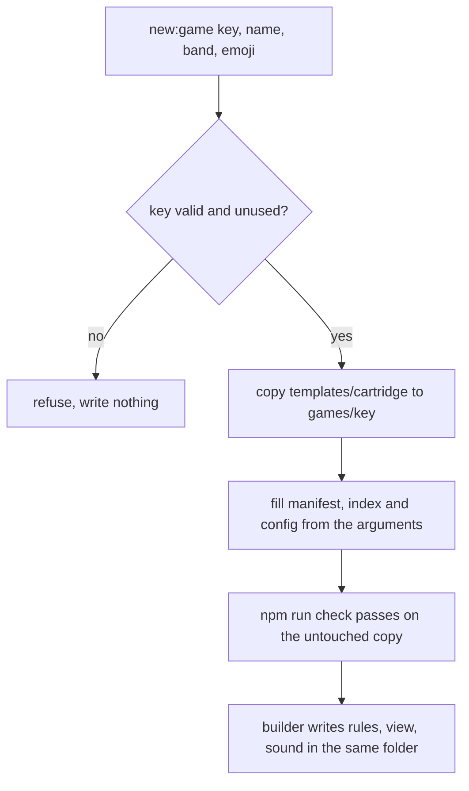

# Learning Games Foundation - Plan

## Goal Capsule

- **Objective:** A learning game for any age from 2 to 12 can be started in the jam from a tested starting point, take a look no other game has, show numerals only where the owner allowed them, and be opened in the shell at its own age, so that about twenty learning games can then be built in waves, several at a time, each at the full quality bar and each with a learning claim that can be checked against the education pack.
- **Means:** an age-aware wordless check with one symbols module per game (KTD1, KTD2), a cartridge template that is copied and gated (KTD4, KTD5), a new look menu kept as a ledger (KTD6), and a guide rewritten for learning games built in parallel (KTD7).
- **Authority:** the owner, Kieran Klaassen, decides product questions. `AGENTS.md` and the Tada cartridge contract bind every game. The two Compound Packs (`education`, `game-design`) are evidence and rules to cite, and `AGENTS.md` wins where a pack rule disagrees with it.
- **Execution profile:** small units written by the lead in order; no parallel builders are needed for this plan.
- **Stop and report when:** the wordless check cannot enforce R2 without also failing one of the thirteen existing games; or the template cannot pass the repository's gates without a game importing from outside its folder.
- **Who finishes:** this plan ends in one pull request stacked on the education pack's. The owner merges. The first wave of games is planned next and builds on this branch.

---

## Product Contract

### Summary

This plan builds what every learning game needs before the first one is written. It writes the owner's decision on numerals into the rules and into the check that enforces them. It lets the jam shell open a game at ages 2 and 9 to 12. It replaces the used-up look menu with a new one of at least 24 looks. It adds a template a new game is copied from, and it brings the building guide up to date with both packs. No game is built here. The twenty games follow in three waves, each with its own plan and pull request.

### Problem Frame

The owner asked for about twenty learning games for ages 2 to 4, 4 to 6 and 9 to 12, made from the lab demos he rated "Build it" and from new designs for older children, each designed from the education pack.

Research for that work found six things in the way.

- The wordless check knows nothing about age. Its only exception is a comment on a line, which accepts anything behind it, so "numerals from about age 6" cannot be held by the check as it stands.
- The jam shell offers child ages 3 to 8 only. Thirteen of the twenty games are for ages it cannot be set to.
- All nine looks on the menu in `docs/art-direction.md` are claimed, and the page still calls them open.
- Nothing is shared between games, by rule, so each game carries about 900 lines of copied helpers. The copies drift, several quality governors shipped wrong, and the `window.__jamPerf` declaration breaks the merged tree when one copy differs.
- No existing game is for a two-year-old or an eleven-year-old, has a designed cycle with an ending, or shows a short scene built from the state of play in the way the game-design pack asks.
- The guide, `docs/solutions/conventions/building-a-jam-game.md`, predates both packs. It has no step for a learning goal, for a 2D game, or for building several games at once.

Seven games built in parallel on that ground would each solve these alone and differently.

### Key Decisions

- **Numerals and mathematics symbols may appear from about age 6; games for the youngest stay free of words and numerals.** (session-settled: user-directed — chosen over an exemption for every learning game, over learning shown without symbols at every age, and over spoken words only: mathematics for ages 9 to 12 needs symbols and the youngest children cannot read.) Governs R1, R2, R4, R5.
- **The demos rated "Build it" become real jam games with a school skill built in, under the cartridge rules.** (session-settled: user-directed — chosen over more lab demos and over polishing the demos in place: he asked for the ones he rated high as real games in the jam.) Governs R12, R15.
- **Each game is designed from the education pack: its plan names the records its learning claim rests on.** (session-settled: user-directed — chosen over grounding a game in the official standards directly, beside the pack: he had the pack built first for this.) Governs R12, R13.
- **All four subjects.** (session-settled: user-directed — chosen over mathematics only: he asked for learning in general and chose all four.) Governs R15.
- **Lively and funny like the job demos, never slow or quiet, and without scores, coins, streaks or rewards.** (session-settled: user-directed — chosen over the calm open-ended style as the default: he rated most calm demos "No" as too slow or too quiet.) Governs R12, R15.
- **The games are built in three waves, and this foundation ships first as its own pull request.** A template fault found in review costs one fix here and seven after a wave. Governs R15.
- **Letters and written words stay off the kid side until the owner decides.** The owner's decision names numerals and mathematics symbols only, and the game-design pack leaves letters to him (pack: game-design, ages-4-to-6.md). Governs R3.

### Requirements

**Symbols by age**

- R1. A game whose age band starts at 6 or above may show numerals and mathematics symbols on the kid side, each laid on or beside the quantity it stands for. The symbols are the digits, the signs for plus, minus, times, divide, equals, less than and greater than, the fraction bar, the decimal mark and the percent sign.
- R2. A game whose age band starts below 6 shows no word, letter, numeral or symbol on the kid side, optional or not.
- R3. No game shows a letter or a written word on the kid side at any age.
- R4. `npm run wordless:check` fails a game that breaks R1, R2 or R3 wherever source code can show it, and the documents list what the check cannot see.
- R5. The symbol rule follows the game's manifest band, never the child's age at run time, and it is stated in the same words everywhere the wordless rule is stated.

**Ages**

- R6. The jam shell can open any game with no child age and at every whole age from 2 to 12.

**Looks**

- R7. `docs/art-direction.md` offers at least 24 looks that no game has claimed and that would not be mistaken for a claimed one in a screenshot, each with its kid clarity, artistry, iPad risk and the ages it suits.
- R8. Every look on the menu has a state: open, reserved for a named game, or claimed. Each of the seven games of the first wave has two or three reserved candidates, and no look is reserved twice.

**Template**

- R9. A new game starts with one command that copies a template into `games/<key>/`, and the copy passes typecheck, tests, the egress scan, the wordless check and `test/games.test.ts` before any game code is written.
- R10. The template carries, without any renderer, what every game needs and past games copied with drift or got wrong: adaptive quality, the performance handle, attention, save cadence, versioned saved state read defensively, sound that unlocks from the first touch, input that forgives a small child's hand, the idle guidance ladder, and a short-scene cue list.
- R11. The template's own code is typechecked and tested in CI, and a game still imports nothing from outside its folder.

**Guide**

- R12. The guide takes a builder from an idea to a green pull request for a learning game of any of the three age ranges, in 2D or 3D, and says in order what to do: read both packs, write the design sheet, build the touch as a toy, then the game, then the gates.
- R13. The guide says what a learning claim must contain and how it is checked: records under one heading per jurisdiction, each with its standing and check state as the lookup prints them, the level the game is designed from with the basis the lookup prints, any lane label and any gap kept as printed, limits taken from each record's Limits, no attainment wording, no California wording, and a check of the sheet by someone who did not write it before the game is built.
- R14. The guide says how several games are built at once without colliding, and what happens to a game that does not reach the bar in its wave: it is not merged.

**The games this serves**

- R15. The plan names the twenty games, their wave, age band, subject and the skill that is the verb of each, so the look reservations, the template and the guide are made for real games.

**Existing games**

- R16. The thirteen existing games and the showcase behave as before and pass every gate.

### Acceptance Examples

- AE1. Covers R1, R4. **Given** a game with band `[9, 12]` whose `symbols.ts` draws a fraction from two integers behind the numeral exception, **when** the check runs, **then** it passes.
- AE2. Covers R2, R4. **Given** the same file in a game with band `[4, 7]`, **when** the check runs, **then** it fails and names the file, the line and the band.
- AE3. Covers R3, R4. **Given** a game with band `[9, 12]` that draws text with a canvas text call in any file other than `symbols.ts` and marks it with the numeral exception, **when** the check runs, **then** it fails.
- AE4. Covers R4, R16. **Given** the thirteen existing games as they are, **when** the check runs, **then** it passes, with the twelve grown-up overlay exceptions still accepted.
- AE5. Covers R4. **Given** a kid-side file that is not a grown-up overlay and carries the plain exception comment on a text line, **when** the check runs, **then** it fails.
- AE6. Covers R9. **Given** a key that no game or showcase uses, **when** the new-game command runs with that key, a name, a band and an emoji, **then** `games/<key>/` exists and `npm run check` passes with nothing else changed.
- AE7. Covers R9. **Given** a key that already exists, **when** the command runs, **then** it refuses and writes nothing.

### Success Criteria

- The first wave's plan can assign each of its seven games a key, a band, two or three reserved looks and a design sheet outline taken from the guide, with no rule left for a builder to invent.
- A reviewer can see every kid-side symbol of a game by reading its `symbols.ts` and its grown-up overlay files.

### Scope Boundaries

- No game is built or changed here.
- The lab, the education pack's records and tools, and the Tada contract are not touched.
- Deploying jam.tada.computer stays the owner's manual step.

#### Deferred to Follow-Up Work

- The three waves of games (see "How This Work Fits Together").
- A spoken-word module and per-language content packs. No game has used on-device speech, a headless browser has no voices, and the first-sounds game needs a trial on the owner's iPad first (Open Questions, 5).
- A symbol standing alone, so that play depends on reading it, for ages 9 to 12 (Open Questions, 1).

#### Considered and not built

- A check command for one game folder. Builders work in separate worktrees, so no builder is failed by another's code, and `npx vitest run games/<key>` already scopes the slow step. Evidence that would change this: builders waiting on the full test run.
- A command that reports how every copied file differs from the template. Frozen files are held equal by a test (KTD4), and the free files are meant to diverge. Evidence that would change this: a fix to a free helper that has to reach more than a handful of games.
- Letting a game's `faces` unlock symbols for an older face. No planned game uses faces. Evidence that would change this: a game that splits its audience by face.

<!-- ce-section: work-relationships -->
### How This Work Fits Together

This plan covers the foundation. The breakdown below is the current understanding of the games, not a committed roadmap; each wave gets its own plan after the one before it, and the owner's play of each wave may change the next.

| Wave | Game (source) | Band | Subject: the skill that is the verb |
| --- | --- | --- | --- |
| 1 | Muddy Truck Wash (demo) | 2 to 4 | Practical life: a wash in its steps, each tool doing its own job; what water does to mud |
| 1 | Balloon Pop Parade (demo) | 2 to 4 | Mathematics: matching by one attribute and small sets of one to three |
| 1 | Who Made That Sound (new, from surprise-eggs) | 2 to 4 | Reading and language: listening, telling sounds apart and matching a sound to who makes it, with invented creature voices and no speech |
| 1 | Monster Pizza (demo) | 4 to 7 | Mathematics: counting out a set to match a pictured set; steps in order |
| 1 | Boo-Boo Vet (demo) | 3 to 6 | Feelings and health: reading a need from how an animal looks and behaves, and doing what helps |
| 1 | Bridge Crew (new, from draw-a-bridge) | 9 to 12 | Science and engineering: design, test and improve a crossing from a kit of parts |
| 1 | Fruit Slicer (demo) | 9 to 12 | Mathematics: fractions on a strip, the cut placed at a fraction of the length, notation laid on the quantity |
| 2 | Fire Truck Hero (demo) | 2 to 4 | Science: what water does to different things |
| 2 | Princess Playground (demo) | 2 to 5 | Science and feelings: heavy and light on the seesaw; bringing in a friend who is left out |
| 2 | Wild Hair Salon (demo) | 4 to 6 | Mathematics: longer and shorter, making a length match |
| 2 | Bread Day (demo) | 4 to 6 | Science and practical life: materials change; a task in its real order |
| 2 | A first-sounds game (new) | 4 to 6 | Reading and language: first sounds and rhyme in speech; depends on the speech trial |
| 2 | Seed Lab (new, from mutant-garden) | 9 to 12 | Science: traits pass from parents to young, with variation |
| 2 | Night Camp (demo: campfire-nights) | 9 to 12 | Mathematics: rates and planning, with the night as a test the child starts |
| 3 | A strokes game (from choo-choo-draw) | 2 to 4 | Reading and language: the strokes that come before writing |
| 3 | A small-sets game (new) | 2 to 4 | Mathematics: one for each, one more and one fewer |
| 3 | Claw Machine (demo) | 4 to 6 | Mathematics: sorting by one attribute, then a second way |
| 3 | Tea Time (demo, rated "maybe") | 4 to 6 | Practical life: pouring to a level, a place for each |
| 3 | Fix-it Stall (new) | 9 to 12 | Science: a complete circuit and what its parts do |
| 3 | Monster Hotel (new) | 9 to 12 | Feelings: taking another's point of view, settling wants that conflict |

All eleven demos rated "Build it" are in the table. Four of them (Balloon Pop Parade, Fruit Slicer, Claw Machine, Night Camp) keep their feel and their fantasy and get a new verb, because in the demo the decision is where or when to tap, or luck, and the game-design pack rules that out for a learning game (pack: game-design, the-mechanic-is-the-school-skill.md).

Two games wait for an owner decision and are in no wave: a letter-and-sound game for ages 4 to 6 and a word-based reading game for ages 9 to 12 (Open Questions, 3 and 4).

### Open Questions

None blocks this plan. Each has the default the plan takes, and each is for the owner.

1. **May a symbol stand alone in a game for ages 9 to 12, so that play depends on reading it?** Default: no. A symbol is laid on or beside its quantity (R1). The pack leaves required notation to the owner (pack: game-design, research/open-questions.md).
2. **Is the optional numeral for ages 5 to 6 withdrawn?** The wordless convention allowed a numeral the child reaches for at 5 to 6. Default: yes, withdrawn; a band that starts below 6 shows none (R2), which is the careful reading of "from about age 6".
3. **May a game for ages 4 to 6 show a single letter that says its sound?** The education pack supports letters as objects to recognise and match to a heard sound before age 6 in both jurisdictions, and no word a child must read. Default: no letters until he decides (R3).
4. **May a game for ages 9 to 12 show written words?** The reading, writing, spelling and word-study records for that age need written words. The spoken-language records (52 of the 107 in the Dutch fase 3 lane) need speech, which waits for the trial on the owner's iPad (question 5). Default: no, and the oldest band has no reading and language game until he decides one of the two; it covers mathematics, science, and practical life and feelings, and reading and language is covered in the two younger bands.
5. **Does Safari on his iPad speak Dutch and English words from a tap, quickly, and stop when the game is put away?** The first-sounds game depends on it. Default: that game is in wave 2 and its plan starts with this trial.
6. **Does he want to pick each game's look from a contact sheet, or have the lead pick?** Default: the lead picks from the reserved candidates. At the end of each wave's toy stage the lead serves every game's toy on one production build with the look contact sheet and sends both to him. Builders carry on with the rules, which have no renderer, without waiting. A look he rejects is replaced by that game's next reserved candidate before refinement continues, and a toy he rejects holds the game as R14 holds one.
7. **A reading on the object (a height, a part count) for ages 9 to 12.** Open in the pack. Default: not used; better is shown by how the thing looks and behaves.
8. **Camera shake and an impact pause.** Ten of the eleven demos he rated "Build it" shake the screen (all but Bread Day) and seven freeze a frame on a big hit. The pack holds both back for gentle games until he decides. Default: neither is used in wave 1; the response is carried by chains of consequences, sound and squash. His answer is wanted before wave 1's toy stage.
9. **Are the four demos that get a new verb still the games he asked for?** Balloon Pop Parade, Fruit Slicer, Claw Machine and Night Camp keep their fantasy and their feel in the hand and lose the loop he played: free popping, flying fruit, the lucky grab, the night clock. Fruit Slicer also moves from the demo's younger audience to ages 9 to 12. Default: yes, built as in the table. Two of them are in wave 1.

### Sources / Research

- `scripts/wordless-check.ts`: the check reads no manifest; `wordless-ok:` on the same or the previous line is its only exception; a canvas text call is flagged whatever its argument.
- `harness/JamShell.tsx`: the age list is `null` and 3 to 8.
- `docs/art-direction.md`: all nine menu rows are in the registry; two looks were claimed off-menu (Bad Neighbours, Moon Phases).
- `scripts/egress-check.ts` and `test/games.test.ts`: no import may leave `games/<key>/` except `../types`, and every folder under `games/` must export a game, so nothing can be shared by import.
- `games/bad-neighbours/perf.ts`: the canonical `window.__jamPerf` declaration; `docs/solutions/build-errors/jam-perf-global-declaration-must-match-in-every-game.md`.
- `games/cosy-scarf/audio.ts`, `games/felt-meadow/audio.ts`: the audio helpers that rebuild a context WebKit left interrupted.
- `games/pebble-table/controller.ts` (first-open beat), `games/kite-tower/controller.ts` (outcome saved when a scene starts): the patterns for a scene that honours attention and lossless exit.
- `docs/solutions/workflow-issues/fan-out-parallel-agents-in-worktrees-from-an-explicit-base-sha.md` and `docs/solutions/workflow-issues/converge-a-parallel-agent-corpus-with-independent-checkers-exact-fixes-lead-rulings-and-hash-bound-verdicts.md`: how parallel builders and a second check are run.
- `lab/arcade/RATINGS.json` (read on 2026-10-02: 11 "build", 5 "maybe", 21 "no") and the code of the sixteen rated demos.
- The education pack's lookup, run on 2026-10-02 for the records the first wave would cite: all confirmed.

---

## Planning Contract

### Key Technical Decisions

- KTD1. **Kid-side symbols live in one module per game, `games/<key>/symbols.ts`.** Its drawing functions take numbers or a small typed value (a fraction as two integers) and never a string from the caller, so the module cannot be handed a word. The check accepts the comment `wordless-ok: numeral <reason>` only in that file and only when the game's `ageBand[0]` is 6 or more. This instantiates the owner's decision on numerals (session-settled: user-directed — chosen over an exemption for every learning game, over no symbols at any age, and over spoken words only: mathematics for ages 9 to 12 needs symbols and the youngest cannot read) and serves R1, R2, R4. A per-line exception alone was rejected: a canvas text call is flagged whatever its argument, so a comment on it would admit a word. Inside `symbols.ts` a string or template literal that holds a letter stays a finding, which the numeral comment does not excuse.
- KTD2. **The plain `wordless-ok:` exception is accepted only in grown-up overlay files.** A grown-up overlay file is one named `overlay` or `perf` with a script extension, plus `games/felt-meadow/view/view.ts`, listed by path with its reason. Anywhere else the plain exception is a finding. Eleven of the twelve existing uses already sit in such files. Serves R2, R4, R16.
- KTD3. **The check reads a game's band by importing `games/<key>/manifest.ts`.** Manifests are Node-importable by rule and the script already runs on Node. A manifest that cannot be read is a finding, never a skip. Serves R4, R5.
- KTD4. **The template is copied, never imported, and holds no renderer.** It lives in `templates/cartridge/`. Wave 1 has two three.js games and five canvas games, so the template stops at the helpers both kinds need and a Mount that shows a blank surface. Each copied file names the template and its version on its first line. Files that must stay identical across games (the performance handle with its global declaration, the governor's stepping logic, attention, save cadence) are marked frozen in that line. What a game tunes, the tier table and its thresholds first of all, lives in one per-game config module the frozen files read. A test holds every copy that names a frozen file at the template's current version byte-equal to it, so a template fix can be re-copied. Serves R9, R10, R11.
- KTD5. **The template is gated through the generator's test.** `templates` joins the `tsconfig.json` and Vitest includes, `templates/types.ts` re-exports the contract types so `../types` resolves, and one test copies the template into a temporary folder shaped like `games/<key>/` and runs the egress and wordless scanners over the copy. The copy's typecheck is the in-place typecheck of `templates/` together with the game generated by hand in U4's verification. Serves R9, R11.
- KTD6. **The look menu is a ledger with one writer.** Each row has a state. Only the lead changes a state, before the builders start and after the merges. Serves R7, R8.
- KTD7. **The guide carries the rules for parallel building and the second check's first rulings in the repository.** In the education pack's build these lived in session notes and had to be reconstructed afterwards. Serves R13, R14.
- KTD8. **No speech and no language pack in the template yet.** Both are unproven on the device and cannot be checked headless; they arrive with the first game that needs them, after the trial in Open Questions 5.
- KTD9. **The foundation is one pull request and each wave is one more, stacked.** Seven games in parallel is the ceiling per wave: a game at the bar has cost about 9,000 lines and 30 logged passes in 3D and about a third of that in 2D, builders share one machine, and the owner should play one wave before the next is built on the same assumptions. Since the owner's request of 2026-10-02, builders may also run on remote machines, each on its own pushed branch, which removes the one-machine ceiling; the two pilot games still come first. The first wave's worktrees are cut in two steps: one canvas game and one three.js game first, built until each has used every copied helper in a running game; the lead folds what they had to change back into the template and raises its version; then the other worktrees are cut from that commit.

### High-Level Technical Design

What the wordless check accepts, by file, comment and band:

| A text finding in | carries | band starts | Result |
| --- | --- | --- | --- |
| a grown-up overlay file (KTD2) | `wordless-ok: <reason>` | any | accepted |
| a grown-up overlay file | `wordless-ok: numeral …` | any | finding: the numeral exception belongs in `symbols.ts` |
| `games/<key>/symbols.ts` | `wordless-ok: numeral <reason>` | 6 or above | accepted |
| `games/<key>/symbols.ts` | `wordless-ok: numeral <reason>` | below 6 | finding, naming the band |
| `games/<key>/symbols.ts` | `wordless-ok: numeral <reason>`, and the text is a literal that holds a letter | any | finding |
| `games/<key>/symbols.ts` | plain `wordless-ok: <reason>` | any | finding |
| any other kid-side file | either comment | any | finding |
| any kid-side file | no comment | any | finding, as today |
| a game whose manifest cannot be imported | | | one finding for the game |

A mathematics sign counts as text wherever a letter or digit does: the signs of R1, in their keyboard and Unicode forms, in JSX text, in string and template children and in the text attributes.

What the check still cannot see, and so stays on the reviewer's list: a numeral drawn as path data, geometry, a sprite or a committed image; CSS `content`; a bare `{count}` child; an emoji that pictures a numeral; a letter held in a constant or built at run time inside `symbols.ts`; and kid-side text placed behind the plain exception in a file named `overlay` or `perf`.

How a game starts from the template:



### Output Structure

```text
templates/
  types.ts                 re-export of the contract types, so ../types resolves
  cartridge/
    manifest.ts            filled by the generator
    index.ts               jam registration
    game.tsx               Mount with a blank surface; renamed to <key>.tsx
    config.ts              the one per-game tuning module the frozen files read: the tier table and thresholds
    perf.ts                frozen: performance handle and the global declaration
    quality.ts             frozen: the governor's stepping logic, tiers counted from 0 as full
    attention.ts           frozen: attended and not hidden
    saveCadence.ts         frozen
    state.ts               versioned state, defensive deserialize, the hidden position rules
    audio.ts               unlock on touch-down and on lift; rebuilds an interrupted context
    input.ts               pointer tracking that forgives a lifted finger and extra fingers
    guidance.ts            idle guidance ladder on attended time
    scene.ts               cue list of timed beats over game time
    ART.md                 the design sheet outline
    REFINEMENT.md          status block and pass log
    *.test.ts              beside each module
scripts/
  new-game.ts              the generator
test/
  new-game.test.ts         the template's gate
```

The tree shows the expected shape. The per-unit file lists are authoritative.

### Assumptions

These are the lead's bets, not the owner's decisions.

- The defaults under Open Questions 1 to 9 hold until the owner says otherwise.
- Detailed 2D is acceptable for a learning game. The owner called Pebble Table's first plain 2D slice ugly and asked for 3D or very detailed, and he rated eleven canvas 2D demos "Build it" and accepted Bad Neighbours.
- A band of 4 to 7 or 3 to 6 counts toward "ages 4 to 6" in his split of about seven, seven and six, since a band may be five years wide and the youngest age governs the design.
- The first wave's reading and language game is the listening game with invented creature voices, because it needs no speech; the spoken first-sounds game moves to wave 2.
- The four demos whose verb changes are still the games he asked for, because the feel in the hand and the fantasy are kept (Open Questions, 9). This is said plainly in this plan's pull request and in each wave's.

### Risks

| Risk | What limits it |
| --- | --- |
| The new check fails an existing game for a reason nobody intended | AE4 is a test over the real tree; the one odd line is listed by path (KTD2) |
| A template helper is wrong and is copied seven times | The template is typechecked and tested in CI (KTD5), reviewed in this pull request before any wave starts, and the governor starts from the corrected rules in `docs/solutions/performance-issues/measure-on-the-target-device-and-ship-adaptive-quality.md` |
| The scene cue list, the position rules and the forgiving drag have no working copy in any game | They are free files, not frozen; the first wave proves them in two pilot games before the other worktrees are cut (KTD9) |
| The template grows into a framework | It holds no renderer and no game rule (KTD4); a helper is added only when two planned games need it |
| A new look is too close to a claimed one | Each menu row names the claimed look it is nearest to and how it differs; the first wave's candidates are compared on one sheet with the thirteen claimed looks |
| The base pull request changes or is squashed while this branch is open | This branch takes changes from its base once, before its own pull request is opened; if the base is squashed into `main`, the lead moves this branch onto `main` once and runs the full gates |
| California wording enters a guide, a menu or a commit message | Nothing here quotes a record; the guide tells builders the rule; the lead reads every changed document before each commit |

---

## Implementation Units

### U1. Symbols by age in the wordless check and the rules

- **Goal:** the check enforces R1 to R3 as KTD1 to KTD3 describe, and every document that states the wordless rule states the amended rule.
- **Requirements:** R1, R2, R3, R4, R5, R16; AE1 to AE5.
- **Dependencies:** none.
- **Files:** `scripts/wordless-check.ts`, `test/wordless.test.ts`, `AGENTS.md`, `docs/art-direction.md` (the wordless line of the quality bar only), `docs/solutions/conventions/wordless-clarity-for-the-declared-age-band.md`, `CONCEPTS.md`, `README.md`, `compound-packs/game-design/fade-to-school-symbols.md`, `compound-packs/game-design/ages-4-to-6.md`, `compound-packs/game-design/ages-9-to-12.md`, `compound-packs/game-design/research/open-questions.md`.
- **Approach:**
  1. Classify each kid-side file as a grown-up overlay file, the game's `symbols.ts`, or other, per KTD2 and KTD1.
  2. Split the exception into two classes, plain and numeral, and apply the table in High-Level Technical Design.
  3. Widen what counts as text: the signs R1 lists, in their keyboard and Unicode forms, are text in JSX text, in string and template children and in the text attributes, and are judged by the same table. Today the scanner matches letters and digits only, so a bare plus or equals sign passes in any game.
  4. Read each game's band once per run by importing its manifest (KTD3).
  5. Keep `scanWordless` usable on one source string, with the file class and band passed in, so the template's gate in U4 can call it.
  6. Amend the documents: the quality-bar bullet and jam rules in `AGENTS.md`; a table keyed on the band's first age in the convention, with the old optional-numeral line of the 5 to 6 row struck; the list of what counts as a symbol and what the check cannot see; "Wordless clarity" and "Kid side" in `CONCEPTS.md`; the pack's symbol rule in `fade-to-school-symbols.md`, restated as R1 and R2 with the optional numeral from five withdrawn; and in `research/open-questions.md` the paragraphs that describe the old rule reworded to the amended one, with every item left open and given this plan's default, because the owner's decision closes none of them.
- **Patterns to follow:** the rule tests in `test/wordless.test.ts`; the existing finding shape (`file`, `line`, `rule`, `match`).
- **Test scenarios:**
  - Covers AE1. A `[9, 12]` game's `symbols.ts` with a canvas text call under the numeral exception passes.
  - Covers AE2. The same source with band `[4, 7]` gives one finding that names the band.
  - A band that starts at exactly 6 passes; a band that starts at 5 fails.
  - Covers AE3. The numeral exception in a file other than `symbols.ts` gives a finding.
  - Covers AE5. The plain exception in a file that is neither an overlay file nor listed gives a finding.
  - The plain exception inside `symbols.ts` gives a finding.
  - The plain exception in `view/overlay.tsx` and in `view/perf.tsx` passes, at any band.
  - A game folder whose manifest throws on import, or has no `ageBand`, gives one finding for the game.
  - Covers AE4. `scanGames` over the repository returns no findings.
  - A numeral exception comment on the line above the call is accepted, as the plain one is today.
  - An equals sign as SVG text or as a string child in a view file is a finding at band `[4, 7]` and at band `[9, 12]`; the same sign passes only in `symbols.ts` under the numeral exception when the band starts at 6 or above.
  - In `symbols.ts` at band `[9, 12]`, a text call whose text is the literal of a unit or any other letters is a finding even under the numeral exception.
- **Verification:** `npm run wordless:check` passes on the tree; the new tests fail against the old script; the five documents and the pack state the same rule.

### U2. Child ages 2 to 12 in the jam shell

- **Goal:** the shell's grown-up strip offers no age and every age from 2 to 12.
- **Requirements:** R6, R16.
- **Dependencies:** none.
- **Files:** `harness/JamShell.tsx`, `harness/JamShell.test.tsx` (new, or the existing harness test that covers preferences).
- **Approach:** extend the age list, and change `readPrefs` so a stored age that is not in the list falls back to the default. Today any stored number is kept and only a non-number falls back.
- **Patterns to follow:** `readPrefs` in `harness/JamShell.tsx`; `harness/shell.perf.test.tsx` for mounting the shell in a test.
- **Test scenarios:**
  - The age control lists `null` and 2 through 12, in order.
  - Choosing 2, 9 and 12 passes that number to the game as `ctx.childAge`.
  - A stored preference of 15 or of text falls back to the default.
- **Verification:** an existing game opens at age 2 and at age 12 in a production build with no error.

### U3. The look menu as a ledger

- **Goal:** `docs/art-direction.md` has a menu of at least 24 unclaimed looks with states, and the first wave's candidates are reserved.
- **Requirements:** R7, R8, R15.
- **Dependencies:** none.
- **Files:** `docs/art-direction.md`, `docs/solutions/conventions/distinct-visual-style-per-game-shared-quality-bar.md` (the step that says to pick from the menu), `AGENTS.md` and `README.md` (the sentences that say to pick an unclaimed style from the menu).
- **Approach:**
  1. Move the nine claimed menu rows out of the menu; the registry above it already lists them.
  2. Write the new menu. Each row: the look, 2D or 3D, kid clarity, artistry, iPad risk, the ages it suits, the claimed look it is nearest to and how it differs, how to build it cheaply, and its state.
  3. Draw the looks from what the demos tried (`lab/arcade/GENTLE.md`) and from directions no game has used, and include looks that are not babyish for ages 9 to 12 (pack: game-design, ages-9-to-12.md).
  4. Reserve two or three rows for each wave 1 game in the table under "How This Work Fits Together", disjoint across games, with a first choice. Starting first choices, to be confirmed by each game's spike: enamel toy cars (Muddy Truck Wash), inflatable vinyl toys (Balloon Pop Parade), felt-tip marker drawing (Monster Pizza), glossy die-cut stickers (Boo-Boo Vet), two-colour print (Who Made That Sound), blueprint and balsa (Bridge Crew), comic-book halftone (Fruit Slicer).
  5. State the ledger rule (KTD6) above the table.
- **Test scenarios:** Test expectation: none -- a document; no test reads `docs/art-direction.md`.
- **Verification:** at least 24 rows with state open or reserved; seven games each with two or three reserved rows; no row reserved twice; no sentence in the repository still says the old menu is open.

### U4. The cartridge template and its generator

- **Goal:** `npm run new:game` makes a game folder that passes every gate, from a template that is itself checked.
- **Requirements:** R9, R10, R11, R16; AE6, AE7.
- **Dependencies:** U1 (the scanner's signature), U2 is independent.
- **Files:** `templates/types.ts`, `templates/cartridge/**` as in Output Structure, `scripts/new-game.ts`, `test/new-game.test.ts`, `test/games.test.ts` (the frozen-copy assertion), `package.json` (the `new:game` script), `tsconfig.json`, `vite.config.ts` (test include).
- **Approach:**
  1. Write each helper from the best existing copy, not from scratch: `perf.ts` from `games/bad-neighbours/perf.ts` with the declaration unchanged; `audio.ts` from `games/cosy-scarf/audio.ts`; the governor from the corrected rules in the performance learning, with tiers counted from 0 as full quality.
  2. `audio.ts` tries to unlock on touch-down and again on lift, and plays the sound of the touch that just ended when the unlock lands at lift.
  3. `input.ts`: a drag survives a briefly lifted finger and counts when partly done, extra fingers or a palm never cancel the finger that is working, and a parked surface clears every gesture.
  4. `state.ts`: a version field, `deserialize` from `unknown` that repairs field by field and treats a version higher than it knows as unreadable, and the position rules: a visit starts at the stored position, the position moves between cycles only and one step at a time, up after a cycle that goes well and down after one that goes badly, a saved position wins over `ctx.childAge`, and positions are stored as stable ids. No clock is read, so a long break is handled by the same rule as any miss.
  5. `scene.ts`: beats advance on the game's attended clock only; a touch ends the scene and lands everything where it was going; the outcome is saved when the scene starts.
  6. `guidance.ts`: an idle ladder on attended time that shows what can be touched, then one move, and never a solution.
  7. The generator validates the key pattern, refuses a key under `games/` or `showcases/`, copies the template, renames the Mount file, and fills manifest, index and config from its arguments. It writes nothing outside `games/<key>/`.
  8. `ART.md` and `REFINEMENT.md` in the template are outlines: the design sheet headings listed in U5 approach step 2, in that order, and a status block naming the stage reached and what is open.
  9. Neither the generator nor any file under `scripts/` names the education pack; the pack's isolation test reads `scripts/` and the root configs.
- **Execution note:** write the generator's test first: it defines what "passes every gate" means for a fresh copy.
- **Patterns to follow:** `lab/arcade/kit/example/` for the idea of a template (its code is not copied); `games/moon-phases/snapshot.ts` and `games/frog-choir/state.ts` for `deserialize`; `games/bad-neighbours/bad-neighbours.tsx` for the attention and resize pattern in the Mount.
- **Test scenarios:**
  - Covers AE6. Generating into a temporary root gives a folder that passes `validateManifest`, the egress scan and the wordless scan, and every relative import in the copy resolves to a file in the copy or to `../types`.
  - Covers AE7. A key that exists, a key with an upper-case letter and a band wider than five years are each refused, and nothing is written.
  - The copied `perf.ts` global declaration is byte-equal to the one in `games/bad-neighbours/perf.ts`.
  - Every file under `games/` whose first line names a frozen template file at the current version is byte-equal to that file; a copy with one changed character fails and is named.
  - `deserialize` returns a usable state for `null`, for a string, for a version above the current one and for an object with one damaged field.
  - A largest legal state serializes under half the 64 KB cap.
  - The position: a first visit at `childAge` 2, `null` and 12 starts at the youngest, youngest and oldest default; ten one-cycle visits that each go well end ten steps on; ten visits opened and put away with no finished cycle leave the position unchanged; a cycle that goes badly moves it down one step; an unknown stored id falls back to the default.
  - `input.ts`: a drag with a 150 ms lift in the middle is one drag; a second finger landing does not end it; clearing on park leaves no active gesture.
  - `scene.ts`: beats do not advance while unattended; a touch ends the scene with every beat's end state applied.
  - `audio.ts`: with a stubbed context, an unlock that fails on touch-down succeeds on lift and plays once.
  - The governor steps down on sustained slow frames and steps up only after sustained fast ones, on counted frames, with no wall-clock sleep in the test, and reads its tiers from the config module.
- **Verification:** `npm run check` passes with the template in the includes; a game generated by hand into the working tree passes `npm run check` with nothing else changed, shows a blank surface in the shell, and is then removed.

### U5. The guide for learning games

- **Goal:** `docs/solutions/conventions/building-a-jam-game.md` is the one document a builder of a learning game needs first.
- **Requirements:** R12, R13, R14; the settled decisions on demos, on designing from the pack and on liveliness.
- **Dependencies:** U1, U3, U4 (the guide names what they made).
- **Files:** `docs/solutions/conventions/building-a-jam-game.md`, `AGENTS.md` (the "Before you show the owner" list and the template's place in "Shape of a game"), `CONCEPTS.md` (terms the guide introduces).
- **Approach:**
  1. Step 0: both packs, how to find rules by `applies_when`, and the lookup with `--outline` first, one lane at a time, never `--wording`.
  2. The design sheet, written into `ART.md` before any code: the band and the age rule that governs its youngest age; the toy; the object-by-action grid and what is new on day 15; the representation; the four mechanic questions; the error as a consequence; the designed order and what is stored; the characters and their fixed tastes; the scenes; then the records under one heading per jurisdiction with standing and check state as printed, the level the game is designed from with the basis the lookup prints, any lane label and any gap kept as printed, the limits from Limits, which jurisdiction the game follows where they differ, and the claim sentence in the words of each standing.
  3. The check of the sheet by someone who did not write it, before the game is built, with its three outcomes as numbered rulings: the claim is reworded to what the records carry; a jurisdiction with no supporting record gets a sentence saying so and the game may rest on the other; a game with no supporting record in either is held.
  4. One rule for how a cycle restarts: the next customer, patient or vehicle is visible and waiting, and comes in on the child's touch; a finished scene stays; on load no scene replays.
  5. What "found as left" means for a piece in the hand, a running test, a continuous surface, a scene, and timers inside a cycle.
  6. The paths that differ by kind: a canvas game's own overlap tests and its budget for test time; a three.js game's audit to `enforce: true`.
  7. Ages 2 to 4: every touch answered and no dead end, about 100 logical pixels for essential targets, none in the bottom strip. Ages 9 to 12: a real system, more than one solution, help the child fetches.
  8. Building in parallel: lead-made worktrees from an explicit base commit with the reset guard, cut in two steps as KTD9 says; one owner checkpoint per wave at the end of the toy stage (Open Questions, 6); shared files frozen during a wave and a request path for them; the lead commits at each stage boundary, reads each `ART.md` first, and writes every commit message; the status block in `REFINEMENT.md`; never a shared stash; a private scratch folder and a preview port per builder; frame rates for the pull request taken by the lead on the merged production build, one game at a time; a game below the bar is not merged, keeps its branch and its reserved look, and is listed first in the next wave.
  9. The gates as they are now: `npm run check`, `npm run build`, `egress:built`, `education:built`, the audit, the compound audit; pack ids only in `ART.md` or a comment.
  10. A sentence at the top: a lab demo lends its idea, verb and feel, and never its code.
- **Test scenarios:** Test expectation: none -- a document; `compound audit --strict` validates its frontmatter.
- **Verification:** `compound audit --strict` passes; every step of the old guide is either kept, replaced or removed on purpose; a reader can list the contents of a design sheet from the guide alone.

---

## Verification Contract

| Gate | Command | Applies to | Passes when |
| --- | --- | --- | --- |
| Types | `npm run typecheck` | U1, U2, U4 | no error, with `templates` in the includes |
| Tests | `npm test` | U1, U2, U4 | all pass, including `test/wordless.test.ts` and `test/new-game.test.ts` |
| Wordless | `npm run wordless:check` | U1, R16 | no finding on the thirteen games |
| Egress | `npm run egress:check` | U4 | no finding |
| Whole check | `npm run check` | all | passes |
| Learnings | `compound audit --strict` | U1, U3, U5 | no error or warning |
| Build | `npm run build`, then `npm run egress:built` and `npm run education:built` | all | all three pass; no template file is in `dist/` |
| Pack isolation | `npm run education:check` | U1, U4 | the pack's isolation test still finds no file under `scripts/` and no root config that names the pack |
| Pack discovery | the planning resolver over `.compound-engineering/config.yaml` | U1 | both packs resolve with no warning after the pack's rule files changed |
| Browser | a production build opened in a browser | U2 | the home page lists thirteen games; one opens at age 2 and at age 12 |

`npm run check` was slow and flaky on this machine under load from other sessions during the education pack's work. When a games test that this plan does not touch times out locally, run it alone before treating it as a failure, and let CI decide.

No education record is quoted or edited by this plan, so the education pack's record checks are not part of this contract; its isolation test is. The rule on California wording still applies to every document written here and is kept by hand.

## Definition of Done

- R1 to R16 hold, and AE1 to AE7 are tests that pass.
- Every gate in the Verification Contract passes on the branch, and CI is green on the pull request.
- The thirteen existing games and the showcase are unchanged in behaviour; the diff touches no file under `games/`, `showcases/`, `lab/` or `education/`.
- The pull request says what was decided by default and lists Open Questions 1 to 9 for the owner.
- No game folder made while trying the generator is left in the tree, and no abandoned helper is left in the template.
- `lab/arcade/RATINGS.json` is not in any commit.
