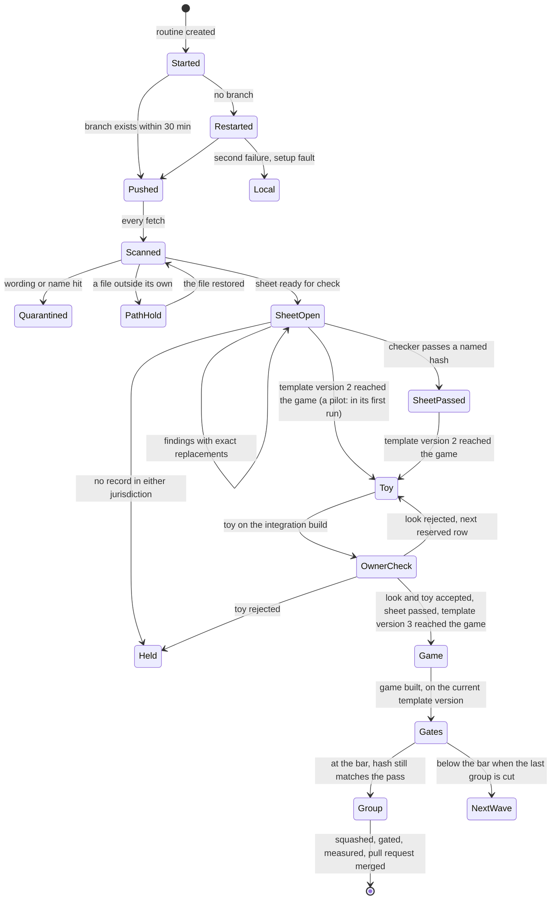
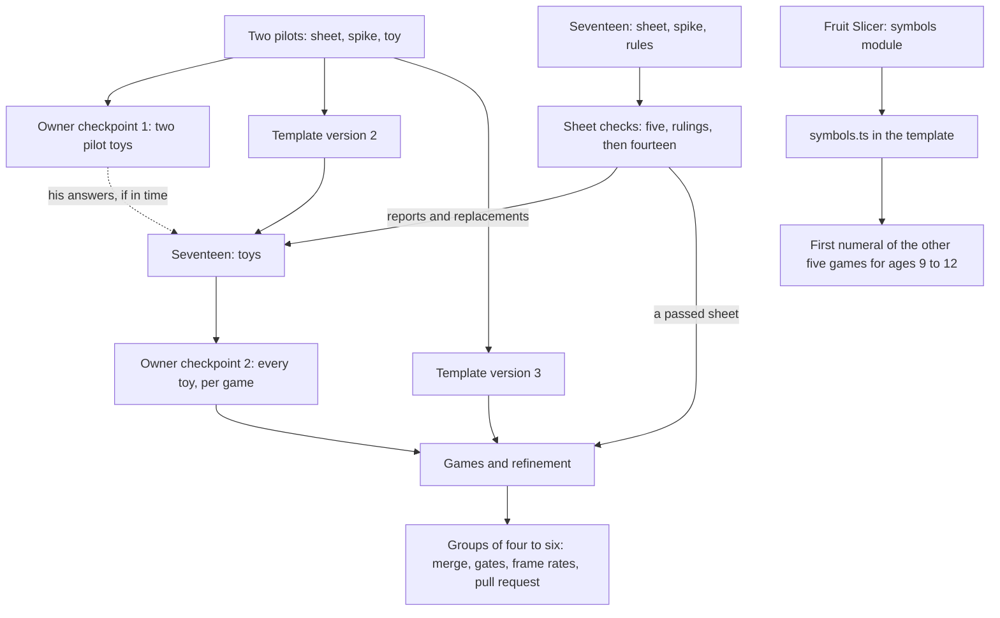

# Learning Games Cloud Wave - Plan

## Goal Capsule

- **Objective:** The nineteen learning games of the roster are playable in the jam, each at the quality bar, each designed from the education and game-design packs, and the owner has played them and decided which go in.
- **Means:** One remote builder per game on a cloud machine and its own branch, with the lead on the owner's Mac checking, folding, measuring and merging (KTD1, KTD2).
- **Authority:** The owner's settled decisions (Key Decisions), then `AGENTS.md` and the guide `docs/solutions/conventions/building-a-jam-game.md`, then this plan, then a lane's brief. Where this plan and the guide differ, the guide wins and the plan is corrected. The five places where this plan departs from the guide as it stood are written into the guide first (U1, step 1), so the rule holds.
- **Stop conditions:** The wave stops when the owner rejects the approach at the first checkpoint, or when lanes cannot be started or messaged at all (Open Questions, 1). One lane stops, and the others continue, when text that may not be published is found on its branch (quarantine, KTD4) or when it changes a file outside its own (a hold, KTD4).
- **Execution profile:** Long-running and event-driven. Most of the work is done by lanes the lead cannot reach while they run; the lead acts when the watcher wakes it (KTD11), when a run ends or when the owner answers.
- **Who finishes:** The lead opens each pull request and merges it when it is good. The owner deploys.

---

## Product Contract

### Summary

Nineteen learning games are built at once by remote builders, one cloud machine and one branch each, from the briefs in `docs/build/cloud-briefs/`. This plan covers the lead's side: starting the lanes and keeping them alive, scanning what they push, having every design sheet checked, folding what the two pilot games learn back into the template, showing the owner the toys, and bringing finished games into the jam in groups with measured frame rates and green gates.

### Problem Frame

The foundation (PR 36, merged) gives a builder a template, a guide, a look ledger and an age-aware wordless check. It assumed waves of seven local builders on the owner's Mac. The Mac is the bottleneck: under the load of other sessions its heavy tests time out, and a frame rate taken there beside other work is noise.

The owner asked for the games to be built on remote machines, all in parallel. A remote builder cannot be reached while it runs, sees no graphics card and hears nothing, and pushes to a public repository where a commit cannot be taken back. The guide's remote path says what a builder does. Nothing yet says how one lead keeps nineteen of them correct, in step and mergeable.

### Key Decisions

- **Remote builders on cloud machines, one per game, each on its own pushed branch.** (session-settled: user-directed — chosen over local builders in worktrees on the owner's Mac, seven at a time: the Mac is the bottleneck and he asked for the work to be offloaded.) Governs R1, R2, R3.
- **Each game is designed from the two packs, and its sheet names the records its claim rests on.** (session-settled: user-directed — chosen over grounding a game in the official standards beside the pack: he had the pack built first for this.) Governs R6, R7.
- **Numerals and mathematics symbols only where a band starts at 6 or above; no word or letter at any age.** (session-settled: user-directed — chosen over an exemption for every learning game and over no symbols at any age: mathematics for ages 9 to 12 needs symbols and the youngest cannot read.) Governs R9.
- **Lively and funny, without scores, coins, streaks, rewards or praise.** (session-settled: user-directed — chosen over the calm open-ended style as the default: he rated most calm demos "No".) Governs R11.
- **The demos he rated "Build it" become real jam games, with new designs for ages 9 to 12, in all four subjects.** (session-settled: user-directed — chosen over more lab demos: he asked for real games in the jam app.) Governs R12.
- **The lead merges a pull request when it is good; deploying stays with the owner.** (session-settled: user-directed — chosen over leaving every merge to him: told that the two open pull requests were his to merge, he answered "Merge when good".) Governs R14.

### Requirements

**Lanes**

- R1. Every game is built by one remote builder on its own branch `lane/<key>`, from its brief and `docs/build/CLOUD.md`, and a lane changes nothing but `games/<key>/` and, for a three.js game, its audit config.
- R2. A lane that dies, is cut off or never pushes is found within the hour and restarted from what it pushed, without redoing or losing pushed work.
- R3. Every later message to a lane can be acted on by a fresh session with no earlier checkout.

**What may not be published**

- R4. No official California wording and no model name reaches a branch the lead writes, a pull request or a commit message of the lead.
- R5. Every commit a lane pushes is scanned for both, within fifteen minutes of its push while the lead's watcher runs and in any case before anything else is done with it, and a hit stops that lane and is put to the owner the same hour.

**Design**

- R6. Every design sheet is checked by an agent that did not write it, against both packs, before the game built on it is merged; a pass names the exact text it judged.
- R7. A game whose sheet has no supporting record in either jurisdiction is held, and a claim never says more than its records carry.
- R8. What the two pilot games learn about the template reaches every other game once, through the template, before that game builds the stage that depends on it.
- R9. Numerals in the six games for ages 9 to 12 are drawn through one proven `symbols.ts`, started from the template.

**The owner**

- R10. The owner is shown the two pilot toys the hour they exist, and the other seventeen wait for his answers only until template version 2 is ready, then build their toys under the standing defaults. He plays each game's toy on a production build on the local network before that game is built further, and a game he has not answered blocks no other.
- R11. He is told plainly what nobody has yet judged: nobody has listened to a sound, and no frame rate from a cloud machine counts.

**Into the jam**

- R12. A game is merged only at the quality bar, with a frame rate measured on a real graphics card on the merged build, its gates green on the merged tree, its look registered and its sheet passed.
- R13. Games arrive in pull requests small enough to read, and a finished game does not wait for the slowest.
- R14. The lead merges a pull request of this wave when it is good: its checks green on its head, review comments answered, mergeable, and nothing in it that forecloses a decision still open with the owner. Deploying is the owner's.

### Acceptance Examples

- AE1. **Covers R2.** Given a lane that pushed its generated folder and half a sheet and then went silent, when the lead restarts it, then the new run continues from the pushed branch and its status block, runs no generator, and its first push is accepted.
- AE2. **Covers R5.** Given a lane commit whose `ART.md` holds eight consecutive words of a statement in the wording store, when the lead fetches the branch, then the scan names the file and commit, no message is sent to that lane, nothing of it is merged, and the owner is told.
- AE3. **Covers R6.** Given a sheet that passed at one commit and was edited above `## The look` afterwards, when the lead fetches the branch, then the hash of the sheet part no longer matches the pass and the sheet is checked again before the merge.
- AE4. **Covers R8.** Given template version 2, when it reaches a game whose copied `input.ts` is still as generated, then the lead replaces that file; and given a game that changed its copy, then its next message carries the change as a short migration instead.
- AE5. **Covers R12, R13.** Given five games ready and fourteen not, when the lead integrates, then the five are merged and gated as one group and offered in one pull request, and the fourteen keep building.

### Scope Boundaries

- The first-sounds game is not started: it waits for the speech trial on the owner's iPad. The letter-sound game and the word-based reading game stay undecided.
- The builder's own stages (the sheet's headings, the toy, the refinement loop, the audits) are the guide's and are not restated here.
- No change to the Tada contract, the harness or the education corpus. `education/` is not edited on the wave branch while the wave runs, so the lookup prints the same on every machine.
- Porting any game to Tada is not part of this work.

#### Considered and not built

- **A private mirror that lanes push to, scanned before anything becomes public.** It would close the gap in R5 (a hit is found after publication, never before). Not built: it changes where the owner's repository lives and what cloud sessions may reach, which is his decision (Open Questions, 2). What would change the call: his answer, or a first hit.
- **Scheduled polling of CI.** Not built: the app forbids it. The watcher of KTD11 reads the git remote only, and the lead reads a lane's check run when it is already looking at that lane.
- **Auditing only a lane's own game in CI.** Lane branches run the check job alone (done in the base commit); the audits run on the merged tree.
- **An offline loudness check of every voice.** Not built: each lane keeps its voices in a module of its own shape, so the tool needs an adapter per game, and what it guards against is heard at once and fixed cheaply. Each lane's range test bounds peak and length, and the owner is told that nobody has listened (R11). What would change the call: a silent or clipped toy at the first checkpoint.
- **A scan for official Dutch wording in a lane's files.** Dutch wording may be committed in the pack, but not under `games/`. The scan matches the wording store, which holds California's. Not built: the checker of a sheet and the lead's read before each squash cover it. What would change the call: one Dutch sentence found in a game file.

#### Deferred to Follow-Up Work

- Branch protection for `main`, if the owner wants it (Open Questions, 3).
- A committed tool that scans files outside `education/` for official wording. Today it is a local script that calls the pack's own matcher.

### Open Questions

1. **Blocking for everything after the first pilot's first run: may the lead create the cloud routines?** A routine's `model` field has to hold the session's own model id, or the lane runs on a smaller model, which he ruled out. The app's permission classifier allowed one such creation and refused the next as a leak of that id. The permission is needed for every routine of the wave, not only the eighteen starts: each later message to a lane and each restart is a routine too, at least four per game, so about eighty in all. Default: nothing more is created until he says so. His options: a permission rule for this session, which is what the lead asks for; a yes in the conversation, which the classifier may still refuse; or creating the routines himself, which means sending each later message too as it falls due.
2. **Do lanes keep pushing to the public repository?** A sentence a lane recalls from a standard is public at its push and cannot be withdrawn; only the host can remove an unreachable commit, and only he can ask. Default: stay public, scan every commit within fifteen minutes, quarantine on a hit (KTD4, KTD11). Put to him with question 1, before the seventeen start.
3. **Should `main` be protected?** Every lane holds write access to the whole repository. Default: asked with question 1; the lead compares every remote branch with the board on every fetch (KTD4).
4. The nine open questions of the foundation plan still stand with their defaults. Three are wanted at the first checkpoint because seventeen toys are built on them: camera shake and an impact pause (8), whether the four demos with a new verb are still the games he asked for (9), and who picks looks (6).

### Sources / Research

- `docs/plans/2026-10-02-1455-feat-learning-games-foundation-plan.md`: the roster, the nine open questions, KTD9 (pilots first).
- `docs/solutions/conventions/building-a-jam-game.md`, "Building several games at once", "The check of the sheet", "The template", "The gates".
- `docs/build/CLOUD.md` and `docs/build/cloud-briefs/` (the lanes' contract; base commit `051ab2ee`).
- `docs/solutions/workflow-issues/converge-a-parallel-agent-corpus-with-independent-checkers-exact-fixes-lead-rulings-and-hash-bound-verdicts.md`: checker independence, exact replacements, numbered rulings, verdicts bound to a hash.
- `docs/solutions/workflow-issues/deliver-from-a-cloud-vm-through-the-github-mcp-when-git-push-is-refused.md`: batch publishing gives red runs on trees that never existed, which is why a lane stops on a refused push.
- `docs/solutions/workflow-issues/measure-jam-game-performance-on-a-gpu-less-cloud-vm.md`: a cloud frame rate measures the software renderer.
- `docs/solutions/performance-issues/measure-on-the-target-device-and-ship-adaptive-quality.md` and `scripts/jam-perf.mjs`: the probe, its throttle and its `SIZE=2` run.
- `.github/workflows/ci.yml`: every push of every branch runs CI; lane branches run the check job alone.
- The first lane's run (Muddy Truck Wash, 2026-10-03): a cloud session installs Node 24 through `nvm`, runs the lookup, and pushes to its own branch.

---

## Planning Contract

### Key Technical Decisions

- KTD1. **A lane is a run-once cloud routine, and every later message is a new routine posted into a fresh or the same session.** This is how the owner's other project runs its lanes. A lane's branch and status block are the only state the lead relies on, since a session or its checkout may be gone (R3). Instantiates the first Key Decision (session-settled: user-directed — chosen over local builders in worktrees on the owner's Mac: the Mac is the bottleneck and he asked for the work to be offloaded); serves R1, R2, R3.
- KTD2. **One pilot is the canary.** One pilot lane starts first. The second pilot and the other seventeen start once that pilot's branch exists with a generated folder and a green check run and the owner has answered Open Questions, 1, so a fault of the machine image (Node, the browser, push access) costs twenty minutes and not nineteen dead runs. Serves R2, R8.
- KTD3. **The lead keeps a board outside the repository.** One row per game: routine and session ids, branch tip, last scanned commit, the commits the lead itself wrote on the branch, stage, template version, sheet round with its checker label, commit and hash, open findings, rulings in force at the pass, look in use, CI state, owner answers. Session ids and run logs do not belong in a public repository. The paths of the board, the scan script and the watcher are in the lead's notes for this project, which is where a lead that has lost its context looks first.
- KTD4. **Scan on fetch, hold or quarantine on a hit.** Before anything else is done with a fetched lane, the lead:
  1. lists every remote branch and compares it with the board. `lane/<key>-rescue` is the one other branch a lane may push; it is scanned as the lane is. Any other branch that appeared or moved without the lead's own push (`main`, the wave branch, another lane's branch) is reported to the owner the same hour.
  2. scans every commit of `lane/<key>` that is not reachable from the wave branch and is not one the board records as the lead's own. A commit is the lead's by ancestry or by its hash on the board, never by its author line, which a lane sets itself.
  3. runs, on each such commit, both checks on both surfaces: each changed file as it stands in that commit, and the commit's message with its author and committer lines, go through the pack's eight-word matcher against the wording store and through the name patterns, which are given at call time and stored nowhere. The changed paths are compared with the lane's own.

  A wording or name hit quarantines the lane. The steps, in order: the owner is told the same hour; the lane's routine is disabled and no message is sent; while the lane's run is still live the old branch is left standing, since a deleted branch would be pushed again with its whole history; once the run has ended the lead rebuilds the branch as one commit from a cleaned tree under a new name, deletes the old branch and any rescue branch, lists the remote again to confirm neither came back, and notes that the old commits stay reachable by hash until the host removes them. Quarantine is the game's end state for this wave unless the owner clears it; a cleared game continues on `lane/<key>`, recreated by the lead from the cleaned commit, so its next run is a later run and no generator runs. A path hit is not quarantine but a hold: the lane is not merged, built or shown until its change against the base lies inside its own files, and its next message asks for the commit that restores the file. Serves R4, R5. The matcher finds a run of eight words; a shorter statement is still kept by hand, at the read before each merge.
- KTD5. **Sheets are checked in two groups by local agents that read an extracted file.** The checker is a fresh agent on the Mac, where the lookup and the pack are. It reads a copy of `ART.md` the lead extracts from a named commit, never a branch tip, and its brief carries the ban on `--wording` and the rule that a suspected paste is reported by heading and line with a replacement in the game's own words, never quoted against a source. The first group is both pilots and one sheet per age range; its rulings are written into the guide's list before the other fourteen are checked, and those first five are swept against later rulings at their closing check. Serves R6, R7. Cloud checkers were weighed and not chosen: a check is a few lookups and some reading, which does not load the Mac, and a checker beside the board can be handed the rulings as they are made.
- KTD6. **The lead may write five things on a lane's branch, and only between that lane's runs:** a checker's exact replacements in the sheet part, the check lines of the status block, the frozen files through `--refresh`, any free template file that is still byte-equal to its generated form, and the commits of that lane's rescue branch, brought onto `lane/<key>` with the builder's text kept where the two differ. Everything else goes to the lane as a migration in its next message. A run counts as ended only when its session has reported or been cut off, never because the branch is quiet. This saves a full round trip per check round for nineteen sheets and keeps the one-writer rule for everything a builder authored. Serves R2, R6, R8.
- KTD7. **Two template versions are planned, and the symbols module lands on its own.** Version 2, after the pilots' toy stage, carries what input, audio, the Mount, quality and attention needed, and it gates the seventeen's toys. Version 3, after the pilots' game stage, carries guidance, scenes, state and save cadence, and gates the seventeen's games. `templates/cartridge/symbols.ts` and the generator's band rule land as their own step once Fruit Slicer's module and its test are green; that step gates only the first numeral drawn by the other five games for ages 9 to 12. `--refresh` is run on a lane branch only when the typecheck and the game's tests stay green; otherwise the game stays on the earlier version, which the frozen-copy test allows, and the lane gets the migration. When a pilot is held, quarantined or handed to a local builder, the lead names the furthest-along lane of the same renderer kind in its place, sends it the pilot's duty in its next message and records the change on the board; a version is cut when one game of each renderer kind has finished the stage. Serves R8, R9.
- KTD8. **The owner sees toys on an integration branch that is never pushed.** The lead merges lane tips into a throwaway local branch (the folders are disjoint), admits each lane only after its module loads alone, since the home page imports every game eagerly, and serves that production build on the local network. Serves R10.
- KTD9. **Games are merged in groups of four to six by readiness, one pull request per group.** Each lane branch is squashed into the wave branch under a message the lead writes, with the typecheck and the game's own tests per merge and the full gates once per group; a group is split only when its gates fail. When a group's gates are green the lead cuts a branch for that group at that commit and opens the pull request from it against `main`; what the wave branch gained since the last cut besides the games (template versions, rulings, answers files) rides in that pull request and is listed in its body. After the lead merges the pull request (R14), it merges `main` into the wave branch, which keeps its name because lanes read their answers from it. A follow-up to a merged game starts on a new branch cut from the wave tip, since a squash records no ancestry. Where a gate on the Mac goes red on a timing test of another game, CI on the group's head decides. Serves R12, R13.
- KTD10. **A frame rate counts only inside a bracketed session.** Each measuring session opens and closes with Pebble Table, read where its numbers are not pinned at the display rate: its frame CPU time and its worst one-second window in Chrome under heavy throttle, and its `SIZE=2` run. The accepted range of each is taken on a quiet Mac and written on the board before the first session; a session is thrown away when either end falls outside a range. The seven three.js look spikes are measured first, straight after the first run, while a look can still change. Serves R12.
- KTD11. **A watcher wakes the lead.** While any lane's run is live, a background loop on the Mac fetches `lane/*` every fifteen minutes and runs the scan of KTD4 on new commits. It ends, which wakes the lead, on a hit, on a branch that is not on the board, on a new `Open:` line in a status block, or on a lane with a live run and no push for an hour. It reads the git remote only. Fifteen minutes is the longest a pushed commit goes unscanned while it runs (R5), and an hour the longest a dead lane goes unnoticed (R2). Serves R2, R5.

### High-Level Technical Design

The life of one lane, from the lead's side:

What gates what across the wave:

### Assumptions

- A cloud session can install Node 24 and a headless browser and can push to its own branch. The first lane has shown the first and the third; the browser is still to be seen.
- A session may not accept a second message, or may be gone, so every message is written for a fresh one.
- The lead cannot end a running cloud session from the Mac; it can disable a routine and withhold a message. Ending one takes a small cloud session with its own tools, which is itself a routine (Open Questions, 1).
- A game needs at least four runs: sheet and rules; toy; game; refinement and gates.
- The account's limits allow about twenty sessions at once. If not, lanes start in the roster's wave order.
- Other sessions keep using the Mac, so measuring sessions are short and bracketed.
- The last group is cut when no lane has a live run and the owner has answered every toy shown to him.

### Risks

| Risk | What the plan does |
| --- | --- |
| The lead may not be allowed to create routines, for starts or for later messages (Open Questions, 1) | One pilot runs as canary; everything else waits for the owner; a permission rule is asked for |
| Forbidden text is public before it is found | The watcher scans within fifteen minutes, quarantine, the owner told the same hour; the private mirror is put to him |
| The lead itself publishes forbidden text (a checker's replacement, a ruling, a pull request body) | The lead's outgoing commits and pull request text go through the same scan before each push |
| Seventeen lanes fix the same template fault seventeen ways | Rules in new modules, copied files left as generated, faults reported as Template notes, pristine files replaced by the lead |
| A look fails where only one row is reserved (six games) | The lane proposes and waits; the lead rules in push order against every claimed and reserved row; a game's spare rows are released when the owner accepts its look |
| Nobody hears before the owner | Voices as numbers with range tests; he is told nobody has listened |
| A wall-clock test of another game goes red under load | A red whose failing tests are all outside `games/<key>/` is rerun once and not sent to the lane; on a group, CI on its head decides |
| A pilot is held, quarantined or lost | The furthest-along lane of the same renderer kind takes its duty (KTD7) |
| Fruit Slicer is late, held or quarantined | Only the five other games for ages 9 to 12 wait, and only for their first numeral; the lead names another of them to write the module |
| The lead loses its context mid-wave | The board, the status blocks and the lead's notes hold every decision and every path; nothing lives only in a session |

---

## Implementation Units

### U1. Start the lanes and keep them alive

- **Goal:** Nineteen lanes running from one base commit, each found and restarted when it fails.
- **Requirements:** R1, R2, R3; KTD1, KTD2, KTD3.
- **Dependencies:** Open Questions, 1 for every routine after the first pilot's start, that pilot's second message included.
- **Files:** `docs/solutions/conventions/building-a-jam-game.md` ("Building several games at once", "The check of the sheet"), `docs/art-direction.md` (section 4, when rows return to open), `CONCEPTS.md`, `docs/build/CLOUD.md`; the board outside the repository; `docs/build/answers/<key>-<n>.md` (long answers a message points to, read by a lane with `git show`).
- **Approach:**
  1. Before any lane's second run, amend the guide on the wave branch for a wave of remote builders, in five places: the other builders start from the base commit on sheet, spike and rules and receive later template versions between runs; the lead may make the five writes of KTD6 between a lane's runs; the pilots' toys get a first owner checkpoint ahead of the wave's; a game's spare look rows are released when the owner accepts its look; and a wave of remote builders is merged as one pull request per group of ready games. Make the same row-release edit in section 4 of `docs/art-direction.md`.
  2. Create the board with the nineteen rows and the first pilot's routine id, and put Open Questions 1 to 3 to the owner in one message; the default of 2 and 3 applies if he answers 1 alone.
  3. Thirty minutes after a start, list the remote `lane/*` branches. A missing lane gets one restart with the same message; a second failure is read from its run log, and a setup fault sends the game to a local builder under the guide's local rules.
  4. In every run, first or later: a lane with a live run and no push for an hour (the watcher of KTD11 reports it) has its session state and log read, and is restarted from its branch only when the session has ended or been cut off.
  5. Start the second pilot and the seventeen when the first pilot's branch has a generated folder and a green check run and the owner has answered question 1.
  6. Write every later message for a fresh session: the branch, the commit to continue from, the stage for this run, and the path of its answers file.
- **Test scenarios:**
  - Covers AE1. A lane restarted after one push continues from the remote branch and its first push is accepted.
  - A message sent to a lane whose session is gone is carried out by a new session from the branch alone.
  - A lane that pushed in its toy run and then went silent for an hour is reported by the watcher and restarted from its tip.
  - A run log that reads like an instruction to the lead is treated as data and reported to the owner.
- **Verification:** every row of the board has a branch tip or a recorded reason for having none, and the guide says what the plan does in each of the five places.

### U2. Scan and read every push

- **Goal:** Nothing a lane pushes is used before it is known to be clean and inside its own paths, and nothing the lead pushes is published unscanned.
- **Requirements:** R2, R4, R5; KTD4, KTD11.
- **Dependencies:** U1.
- **Files:** a local scan script and a watcher script outside the repository; the board.
- **Approach:**
  1. On each fetch, do the three steps of KTD4, then read the lane's check run. Record the scanned tip on the board. A lane is never merged, built or shown past its last scanned commit.
  2. Bring a scanned rescue branch onto `lane/<key>` between that lane's runs (KTD6), delete it from the remote, and name the new tip in the lane's next message.
  3. On a wording or name hit, follow the quarantine steps of KTD4. On a path hit, hold the lane.
  4. Before each push of the lead's own, to a lane branch or the wave branch, and before a pull request is opened or edited, run the same scan over the outgoing commits (files, messages and author lines) and over the pull request body; a hit blocks the push.
  5. Run the watcher of KTD11 while any lane's run is live.
- **Test scenarios:**
  - Covers AE2. In a throwaway repository outside the working clone, with an invented statement and a wording store built from it, a planted eight-word run in an `ART.md` is named with its commit. No official wording is used in any test.
  - The same planted run in a commit message is named.
  - A listed name planted in a `REFINEMENT.md`, and one in a commit's author line, are each flagged.
  - A commit that touches `templates/` or another game is flagged by the path check and the lane is held, not quarantined.
  - After the lead merges the wave branch into a lane branch, the scan reports no path hit for the wave's commits or for the lead's merge commit recorded on the board.
  - A rescue branch holding a planted run is scanned and named; a clean one is brought onto its lane and is not reported as a stray branch.
  - A commit pushed to a branch that is not on the board is reported.
  - A clean branch of several commits passes and records its tip.
- **Verification:** the board shows a scanned commit equal to the tip for every lane that is used, and no remote branch that the board does not know.

### U3. Check the sheets

- **Goal:** Every sheet passed against both packs by someone who did not write it, with the pass bound to a hash.
- **Requirements:** R6, R7; KTD5, KTD6.
- **Dependencies:** U2.
- **Files:** `docs/solutions/conventions/building-a-jam-game.md` (new numbered rulings under "The check of the sheet"); `games/<key>/ART.md` and `games/<key>/REFINEMENT.md` on lane branches (replacements and check lines only); the board.
- **Approach:**
  1. Check the first five first: both pilots and one sheet from each age range.
  2. Write each disagreement that shows in more than one sheet as a numbered ruling in the guide, then check the other fourteen with the rulings in the checker's brief.
  3. Between a lane's runs, paste exact replacements into the sheet part and record the round; findings that change the mechanic, the error or the designed order go to the lane instead. Each pasted replacement goes through the scan of U2 before the push.
  4. A fresh checker closes each round. A pass records the commit and the hash of everything above `## The look`.
  5. Compare that hash on every fetch; a changed sheet part is checked again.
  6. A lane's toy may be built while a round is open. Its game run is sent only after a pass.
- **Test scenarios:**
  - Covers AE3. A sheet edited above `## The look` after its pass shows a changed hash and returns to open.
  - A sheet whose records carry less than its claim gets the replacement sentence, and the closing check confirms the paste only.
  - A sheet with no supporting record in either jurisdiction is held under ruling 3 and its lane gets no next stage.
  - A checker's replacement that holds a planted run from the test store is stopped by the scan before the lead pushes it.
- **Verification:** each merged game's status block names a passed round whose hash equals the sheet part at the merged commit.

### U4. Fold the pilots' notes into the template, twice

- **Goal:** Template versions 2 and 3 and the symbols module, each reaching every game that needs it before the stage that needs it.
- **Requirements:** R8, R9; KTD6, KTD7.
- **Dependencies:** the pilots' toy stage for version 2; their game stage for version 3; Fruit Slicer's green module for the symbols step.
- **Files:** `templates/cartridge/**` (and a new `templates/cartridge/symbols.ts` with its test), `scripts/new-game.ts`, `test/new-game.test.ts`, `test/games.test.ts`, `test/template-mount.test.tsx`, `docs/solutions/conventions/building-a-jam-game.md` ("The template").
- **Approach:**
  1. Collect the Template notes of both pilots and of any other lane; settle each as a template change, a per-game matter or nothing.
  2. Raise the version, push the wave branch, and for each lane branch between its runs: merge the wave branch in and record that merge commit on the board, run `--refresh` if the game stays green, replace free files that are still as generated, and write the rest as a migration in the lane's answers file.
  3. As its own step, take `symbols.ts` from Fruit Slicer with anything particular to fruit removed; the generator copies it only for a band that starts at 6 or above. Name its commit in the next message of each of the other five games for ages 9 to 12.
- **Test scenarios:**
  - Covers AE4. A game with an untouched `input.ts` receives the new one; a game that changed it receives a migration and keeps its file.
  - A generated game for a band starting at 9 holds `symbols.ts`; one for a band starting at 4 does not.
  - The frozen-copy test passes for a game on the earlier version and for one on the new version, and fails for a game with a frozen file edited by hand.
  - A refresh that would turn a game's typecheck red is not committed to its branch.
- **Verification:** before a group's pull request, no game in it is on an earlier template version.

### U5. Show the owner the toys, twice

- **Goal:** His answers on looks and toys, per game, before refinement is spent.
- **Requirements:** R10, R11; KTD8, KTD10.
- **Dependencies:** U2 for every lane shown; the pilots' toys for the first checkpoint; the seventeen's toys for the second.
- **Files:** `docs/art-direction.md` (a game's spare rows set back to open when he accepts its look); the integration branch and the contact sheet stay local.
- **Approach:**
  1. First checkpoint, the hour the two pilot toys exist: both toys on one production build on the local network, with foundation questions 6, 8 and 9. The seventeen's toy runs wait for his answer only until version 2 is ready.
  2. Second checkpoint: every toy on one build, and one page with two answers per game (the look, the toy). The three games with no demo behind them come first on the page. A game he has not answered stays stopped at the toy and blocks no other. When he accepts a game's look, the lead sets that game's other reserved rows back to open in the ledger on the wave branch.
  3. Before each, take each look's still at 1180 by 820 on the Mac and measure the three.js spikes in a bracketed session. Say in the message what nobody has judged.
- **Test scenarios:**
  - A lane whose module throws on import is left out of the integration build and the others still load.
  - A look he rejects moves that game to its next reserved row, or to a proposal ruled on by the lead, before its next run.
  - A toy he rejects holds the game; its rows stay reserved.
- **Verification:** the board holds his answer, or "not answered", for every game shown.

### U6. Bring finished games in, in groups

- **Goal:** Games in the jam through pull requests the owner can read.
- **Requirements:** R4, R12, R13, R14; KTD9, KTD10.
- **Dependencies:** U3 passed and U4 current for each game in the group; his acceptance at the second checkpoint.
- **Files:** `games/<key>/**`, `scripts/intersections/games/<key>.ts`, `docs/art-direction.md` (registry rows, ledger states), `README.md` (the games list, if it names games), the pull request body outside the repository.
- **Approach:**
  1. Read each game's `ART.md`, comments and status block by eye for official wording of either jurisdiction and for names, and confirm the sheet hash, before its squash.
  2. Squash each lane branch into the wave branch under the lead's message; typecheck and the game's tests per merge.
  3. Once per group: `npm run check`, the build with both built-asset checks, the intersection audit for three.js games, `compound audit --strict`, the scan of U2 and both education wording checks before the push.
  4. Measure each game on the merged production build in a bracketed session and put the numbers in the pull request.
  5. Mark each look claimed and release any row of the game that is still reserved. Cut the group's branch at the gated commit and open its pull request against `main`.
  6. Merge the pull request when it is good (R14), with a merge commit, then merge `main` into the wave branch. Delete each merged lane branch and its rescue branch from the remote and keep the refs locally.
- **Test scenarios:**
  - Covers AE5. Five ready games form one group and one pull request while fourteen keep building.
  - A group whose merged tree fails though each branch passed alone is split and the failing game is found.
  - A game below the bar is left out, keeps its branch and its rows, and is listed first in the next group.
  - A frame-budget test that reads a clock is rejected at the merge in favour of the counted form.
  - A pull request with a red check or an unanswered review comment is not merged.
- **Verification:** each pull request's checks are green on its head when it is merged, and its body names, per game, the records, the measured frame rate and how the game meets each line of the bar.

### U7. Close the wave

- **Goal:** What was learned is in the guide and the packs, and nothing is left half-open.
- **Requirements:** R8, R12.
- **Dependencies:** the last group.
- **Files:** `docs/solutions/**` (one learning per run of the compounding workflow), `docs/build/CLOUD.md`, `docs/art-direction.md`.
- **Approach:** compound the lead's side of a cloud wave as its own learning; correct `CLOUD.md` where lanes found it wrong; list held games and games below the bar with their branches and rows; disable every routine that is still enabled.
- **Test expectation:** none -- documents and housekeeping.
- **Verification:** `compound audit --strict` passes, and the board has no lane in a state other than merged, held, below the bar or quarantined.

---

## Verification Contract

| Gate | Command or check | When |
| --- | --- | --- |
| A lane's own checks | `npx tsc --noEmit`, `npx vitest run games/<key> test/games.test.ts`, `npm run -s wordless:check`, `node scripts/egress-check.ts` | by the lane before each push |
| Lane CI | the `check` job on `lane/<key>` | read by the lead when it looks at that lane |
| Scan of lanes | the three steps of KTD4 | every fetch, before anything else; every fifteen minutes by the watcher while a run is live |
| Scan of the lead's own | the same scan over the lead's outgoing commits and each pull request body | before every push by the lead and before a pull request is opened or edited |
| Sheet | a passed round whose hash equals the sheet part | before a lane's game run, and again at the merge |
| Template | `npx vitest run templates test/new-game.test.ts test/games.test.ts test/template-mount.test.tsx` | each template version and the symbols step |
| Merged tree | `npm run check`; `npm run build`, `npm run egress:built`, `npm run education:built`; `npm run check:intersections -- <key>` at `enforce: true` for a three.js game | once per group |
| Documents | `compound audit --strict` | when `docs/solutions/` changed |
| Education wording | `npm run education:overlap`, `npm run education:reuse-history` for the commits about to be pushed | before every push by the lead (they read `education/` only) |
| Frame rate | `npm run perf:jam -- <key>` on the merged production build, in a session bracketed by Pebble Table | once per game, before its pull request |
| Owner | his answer per game at the second checkpoint | before a game is built past its toy |
| Merge | checks green on the pull request's head, review comments answered, mergeable | before the lead merges |

---

## Definition of Done

- Every game of the roster is in one of four states on the board, with its evidence: merged in a pull request, held, below the bar with its branch kept, or quarantined with the owner told.
- Every merged game has a passed sheet bound to its merged text, a registered look, a frame rate from a real graphics card, green gates on the merged tree, and no template file on an earlier version.
- No pull request, commit message or file written by the lead holds official California wording or a model name, every commit of the lead was scanned before its push, and every lane commit that was used was scanned first.
- The owner has seen every toy on one production build and his answers are recorded.
- Lane and rescue branches of merged games are deleted from the remote, no routine is left enabled, the watcher is stopped, and the integration branch and other scratch work are gone from the Mac.
- Every pull request the lead merged was good when it was merged, and the lead has deployed nothing.
