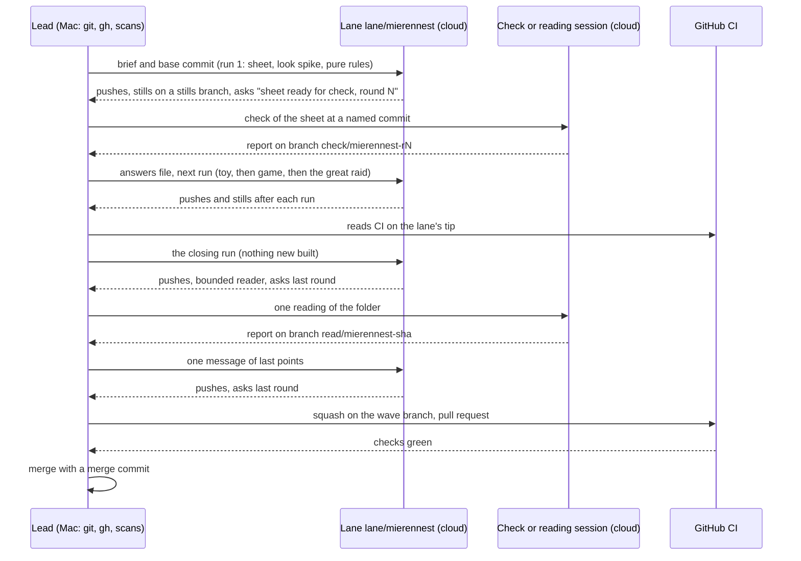
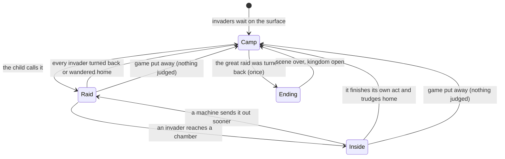

# Mierennest, an Ant Nest Game from a Child's Own Design - Plan

## Goal Capsule

- **Objective.** A child can open Mierennest in the jam and play the game another child designed: dig a kingdom under the ground out of sand, mud and stones, watch it grow, hold it against ants, beetles and flies, and at last against the dung beetle army and its dung fly, and then keep playing in the kingdom that is safe.
- **Means.** One cloud lane builds the game from the cartridge template in stages, cloud sessions check its design sheet and read its folder, the repository's CI is the gate, stills reach the lead by git (KTD10), and the lead brings it in through a pull request (KTD1, KTD2).
- **Authority.** `AGENTS.md` and the Tada contract it restates, then `docs/solutions/conventions/building-a-jam-game.md`, then the two packs, then this plan, then the lane's brief. Where the child's letter and the contract disagree, the contract wins and the plan says what changed (R4 to R7). Two decisions of this plan stand, by the owner's direction that nothing heavy runs on his Mac, over the guide and the cloud page where those have the lead take stills and frame rates in a browser of its own: KTD2 and KTD8, with KTD10 for the stills.
- **Stop conditions.** The look fails its spike on clarity twice (then the lead reserves another row). The lane is refused an edit to its own files (then the lead surfaces it to the owner and does not make the edit for the lane). A cloud session cannot be started or is cut off (then the work waits and the lead tells the owner; no check, build or browser moves back to the Mac).
- **Execution profile.** Long-running, in runs of one cloud lane with the lead steering between runs. Nothing heavy runs on the owner's Mac mini.
- **Who finishes and ships.** The lead merges the pull request when CI is green and the review is read. Deploying jam.tada.computer stays the owner's.

---

## Product Contract

### Summary

Mierennest is a new jam game for ages 9 to 12 in `games/mierennest/`. The screen is an ant farm seen from the side: grass and sky on top, ground below. The child leads a small ant with a finger: it digs tunnels, carries lumps, and builds walls, pits and plugs from three materials that behave differently. Invaders camp on the surface in plain view and wait. A raid starts when the child calls it, and it shows where the defences hold and where they give; when it is over the workers put back what it knocked down, so trying again costs one touch. The kingdom grows as the child builds, and the last raid is the dung beetle army led by a dung fly. After it, an ending scene plays once and the kingdom stays open to play. It is a play-first game and claims no school skill.

### Problem Frame

A child wrote to ask whether a game called Mierennest could be made with Tada, and described it: a small ant, a kingdom built underground from sand, mud and stones, levels that make it bigger and stronger, invaders, walls and clever defences, a catapult or a cannon, and a final army of dung beetles led by a dung fly. The owner asked for it to be built, ambitiously, without being asked questions.

The letter's design leans on levels, fights and a final win. The jam forbids scores, experience points, counters dangled at the child, timers that push and punishment for leaving, and its design pack asks for errors that show as consequences and for the butt of a joke to be bewildered and never hurt. The work is to keep the child's game recognisable while it lives under those rules.

### Key Decisions

- **A real jam game, not a lab demo.** (session-settled: user-directed — chosen over a lab demo under `lab/arcade/`, which could keep levels and a win screen as written: the child asked for a game in Tada and the owner asked for the game.) Governs R1, R4 to R7.
- **Growth is the level.** The kingdom's size and strength are seen in the nest itself; no number, bar or badge stands for them. Governs R4.
- **A raid is a test the child starts.** Invaders wait in sight until called; nothing attacks by a clock. Governs R5, R9.
- **Nobody is hurt and nothing is lost.** Invaders tumble, stick and trudge home. A raid is a view of the kingdom as the child built it: what it knocks down is seen where it fell, and when the raid is over the workers put it back as built. The guide's found-as-left rule says a running test is a view of the saved design and is not saved, and the pack's rule for these ages says failure is free and one tap tries again (pack: game-design, ages-9-to-12.md). Governs R6, R10, R11.
- **The ending is a scene, and the kingdom stays.** Governs R7.
- **It is a play-first game with no learning claim.** The child asked for a game, not a lesson. A claim would bring the rule for learning games onto the child's own catapult, where the finger aims and times (pack: game-design, the-mechanic-is-the-school-skill.md), and the guide lets a game with no learning goal ship with no records part. A claim can be added to the sheet later without touching code or saved state. Governs R16.

### Requirements

**The game the child asked for**

- R1. The game is the cartridge `games/mierennest/` with key `mierennest` and name "Mierennest", made from template version 3 by `npm run new:game`, and listed on the jam home page.
- R2. The child plays as a small ant led by the finger: a drag through the ground digs a tunnel behind the finger, and a lump that comes loose can be carried and set down.
- R3. Three materials come from the ground and behave differently in the world: sand pours and slumps into a pile, mud sticks and holds its shape, stone is heavy, falls unless something bears it, and blocks. What can be built from them includes walls, pits, plugs and bearing arches, and combinations are stronger than one material alone.
- R4. The kingdom grows as the child builds: more chambers, more workers, larger structures. Its growth is visible in the nest and is never shown as a number, a bar, a level name or a badge.
- R5. Invaders are other ants, beetles and flies. Each kind has fixed habits a child can learn and test: what it can pass, what stops it, what it does when it gets in. They camp on the surface in view and do nothing until the child calls a raid.
- R6. When invaders get in, the child defends with a catapult and a cannon. Each is built in a place and loaded with a lump as part of the defence, and is fired by the finger. A hit sends an invader tumbling, stuck or blown back, bewildered and never hurt, and each kind answers each kind of shot in its own way. An invader that gets in and is not sent out does its own act there once and trudges home by itself: a machine is never the only way a raid ends.
- R7. The last and hardest raid is an army of dung beetles rolling their balls, led by a dung fly. When that army has been turned back, an ending scene plays once, and afterwards the kingdom is found as it was and can be played on, with raids on call.

**Rules it must keep**

- R8. Nothing the game draws for the child is a letter or a word. Numerals are not needed and none is drawn; the name lives in the manifest.
- R9. No raid, growth step or scene is driven by a clock that pushes, and nothing happens to the kingdom while the game is unattended or put away.
- R10. A put-away at any instant loses nothing and replays nothing: a lump in the mouth goes back where it came from, and a raid in progress ends with the invaders back at their camp and the kingdom as the child built it.
- R11. A wrong build shows as a consequence in the world, at the place it failed and for a reason a child can see. When the raid is over the kingdom stands as built again and the place that gave way can still be told, so that one thing can be changed and the raid called again (pack: game-design, errors-show-as-consequences.md).
- R12. No score, coin, star, confetti, praise or count of raids won is shown, and nothing rewards coming back or punishes leaving (pack: game-design, no-rewards-for-playing.md).
- R13. The first frame is a place filled from edge to edge, with large characters who are already funny, and the materials the child builds with stay the plainest things in it (pack: game-design, a-full-frame-with-large-funny-characters.md).
- R14. The digging is a pleasure with no goal, answered in the frame the finger lands, before any raid is built on it (pack: game-design, toy-first.md).
- R15. The game meets the quality bar of `docs/art-direction.md`, with a look distinct from every claimed look, registered in the same pull request.

**No learning claim**

- R16. The game claims no school skill: its design sheet has no records part and says so plainly, and nothing in the folder, the pull request or the home page says the game teaches a standard. No official wording of any standard is written anywhere.

### Acceptance Examples

- AE1. Covers R3, R6, R11. A child builds a tall, thin wall of sand across a tunnel and calls the beetles. The first beetle leans on it, the wall slumps at its foot into a pile, and the beetle walks over the pile, does its own act in the chamber and trudges home. The workers shovel the pile back into the wall as it was built, and the place where it gave way can still be told. The child packs mud into it or rolls a stone against it and calls the raid again.
- AE2. Covers R5, R9. A child opens the game and builds for ten minutes without calling a raid. The invaders sit at their camp on the surface, fidgeting, the whole time. Nothing comes in.
- AE3. Covers R10. A child is carrying a stone when the game is put away. On opening it again the stone lies where it was picked up, the tunnel dug so far is there, and no scene plays.
- AE4. Covers R10. A child puts the game away with two beetles inside the nest. On opening it again the beetles are back at their camp, the wall they pushed over stands as the child built it, and the raid waits to be called.
- AE5. Covers R6, R7. The dung fly is knocked out of the air by a mud ball from the catapult the child placed and loaded, and the army loses its way and rolls home. The ending scene plays once. The next day the kingdom is as it was left, the scene does not play again, and a raid can still be called.
- AE6. Covers R4, R12. After a week of play the ground is full of chambers and tunnels, with a crowd of workers. Nothing on the screen says which level it is or how many raids were turned back.

### Scope Boundaries

**In scope:** the game folder, its design sheet and art guide, its tests, the look's ledger row and registry row, the README row, the lane's brief, and the reports of the sheet's checks.

**Not in this game:**

- Fighting by the child's ant itself, hit points, or an invader that is removed for good. Considered and not built: the pack rules out hurt, and tumbling invaders carry the comedy. Evidence that would change it: none short of a change to the pack.
- A lost state, a "game over", or a kingdom that can be taken away. Considered and not built: lossless exit and found-as-left forbid it.
- Multiplayer, a level editor, sharing a nest. Not asked for.
- Spoken instructions or written hints. Forbidden at every age.

#### Deferred to Follow-Up Work

- More invader kinds, more machines, and a second look pass after the owner has played it.
- A learning claim designed from the education pack. The lookups of 2026-10-10 found where one would start: on the California side the engineering-design lane for grades 3 to 5 (codes 3-5-ETS1-2 and 3-5-ETS1-3), and on the Dutch side designing and making with the material in mind and the comparative experiment (codes ojw/nattech/1/07/fase2, ojw/nattech/1/06/fase3 and ojw/nattech/1/07/fase3). Adding it changes the sheet, not the code.
- A port into the Tada kid shell.
- Changes to the frozen template files asked for in `docs/build/template-notes-v3.md`.

### Assumptions

The owner said to decide and not ask. Each of these is the lead's decision from the letter, the contract and the packs, and each can be overturned by him.

- The age band is 9 to 12. The letter reads like a child of about 8 to 11; the band may be five years wide at most, and the design pack's rule for these ages asks for real systems and more than one solution, which this game has. A younger child is not locked out: age is a hint.
- "Level" means the growth of the kingdom, not a number (R4).
- A raid is called by the child and never arrives by itself (R5, R9).
- "Defeated" means turned back, muddy and bewildered (R6).
- What a raid knocks down is put back by the workers when the raid is over; the child never rebuilds by hand what an invader broke (R10, R11).
- The game is finished in the child's sense when the dung beetle army is turned back, and it is not over: the kingdom stays (R7).
- The game makes no learning claim (R16). The owner's wave of learning games is designed from the education pack; this game was asked for as a child's own game, and a claim is follow-up work if he wants one.
- No numerals are drawn, though the band allows them, because nothing in the play needs one.
- The game merges on the lead's judgment of the look against R13, with stills sent to the owner, and not on a look answer from him first. He asked for this game to be built end to end; the five games that wait for his look answer were shown to him at a checkpoint he set.
- Nobody plays the toy before the game is built on it unless the owner does: its feel (R14) is judged by the lane's stills and tests. After the toy run the owner's play folder is renewed so that he can dig in it if he wants to (KTD11), and the runs do not wait for him. A toy he finds dull reopens the touch and the view; the pure rules stay.
- The child is named in nothing that is pushed: the repository is public and a pushed commit cannot be taken back. Leaving the name out can be undone later; the reverse cannot.

### Open Questions

None blocks the work. For the owner, after he has played it:

- Whether the look is full and funny enough, and whether the catapult and the cannon feel like the child's.
- Whether the child who wrote should be shown the game before it is deployed, and whether the child is to be named or credited anywhere public.
- Whether the game should carry a learning claim (see Deferred to Follow-Up Work).

### Sources

- The letter, pasted by the owner on 2026-10-10 (not committed; it is a child's private letter).
- `AGENTS.md`: the contract rules and the jam allowances.
- `docs/solutions/conventions/building-a-jam-game.md`: the stages, the design sheet, its check, rulings 1 to 15, found as left.
- `docs/build/CLOUD.md`, `docs/build/runs/` (`check.md`, `reader.md`, `closing.md`, `look.md`): the lane's and the cloud sessions' pages.
- `docs/solutions/workflow-issues/bound-a-builders-fresh-reader-loop-at-four-readings-and-give-the-last-read-to-the-lead.md`.
- `docs/solutions/workflow-issues/measure-jam-game-performance-on-a-gpu-less-cloud-vm.md`: what a cloud machine can say about frame cost.
- `docs/build/cloud-briefs/night-camp.md`: the shape of a brief, and the pattern of a test the child starts.

---

## Planning Contract

### Key Technical Decisions

- KTD1. **One cloud lane builds it, in runs.** The builder is a run-once routine on branch `lane/mierennest`, steered by messages into the same session, as `docs/build/CLOUD.md` describes. (session-settled: user-directed — chosen over local builder agents and local dry runs of the suite: the Mac is shared and was too heavy.)
- KTD2. **Checks, readings and gates run off the Mac.** Each sheet check and the lead's one folder reading is its own cloud session reporting on a branch (`docs/build/runs/check.md`); tests, builds and audits are the repository's CI on the pushed branch and the pull request. (session-settled: user-directed — chosen over local agents and local browser probes: same reason.) On the Mac the lead runs only git, `gh`, the scan of pushed commits for names, and `npm run education:reuse-history`, which needs the wording store kept outside the repository.
- KTD3. **Canvas 2D, a grid of ground cells.** The nest is a side-on grid of cells (empty, sand, mud, stone, and what cannot be dug). The rules of the ground are a pure, deterministic module with no renderer: sand falls and slides to its pile, mud stays where it touches something, stone falls straight unless borne. A cell grid is what makes the ground testable without a browser, small to save, and cheap to draw into a cached sheet. Considered: rigid-body physics (heavier, harder to save, not needed for cells). The nest is one fixed stage with the whole farm in view, with no scroll and no zoom, so a drag is always a dig, a raid can be read at a glance and the save holds no camera. The cell size is set at the spike from two bounds stated together: the finger's drag digs a tunnel a creature fits, and a creature in a tunnel is still about a tenth of the frame wide or more (insects are long and low). The sheet then states the largest kingdom that ground holds, and the size test uses it. A chamber is something the ground module recognises by a measure the sheet states, never a thing placed from a menu.
- KTD4. **The saved state is the ground and the position, never a raid.** Saved: the grid (run-length encoded, under half the 64 KB limit), where loose lumps lie, the machines with their places and their loads, the position in the designed order, the marks of first showings, and the ending's field. The workers follow from the chambers and are not stored. A raid runs on a copy of the ground and changes no saved field (R10): what it knocks down, where invaders stand and the mark that shows where a wall gave way are short-lived and gone on load. Whatever a later scene will save is written with the scene that makes it certain (guide, ruling 12).
- KTD5. **The designed order is a ladder of places in the game's own words.** One new thing at a time, then combinations: from a first chamber, through each material, each invader kind, each machine, to the great raid, and an open kingdom after it. The position ids name places in that order and never a grade, a groep or a level. The exact ladder is the sheet's, and so is what counts as a raid that went well. Every visit of every age starts at the first place: the kingdom is built step by step, so the age hint never starts a child further up, and the sheet says what, if anything, `ctx.childAge` sets.
- KTD6. **Each invader kind is defined by a small table of habits**, read by one raid module: what it passes, what stops it, how it answers each shot. This is what gives combinations their depth and lets tests play whole raids from a seed (pack: game-design, depth-from-combinations.md; pack: game-design, characters-with-opinions.md).
- KTD7. **The look is "Ant farm behind glass", a new row the lead adds to the ledger, with "Squared-paper pencil" as the second choice.** Both are canvas 2D, so a failed spike changes the drawing and not the renderer. The lead may add a row (`docs/art-direction.md`, "The menu is a ledger"). The nearest claimed look is the sand tray; this one is seen straight on through a pane, with strata in bands and a frame, and no raking light.
- KTD8. **Frame cost is judged without a local probe.** The lane measures its own work per frame under CPU throttle and counts what it draws, as the learning on GPU-less machines says; the cloud page's frame rate from the lead does not apply here, and the brief says so. The bar is the jam's (under 8 ms at six times throttle, about 80 draws or the canvas reading the game states). A real frame rate comes from the owner's iPad through the overlay when he gives one, and the pull request says plainly which of the two it has.
- KTD9. **The sheet has no records part.** The game is play-first (R16). Its sheet keeps every other heading, answers the representation and the four mechanic questions for the game's own idea (a defence built from three true materials and tested by a raid), and says in one sentence that no school skill is claimed. The sheet's check then has no record to look up.
- KTD10. **Stills travel by git.** The lane makes its stills on its own machine, as it already does, and at the look spike, the toy, the game and the closing run pushes three of them at 1180 by 820, and nothing else, as one commit on a branch `stills/mierennest-<first eight of its tip>` cut from the base commit in a worktree of its own. The brief names that branch as an allowed one beside the rescue branch; it is never merged. The lead fetches it with git, looks at the files against R13, sends them to the owner and deletes the branch, as it does a check branch. Considered: a cloud session of its own that builds the lane's commit and takes the stills (a second machine and a second build for the same software-drawn picture).
- KTD11. **The owner's play folder is renewed twice, and that is the one build on the Mac.** He asked on 2026-10-10 for a server on which he can play every game, and it is running. After the toy run and after the merge the lead renews that folder with one production build, only while the machine's load is low, so that a person can put a finger on the game. No test, audit or browser runs there, and if he says the machine is heavy this stops.

### High-Level Technical Design

How the work moves between the three kinds of worker:



What a raid is, as a state machine:



### Output Structure

The lane names its own modules; this is the expected shape, not a constraint.

```text
games/mierennest/
  manifest.ts  index.ts  mierennest.tsx  config.ts
  ART.md  REFINEMENT.md
  ground.ts          the cells and how each material moves
  build.ts           digging, carrying, setting down
  habits.ts          each invader kind's table
  raid.ts            a raid played from a seed
  machines.ts        catapult and cannon
  order.ts           the designed order and the position
  save.ts            the saved state and its defensive read
  scenes.ts          first showings and the ending
  voices.ts          every sound as numbers
  view/              the painters: ground sheet, creatures, setting
  *.test.ts          beside each pure module, with frameBudget and overlap tests
```

---

## Implementation Units

### U1. The brief, the look rows and the base

**Goal:** Give the lane everything it needs to start: a brief, reserved looks, and a pushed base commit.

**Requirements:** R1, R13, R15, R16.

**Dependencies:** none.

**Files:**
- `docs/build/cloud-briefs/mierennest.md` (new)
- `docs/art-direction.md` (a new menu row "Ant farm behind glass", reserved first; "Squared-paper pencil" reserved second)
- `docs/plans/2026-10-10-1553-feat-mierennest-ant-nest-game-plan.md`

**Approach:**
1. Write the brief in the shape of `docs/build/cloud-briefs/night-camp.md`: key, name, band 9 to 12, emoji, generator line, branch, the idea in the lead's words (R2 to R7 and the rules R8 to R14), the two looks in order, that the game is play-first with no records part (KTD9), and what run 1 covers.
2. The brief states the changes from the letter (level, raid, defeat and repair, ending) as decisions, so the lane does not reopen them, and what the sheet has to settle before rules are written: what a chamber is, the cell size from the two bounds of KTD3, what counts as a raid that went well, and the first-visit default.
3. The brief gives the stills branch (KTD10) and says the lead takes no still and no frame rate itself (KTD8).
4. Add the look row with all its columns, including the nearest claimed look and how to build it cheaply.
5. Commit by path on the wave branch, scan, push. The pushed commit is the lane's base. Nothing pushed names the child.

**Patterns to follow:** `docs/build/cloud-briefs/night-camp.md`; the ledger's existing rows.

**Test scenarios:** Test expectation: none -- documents only.

**Verification:** The brief names no official wording, no model, no web address and no person; the ledger shows the two rows reserved for `mierennest` and no row reserved twice; CI is green on the pushed commit.

### U2. Run 1 of the lane: sheet, look spike, pure rules

**Goal:** A design sheet ready for its check, the first look spiked on the game's real scene, and the rules of the ground as tested modules.

**Requirements:** R1 to R16 (the sheet states all of them for this game), R3, R10, R11 in the rules.

**Dependencies:** U1.

**Files:**
- `games/mierennest/` made by `npm run new:game -- mierennest "Mierennest" 9-12 🐜`
- `games/mierennest/ART.md` (the sheet, then the art guide)
- `games/mierennest/REFINEMENT.md` (the status block)
- `games/mierennest/ground.ts`, `build.ts`, `habits.ts`, `order.ts`, `save.ts` and a `*.test.ts` beside each

**Approach:** The lane follows `docs/build/CLOUD.md` and the guide's steps 0 to 3 and 5. The sheet has no records part (KTD9). Rules are written at the lane's own risk while the check runs, and the status block records the sheet commit they were written against.

**Execution note:** Write the rules of the ground test-first: each material's behaviour is a small table of cases before it is code.

**Test scenarios:**
- Sand set down on a ledge falls to the floor below and comes to rest as a pile no steeper than its slope.
- A column of sand four cells tall with nothing beside it slumps; the same column between two stones stands.
- Mud set against a wall stays; mud set in the open with nothing touching it falls.
- A stone with nothing under it falls straight down and comes to rest on the first thing that bears it; it does not slide sideways.
- A stone resting on two stones over a tunnel stays when the tunnel is dug under it; the same stone on sand falls when the sand is dug away.
- Digging a cell that cannot be dug changes nothing and is still answered.
- The same seed and the same moves give the same ground, cell for cell.
- A save of a ground of every kind of cell reads back equal; an older version, a truncated string, a wrong type in any field and an empty slot each read back as a fresh game without throwing.
- The saved string of the largest ground the game can make is under half the 64 KB cap (32 KB).
- A raid played on a ground leaves that ground, cell for cell, as it was before the raid.
- No position id contains a grade, a groep or a level name.

**Verification:** `Open: sheet ready for check, round 1` is pushed with the sheet's commit and hash; the spike shows the game's real scene in the first look and its three stills are on the stills branch (KTD10), where the lead looks at them against R13; the lane's tests pass in CI on its branch.

### U3. The sheet's check, as cloud sessions

**Goal:** A sheet that has passed its check, with every finding answered by an exact replacement.

**Requirements:** R16, and the sheet's side of R4 to R12.

**Dependencies:** U2.

**Files:**
- `docs/build/answers/mierennest-<N>.md` (one per round)

**Approach:**
1. For each round, start one cloud session with `docs/build/runs/check.md`, the lane's commit, and the commit the round before read.
2. Fetch its report branch, scan it, wrap the report as the round's answers file, commit by path, push, delete the report branch.
3. A round that is only pasted replacements is confirmed by the lead from the diff, with no new session.
4. The check is of a sheet with no records part: the checker confirms the sheet claims no school skill and holds no record, code or official wording.

**Test scenarios:** Test expectation: none -- review of a document.

**Verification:** An answers file ends in `PASSED round N` with the hash of the sheet part, and the lane's status block records it.

### U4. Run 2: the toy, in the look

**Goal:** Digging that is a pleasure with no goal, in the game's look, with a first frame that is already full and funny.

**Requirements:** R2, R13, R14, R15.

**Dependencies:** U2 (the rules of the ground), U3 may still be running.

**Files:**
- `games/mierennest/mierennest.tsx`, `games/mierennest/view/`, `games/mierennest/voices.ts`, their tests, `games/mierennest/REFINEMENT.md`

**Approach:** The lane follows the guide's step 4 and `docs/build/runs/toy.md`. The first frame holds the frame of the ant farm, the surface with the invaders' camp, the ground in its strata and the small ant already at work. The cells of sand, mud and stone are plain; the look goes on the creatures, the surface and the frame. The lane writes down what share of the frame is empty, what is funny and what is alive.

**Test scenarios:**
- A press on the ground is answered in the same frame: a dig, a sound, crumbs.
- A drag digs a tunnel along its path and no further than the finger went.
- A put-away under a dragging finger ends as a cancelled drag: the lump goes back, no cell changes after the cancel.
- Sounds for sand, mud and stone differ, and each is inside the range the voices test states.
- The fullest toy frame stays under the game's stated draw budget.
- Nothing drawn in the toy overlaps a thing the child aims at.

**Verification:** Three stills at 1180 by 820 are pushed on the stills branch (KTD10) and named in the status block with the seed that makes them again; the lead looks at them against R13 and sends them to the owner, saying that nobody has yet put a finger on the toy and where he can (KTD11).

### U5. Run 3: building, growth, invaders, machines, the order

**Goal:** The game up to the great raid: materials that combine, a kingdom that grows, raids on call, three invader kinds, the catapult and the cannon, the designed order and the save.

**Requirements:** R3 to R6, R9 to R12.

**Dependencies:** U3 (sheet passed), U4.

**Files:**
- `games/mierennest/raid.ts`, `machines.ts`, `habits.ts`, `order.ts`, `scenes.ts`, `save.ts`, `view/`, their tests, `REFINEMENT.md`

**Approach:** Per KTD3 to KTD6. A raid plays on attended time from a seed. Growth follows what is built. First showings follow the guide's ruling 12 and its near case.

**Test scenarios:**
- Covers AE1. A thin sand wall across a tunnel slumps at its foot when a beetle leans on it and the beetle crosses the pile; when the raid is over the ground is, cell for cell, as the child built it, and the place that gave way is marked until the next raid or the next load.
- The same wall with mud packed into it holds the beetle; with a stone rolled against it, it holds two.
- An ant walks through any open tunnel, sticks in a mud patch and is passed by a beetle; a fly crosses an open chamber and does not enter a tunnel one cell wide.
- Each kind answers each shot differently: a stone, a mud ball and a blast of sand against ant, beetle and fly are nine different outcomes, none of which removes the invader for good.
- Covers AE2. With no raid called, a thousand frames of attended time change no cell and move no invader from the camp.
- Covers AE4. A raid put away with invaders inside reads back with the invaders at the camp, the ground as built, and no raid running.
- An invader that reaches a chamber does its own act there once and then trudges home by itself on attended time; a machine sends it out sooner and in its own way; no cell is lost meanwhile, and the raid can be called again once every invader is back at the camp.
- At every place in the designed order a raid ends by itself, with or without a machine in the nest.
- The same nest and the same raid with no shot fired play the same way twice, invader for invader.
- Building a new chamber adds workers; taking the chamber away does not remove what the child built elsewhere.
- The position moves forward only after a raid turned back, by what the sheet counts as a raid that went well, and never back; random play does not move it.
- A whole game played from ten seeds with random touches, put-aways mid-drag and reloads never throws, never loses a cell that was not dug, and never replays a scene.
- No frame of a raid with every kind on screen exceeds the draw budget.

**Verification:** The lane's whole suite and overlap tests pass in CI on its branch; the status block lists what is built against the sheet's grid.

### U6. Run 4: the great raid and the ending

**Goal:** The dung beetle army and its fly, the ending scene and the kingdom that stays, ending at the gates with CI read on the lane's tip.

**Requirements:** R7, R10, R12, R13.

**Dependencies:** U5.

**Files:**
- `games/mierennest/raid.ts`, `habits.ts`, `scenes.ts`, `view/`, tests, `ART.md` (art guide), `REFINEMENT.md`

**Approach:** The army rolls balls that break what is thin and are stopped by what is borne and bound; the fly leads from the air and the army loses its way when the fly is down. The run ends at the gates stage, and the lead reads CI on its tip before the closing run starts (U9).

**Test scenarios:**
- A dung ball breaks a wall one cell thick and is stopped by a bound wall two cells thick; a ball does not turn a corner narrower than itself. After the great raid, turned back or not, the ground is as the child built it.
- With the fly knocked down, every beetle of the army stops following and rolls home within a bounded time.
- Covers AE5. The ending's field is written when the last of the army turns back; a game put away in that instant reads back with the ending already seen and plays no scene.
- After the ending a raid can still be called, and the designed order offers mixed armies.
- No frame of the ending draws confetti, a star, a numeral or a letter.
- The fullest frame of the great raid stays under the draw budget, and the lane's work per frame under six times CPU throttle is recorded.

**Verification:** The lane's whole suite passes in CI on its tip; three stills of the great raid and the ending are on the stills branch.

### U7. The lead's one reading and the last points

**Goal:** A folder that does what its sheet says, by someone who did not build it.

**Requirements:** R8 to R13, R16.

**Dependencies:** U9.

**Files:**
- `docs/build/answers/mierennest-<N>.md` (the last rounds)

**Approach:** One cloud session reads the folder at the lane's tip with the reader's six rules, told what the lane's readers found. The lead sends one message with the reading's points and any sheet replacements. After that run nothing is read again; a last round that is only pastes is confirmed from the diff.

**Test scenarios:** Test expectation: none -- review and one message.

**Verification:** The reading's rules 1 to 5 are clean, every unkept promise is built or its sentence changed and checked, and the sheet's last round has passed.

### U8. Bring it in

**Goal:** The game on main.

**Requirements:** R1, R15, and all gates.

**Dependencies:** U7.

**Files:**
- `games/mierennest/` and, if the lane wrote one, `scripts/intersections/games/mierennest.ts` (from the lane's tip)
- `docs/art-direction.md` (the look claimed, its registry row, the unused row back to open)
- `README.md` (the games table)

**Approach:**
1. Check the lane's tip: the sheet part still has the passed hash, only its own paths changed, the scan of its commits is clean.
2. Squash the folder onto the wave branch under a message the lead writes, then the ledger and README rows.
3. Push, open the pull request with what was decided against the letter, the frame cost as KTD8 has it, what is not verified, and one line for the owner: dig, listen and read the overlay on the iPad before the next deploy. The pull request names no person.
4. Merge with a merge commit when CI is green, the review is read and any commit a reviewer pushed is read. Merge main back, keep the lane's ref, delete the lane, and renew the owner's play folder (KTD11).

**Test scenarios:** Test expectation: none -- integration of work already tested in U2 to U6; CI runs the whole suite.

**Verification:** The pull request's checks are green on its head; the game appears in the home page list of a production build made by CI.

### U9. Run 5: the closing run

**Goal:** A folder ready for the lead's reading, with nothing new built.

**Requirements:** R8 to R15.

**Dependencies:** U6, with CI green on its tip. It runs before U7.

**Files:**
- `games/mierennest/ART.md` (the sheet's sentences and the art guide), `REFINEMENT.md`, and whatever a reading finds

**Approach:** `docs/build/runs/closing.md` as written: the sheet's sentences made true, at most four readings by the lane's own reader, and the look checked against R13 with `docs/build/runs/look.md` if the frame is bare.

**Test scenarios:** Test expectation: none -- the run adds no behaviour; a fix a reading asks for brings its own test.

**Verification:** `Reader:` line in the status block (READY, or stopped after four readings with what is left); the last sheet round is asked for; the closing stills are on the stills branch.

---

## Verification Contract

- **CI on every push and on the pull request** (`.github/workflows/ci.yml`): `npm run check` (typecheck, vitest, the egress scan, the wordless check), the build with `npm run egress:built` and `npm run education:built`, the intersection audit shards, `npm run education:check` and `npm run education:tree`, and the lab's checks. This is the test gate; no suite, build or audit is run on the owner's Mac.
- **The lane's own runs on its cloud machine**: its tests, the overlap tests, its frame-budget test, stills on software drawing pushed on the stills branch (KTD10), and its work per frame under CPU throttle.
- **By the lead on the Mac, light**: `npm run -s education:reuse-history -- <range>` and the scan of every pushed commit and of every pull request text for names and for runs of official wording, before each push; looking at the fetched stills; and the two renewals of the play folder (KTD11).
- **By cloud sessions**: each sheet check, and one reading of the folder under the reader's six rules.
- **Not verified, and said so in the pull request**: nobody has heard the sound; no frame rate on an iPad unless the owner gives one; no person has put a finger on it unless the owner has, so whether the digging is a pleasure (R14) is untested; no child has played it.

## Definition of Done

- The pull request that adds `games/mierennest/` is merged to main with CI green. R1 to R12 and R16 hold for the merged game. R13 to R15 hold as far as the stills, the tests and the lane's frame cost can show, and the rest is named in the pull request as not verified.
- The sheet's last round passed on the hash of the merged sheet part, and the lead's reading found rules 1 to 5 clean.
- The pull request says what changed from the child's letter and why, how the game meets each line of the quality bar, the frame cost as measured, and what is not done.
- The look is claimed in the ledger with its registry row; no reserved row for `mierennest` is left.
- No file, commit, pull request or message holds official wording of a standard, the name of a model, the letter itself, or the name of the child who wrote it.
- Nothing abandoned is left in the folder: spike scenes behind flags that the game no longer uses, dead modules and stale comments are gone.
- The owner has, as text and sent nowhere, a short answer in Dutch to the child who wrote: yes, what the game became, and what changed from the letter and why.
